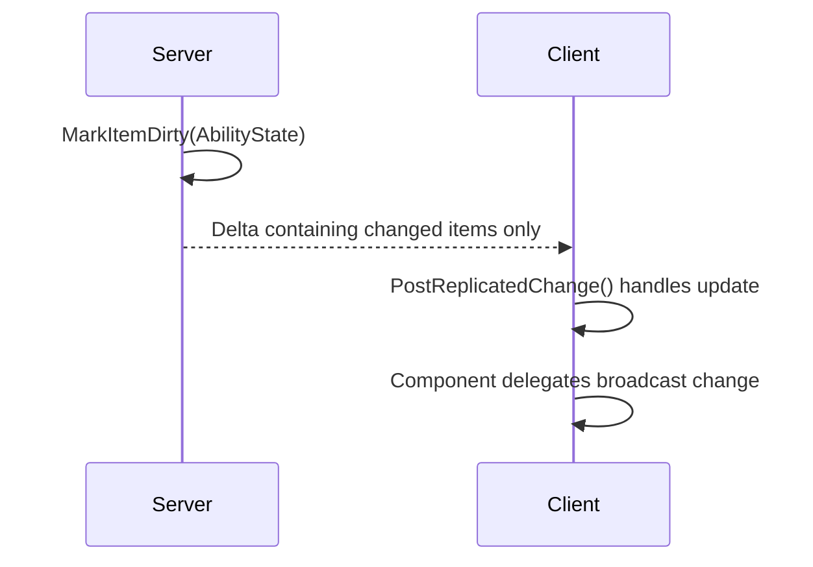
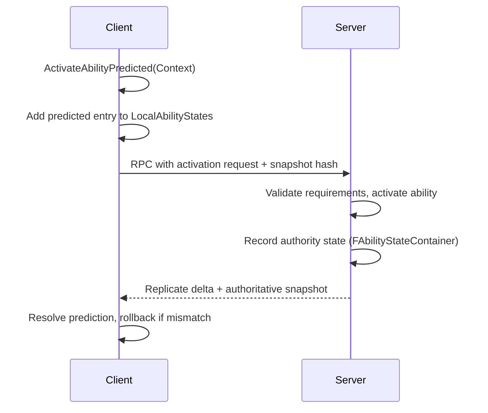
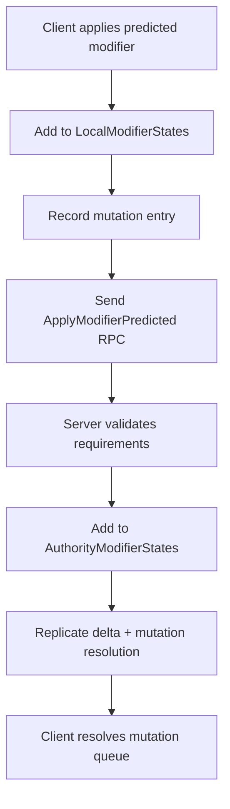
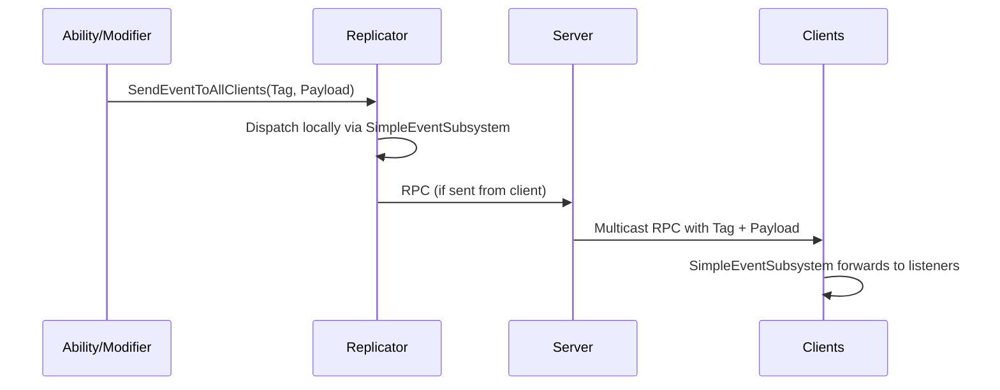
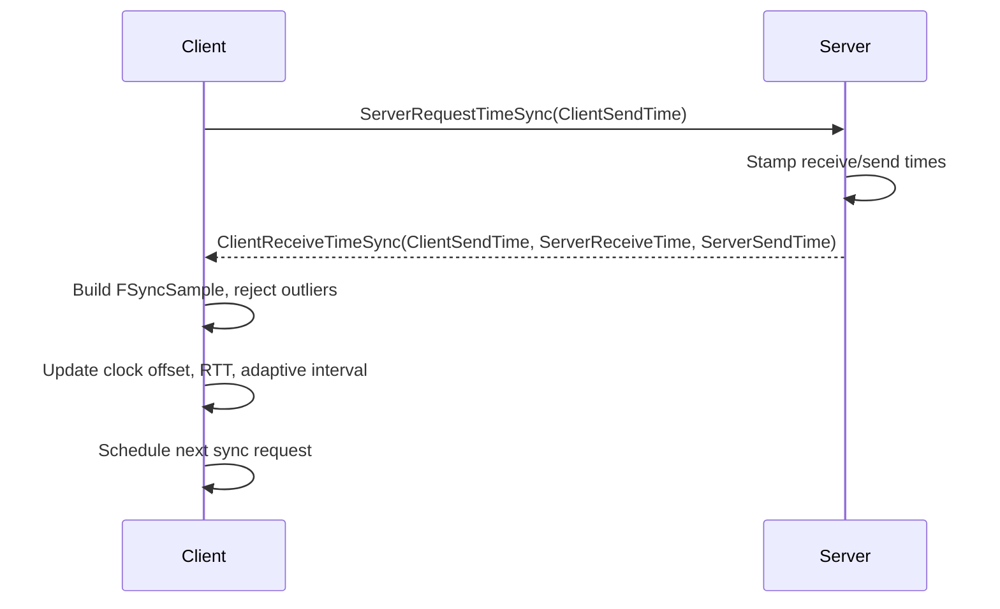

# Networking Deep Dive

SimpleGameplayAbilitySystem is built to keep multiplayer state authoritative, bandwidth-efficient, and predictable. This guide walks through how abilities, attributes, modifiers, and events replicate across the network—and why time synchronization underpins every piece.

## Core Networking Goals

- **Authoritative state:** The server always has final say on abilities, attribute values, and modifier lifetimes.
- **Predictive responsiveness:** Clients can respond immediately, then reconcile against the server without visible pops.
- **Bandwidth awareness:** Replication sends only what changed, not entire data structures.
- **Shared notion of time:** Timers, cooldowns, and duration modifiers expect everyone to agree on “now.”

---

## FastArraySerializer Everywhere

Almost every replicated container in SGAS extends `FFastArraySerializer` or `FFastArraySerializerItem`:

- `FAbilityStateContainer`, `FAbilitySnapshotContainer`
- `FFloatAttributeContainer`, `FStructAttributeContainer`
- `FGameplayTagCounterContainer`
- `FAttributeModifierStateContainer`, `FAttributeModifierMutationContainer`

### Why it matters

- **Delta compression:** Only the items that changed are serialized each frame.
- **Lifecycle hooks:** `PostReplicatedAdd`, `PostReplicatedChange`, and `PreReplicatedRemove` make it easy to react on clients (UI, gameplay).
- **Predictive buffers:** Clients keep local arrays for predicted states and reconcile them when authoritative entries arrive.

Result: You can track hundreds of attributes or active modifiers without flooding the network.

---

## Ability Replication & Prediction

`USimpleGameplayAbilityComponent` owns two FastArrays: one for active ability states and one for prediction snapshots.

- **Activation roles:** Choose `LocalOnly`, `ClientPredicted`, `ServerInitiated`, or `ServerOnly` to balance responsiveness with authority.
- **Snapshots:** `FAbilitySnapshotContainer` stores pre/post state (inputs, timestamps). When the server’s snapshot arrives, the client compares and corrects with `TryResolveSnapshot`.
- **Avatar flexibility:** By replicating only IDs and context via FastArrays, the ability component can live on a PlayerState while acting on a Pawn, surviving possession changes.

> TODO: Capture Blueprint screenshot of an ability’s replication settings and prediction callbacks.

---

## Attribute Replication

`USimpleAttributeComponent` mirrors the approach for attributes and tags:

- **Float attributes:** `FFloatAttributeContainer` replicates `BaseValue`, `CurrentValue`, and limit metadata.
- **Struct attributes:** `FStructAttributeContainer` holds arbitrary data via `FInstancedStruct`; handlers on the server mutate values safely.
- **Gameplay tags:** `FGameplayTagCounterContainer` reference-counts tags so adding/removing stacks stays deterministic.

When a value changes:

1. Server updates the attribute, calls `MarkItemDirty`.
2. FastArray delta replicates to clients.
3. Clients run the attribute’s `PostReplicatedChange`, broadcast delegates, and update UI/HUD.

Because only changed fields travel, attribute-heavy games stay efficient even with frequent ticks.

---

## Attribute Modifiers & Mutations

Modifiers wrap grouped attribute changes and actions. The attribute component keeps two FastArrays in sync:

- `FAttributeModifierStateContainer`: authoritative list of active modifiers (class, instigator, duration, tags).
- `FAttributeModifierMutationContainer`: tracks prediction mutations (especially for client-predicted modifiers) so the server can confirm or reject them individually.

### Prediction flow

- **Duration handling:** Each modifier carries authoritative timestamps so tick intervals and expiry stay in sync after reconciliation.
- **Stack groups:** Because stack state lives in the replicated modifier data, all clients see identical stack counts and durations.

> TODO: Add screenshot of a modifier asset showing network/prediction configuration.

---

## Simple Events Across the Wire

Both the ability and attribute components implement `ISimpleEventReplicator`. Events are identified by gameplay tags and can include optional `FInstancedStruct` payloads.

- **Local-first delivery:** Listeners on the same machine respond immediately (UI, FX, audio), even while RPCs are in flight.
- **Filter control:** Listener filters and domain tags prevent chatter from reaching systems that don’t care.
- **Deterministic payloads:** Payload structs must be replication-safe, ensuring every machine processes the same data.

---

## Time Synchronization: The Hidden Backbone

Prediction and duration modifiers only behave if everyone agrees on time. Both core components call `GetTimeSynchronizerComponent()` to access a `USimpleTimeSynchronizer` (or override it via Blueprint/C++).

### Base synchronizer

`USimpleTimeSynchronizer` defaults to querying `GameState->GetServerWorldTimeSeconds()`. Servers return authoritative time; clients return their best estimate.

### Default implementation: `USimpleTimeSynchronizerExtended`

The plugin ships with `USimpleTimeSynchronizerExtended` as the default component. It improves accuracy with:

- **Burst sampling:** When a client joins, it requests `InitialBurstSamples` rapid syncs to establish a baseline.
- **Sample buffer:** Keeps a rolling history (`SampleBufferSize`) of round-trip measurements (`FSyncSample`).
- **Outlier rejection:** Discards samples with RTT greater than `median * OutlierRTTMultiplier`.
- **Exponential smoothing:** Blends new clock offsets via `SmoothingAlpha` to avoid jitter.
- **Adaptive cadence:** Adjusts sync frequency between `MinSyncInterval` and `MaxSyncInterval` based on measured stability; unstable connections sync more often.
- **Quality metrics:** Exposes `GetRTT()` and `GetSyncQuality()` for debugging or UI.

All sync RPCs are unreliable to avoid congestion. Even if a packet drops, the next sample keeps the clock current.

Accurate shared time is critical for ability cooldowns, modifier durations, and prediction rewind/resolve steps. If you build your own synchronizer, implement `GetServerTime()` and expose it through both components so every system reads the same clock.

---

## Putting It Together

When a client fires a predicted fireball:

1. Input triggers `ActivateAbilityPredicted`.
2. Ability component writes a predicted ability state and snapshot via FastArrays.
3. Ability applies a burn modifier; attribute component enqueues a predicted mutation.
4. Both systems stamp actions using the synchronized server time estimate.
5. Simple events broadcast hit confirmations locally and over the network.
6. Server processes RPCs, validates requirements, writes authoritative FastArrays.
7. Deltas replicate back, prediction queues resolve, and timestamps reconcile based on the synchronizer’s clock offset.

With FastArrays handling deltas, the time synchronizer keeping clocks aligned, and the event replicator bridging communication, SGAS maintains tight multiplayer fidelity without drowning the network.
