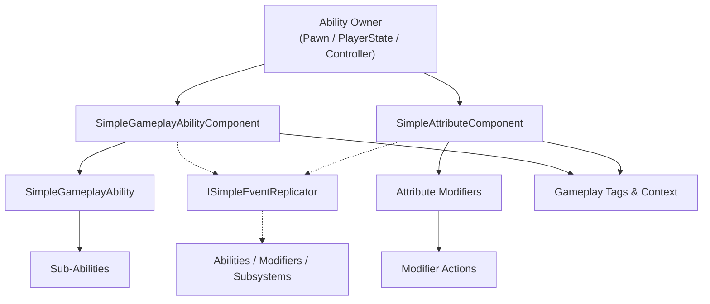
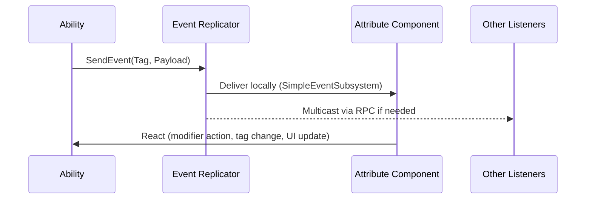

# How SimpleGAS Fits Together

SimpleGameplayAbilitySystem condenses ability authoring into three cooperating systems. Instead of custom RPCs and scattered state, you drop two components on an actor, wire up a handful of assets, and let the framework handle replication and prediction.

## Why These Systems Exist

Multiplayer abilities need to stay authoritative on the server, responsive on the client, and loosely coupled so designers can iterate. SGAS solves this with clear domains:

### Quick Snapshot
- `SimpleGameplayAbilityComponent` grants abilities, runs them, and keeps prediction snapshots synced across the network.
- `SimpleAttributeComponent` owns float/struct attributes, gameplay tags, and the modifier stack that drives buffs, debuffs, and damage.
- Attribute modifiers encapsulate stat changes and call into modifier actions that trigger abilities, apply further modifiers, or broadcast events.
- `ISimpleEventReplicator` bridges ability and attribute components so anything can publish gameplay tags plus optional payloads locally or over RPC.
- Shared utilities—`FInstancedStruct`, FastArrays, and the gameplay tag system—provide common language for context, replication, and requirements.

The diagram above is the mental model you should keep: two components hosted on the same actor, each with their own data, stitched together by events, tags, and context structs.

---

## Abilities: Author Reusable Actions

`SimpleGameplayAbility` is your repeatable gameplay move—a UObject with a predictable lifecycle and built-in prediction support. You create a Blueprint (or C++ class), decide how it activates, and drive behavior in `OnActivate`, `EndAbility`, and `CancelAbility`.

- **Activation flow**: request → requirements check (`ActivationRequiredTags`, context validation, avatar filters) → run `OnActivate` → end or cancel.
- **Instancing & coexistence**: `SingleInstance` prevents duplicates, while `MultipleInstances` lets you stack copies for things like multi-hit combos.
- **Activation policies** keep responsiveness in check. Cosmetic logic can stay `LocalOnly`, combat moves go `ClientPredicted` so the client feels immediate, and authoritative abilities stick to `ServerInitiated`.
- **Context everywhere**: `FInstancedStruct` carries whatever data the ability needs—targets, damage numbers, montage references—and the same struct is visible on clients for prediction rollback.

> TODO: Add screenshot of a SimpleGameplayAbility Blueprint showing `OnActivate` and `EndAbility`.

---

## Sub-Abilities: Compose Shared Behaviors

Sub-abilities let you package repeatable fragments—montage playback, cooldown timers, projectile spawns—without bloating the main ability. They never replicate on their own; the owning ability drives them.

- **Reusable blocks**: drop the same sub-ability into multiple parents instead of copy-pasting logic.
- **Cancellation policies** define whether they follow the parent’s outcome or finish independently.
- **Context-driven**: like abilities, they opt into `RequiredContextType` and avatar filtering so you can pass custom data for each activation.

---

## Ability Component: Orchestrate Replication & Prediction

Attach `SimpleGameplayAbilityComponent` to the actor that should run abilities (commonly the PlayerState so it survives possession changes). It manages the ability roster, activation requests, and the FastArray that replicates live state.

- **Granting abilities**: call `GrantAbility`/`RevokeAbility` from code, or assign `AbilitySets` to automatically grant bundles on BeginPlay.
- **Three activation entry points** keep UX and authority balanced:
  1. `ActivateAbility` for local or AI-driven actions.
  2. `ActivateAbilityPredicted` for client-predicted gameplay that reconciles with server snapshots.
  3. `ActivateAbilityServerInitiated` when the server should be the sole decision maker.
- **Prediction snapshots**: every predicted activation records pre/post state so the server can validate and correct only the deltas.
- **Shared avatar**: the component can live on one actor and control another via `AvatarActor`, keeping replicated state stable during possession swaps.

> TODO: Capture screenshot of the Ability Component details panel highlighting `AbilitySets` and activation settings.

---

## Attribute Component: Keep Stats Honest

`SimpleAttributeComponent` owns health, mana, cooldown timers, struct blobs, and the gameplay tags that gate behavior. It keeps everything replicated, exposes events for UI, and integrates tightly with modifiers.

- **Float attributes** track base/current values with min/max bounds and automatically clamp changes.
- **Struct attributes** store complex state (inventory entries, combo data) and hand off mutation to custom handlers so everything stays authoritative.
- **Tags as truth**: the component publishes persistent and temporary gameplay tags, making requirements consistent across abilities and modifiers.
- **Network safety**: replication uses FastArrays, and attribute events broadcast both locally and over the network.

> TODO: Add screenshot of the Attribute Component showing float and struct attribute lists.

---

## Modifiers & Actions: Package Gameplay Effects

Attribute modifiers bundle the work of buffs, debuffs, damage ticks, and heals. They apply once, live for a duration, or persist indefinitely, and each modifier is composed of modifier actions that do the actual work.

- **Lifecycle**: build modifier context → validate requirements (tags, target filters) → run `OnPreApply` → execute actions → tick or end → run `OnModifierEnded` or `OnModifierCancelled`.
- **Modifier actions** can:
  - Change float or struct attributes.
  - Trigger abilities on the instigator or target.
  - Apply or cancel other modifiers (stacking, cleanses).
  - Fire custom logic in Blueprint or C++.
- **Stack management**: use `StackGroupTag` rules to decide whether a reapply should add another stack, refresh duration, or replace an existing instance.
- **Scratchpad sharing**: actions can stash transient data for their siblings so you can coordinate damage totals, random seeds, or references across the chain.

---

## Event Layer: Broadcast Context Without Coupling

Both components implement `ISimpleEventReplicator`, which acts as a lightweight bus for gameplay events represented by gameplay tags plus optional `FInstancedStruct` payloads.

- **Local first**: events route through `SimpleEventSubsystem` so listeners on the same machine respond immediately.
- **Network aware**: `SendEventToServer`, `SendEventToClient`, and `SendEventToAllClients` use RPCs under the hood, keeping payload replay deterministic.
- **Filterable**: listeners can filter by tag domain or add their own logic so only relevant systems respond.

---

## Shared Utilities: The Glue

A few shared patterns keep abilities, modifiers, and events speaking the same language:

- **Gameplay tags** gate activation, categorize modifiers, and label events.
- **`FInstancedStruct`** carries context data without hard dependencies between Blueprint classes.
- **FastArrays & prediction buffers** ensure only deltas replicate and clients reconcile smoothly after server validation.
- **Time synchronization** hooks keep duration modifiers and prediction timestamps aligned across machines.

---

## Putting It All Together

Here’s a typical flow when a player casts a fireball:

1. The input system calls `ActivateAbilityPredicted` on the ability component with a `FireballContext` struct.
2. The ability validates tags/requirements, launches a projectile locally, and queues a prediction snapshot.
3. On hit, the ability applies a burn modifier via the attribute component, passing along the instigator and target.
4. Modifier actions subtract mana, apply damage-over-time, and broadcast an event notifying UI and other systems.
5. The server confirms the activation, replicates the authoritative ability state, and reconciles any client divergence.
6. When the burn expires, its modifier removes temporary tags and fires a cleanup event.

With those pieces in mind, you can decide which parts of SGAS to adopt: run only the attribute component for a stat-heavy system, lean on abilities for action-driven prototypes, or combine everything for fully networked combat.
