# SimpleGameplayAbilitySystem Plugin - Complete Technical Reference

<PluginDescriptionActions />

:::tip Use Case for This Document
This document serves as a comprehensive technical reference for the SimpleGameplayAbilitySystem plugin. 

When working with AI assistants (like Claude, ChatGPT, or other large language models), copy or download this file and include it in your conversation to provide complete context about the plugin's architecture, APIs, and implementation patterns. 

This enables the AI to give you more accurate and detailed help with your questions about the plugin.
:::

## Table of Contents
1. [Quick Reference](#quick-reference)
2. [Architecture Overview](#architecture-overview)
3. [Module Structure](#module-structure)
4. [Core Systems](#core-systems)
5. [Network Architecture](#network-architecture)
6. [Key C++ Classes](#key-c-classes)
7. [Data Assets](#data-assets)
8. [Modifier Actions](#modifier-actions)
9. [Event System](#event-system)
10. [Blueprint Integration](#blueprint-integration)
11. [Gameplay Debugger](#gameplay-debugger)
12. [Common Patterns](#common-patterns)
13. [File Navigation](#file-navigation)

---

## Quick Reference

### What Is This Plugin?

SimpleGameplayAbilitySystem (SGAS) is a **lightweight, multiplayer-ready framework** for building ability and attribute systems in Unreal Engine. It provides the essential building blocks for gameplay mechanics (abilities, stats, buffs/debuffs) without the complexity of Epic's Gameplay Ability System (GAS).

**Core Philosophy:**
- Minimal boilerplate for common use cases
- Full Blueprint support (no C++ required)
- Modular architecture (use only what you need)
- Network-first design with built-in prediction and replication
- Data-driven configuration via Data Assets

### When to Use This Plugin

**Use SimpleGAS if:**
- You're a solo dev or small team needing to ship fast
- Designers need to create abilities without C++ knowledge
- You want multiplayer support without writing RPCs manually
- You need a subset of GAS features without the learning curve
- You value simplicity and maintainability over configurability

**Use Epic's GAS if:**
- Building large-scale RPG with hundreds of interacting systems
- Have a dedicated team that can invest in learning GAS
- Need advanced features like gameplay cues, attribute-based costs, complex stacking
- Extending an existing GAS-based project

### Problem It Solves

**Without SGAS, multiplayer gameplay requires:**
- Manual RPC setup for every ability
- Custom replication for every stat/attribute
- Scattered requirement checks (Can I dash? Check stun, stamina, grounded state...)
- Tight coupling (abilities directly manipulating variables)
- Copy-paste reuse (same montage logic duplicated across abilities)
- Complex prediction reconciliation code

**With SGAS:**
- Automatic replication via FastArraySerializer
- Built-in prediction with server reconciliation
- Centralized requirement system (tags, context validation)
- Loose coupling via event system
- Reusable sub-abilities for common behaviors
- Three activation patterns: Local, Client-Predicted, Server-Initiated

---

## Architecture Overview

### Three Core Systems

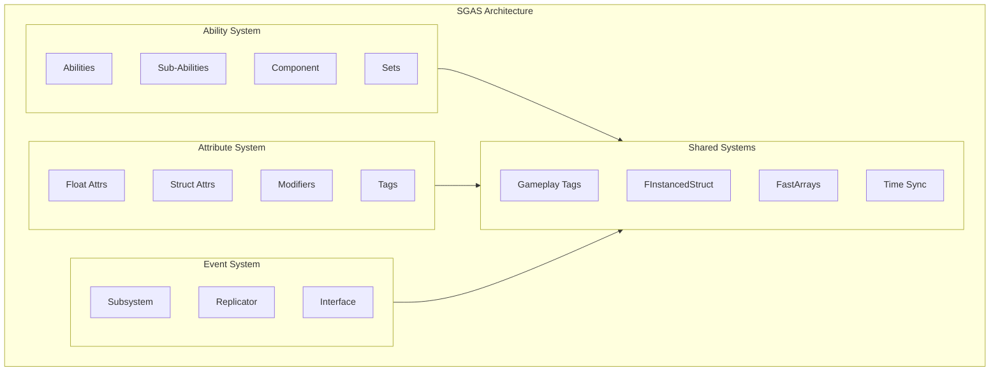

### Component Relationships

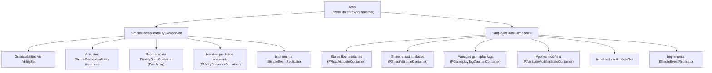

### Data Flow Example: Casting a Fireball

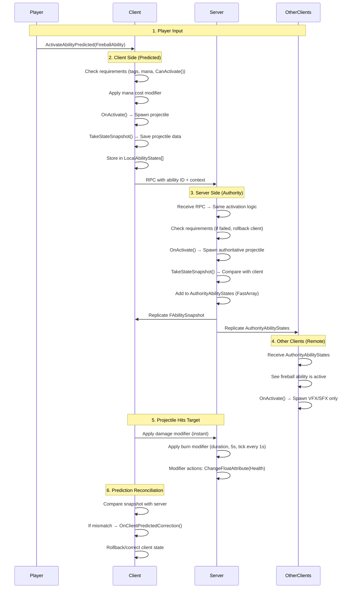

---

## Module Structure

The plugin consists of **three modules**:

### 1. SimpleGameplayAbilitySystem (Runtime)
**Loading Phase:** `PreDefault`
**Purpose:** Core runtime functionality

**Dependencies:**
- `StructUtils` (FInstancedStruct support)

**Key Directories:**
- `SimpleAbility/` - Ability base classes
- `Components/` - AbilityComponent, AttributeComponent
- `DataAssets/` - AbilitySet, AttributeSet
- `SimpleEventSubsystem/` - Event pub/sub system
- `AsyncActions/` - Blueprint async nodes (WaitFor...)
- `BlueprintFunctionLibraries/` - Helper functions
- `Interfaces/` - ISimpleEventReplicator

### 2. SimpleGameplayAbilitySystemEditor (Editor)
**Loading Phase:** `Default`
**Purpose:** Editor customizations

**Features:**
- Custom property editors for struct attributes
- Enhanced UI for configuring abilities/modifiers

**Key Files:**
- `StructAttributeCustomization.h/cpp` - Custom detail panel for struct attributes

### 3. SimpleGameplayAbilitySystemDebugger (DeveloperTool)
**Loading Phase:** `Default`
**Purpose:** Gameplay debugger categories

**Features:**
- In-game debugging overlay (showdebug SGAS)
- View active abilities, attributes, modifiers, tags
- Pagination and filtering

**Key Files:**
- `GameplayDebuggerCategory_AbilityComponent.h/cpp`
- `GameplayDebuggerCategory_AttributeComponent.h/cpp`
- `GameplayDebuggerCategory_AttributeModifier.h/cpp`

---

## Core Systems

### 1. Ability System

**Purpose:** Manage discrete gameplay actions with lifecycle, replication, and prediction.

**Key Concepts:**
- **SimpleGameplayAbility**: Main ability class (Blueprintable UObject)
- **SimpleSubAbility**: Reusable helper abilities (non-replicated)
- **AbilityComponent**: Grants, activates, and replicates abilities
- **Instancing Policies**: SingleInstance vs MultipleInstances
- **Activation Policies**: LocalOnly, ClientPredicted, ServerInitiated, etc.

**Lifecycle:**
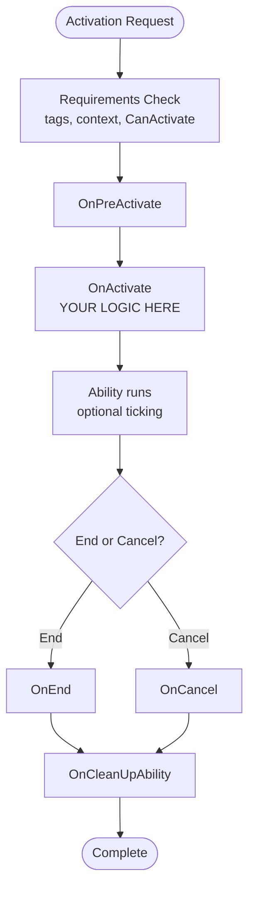

### 2. Attribute System

**Purpose:** Replicated stats (health, mana, custom data) with event dispatching and tag management.

**Key Concepts:**
- **Float Attributes**: Simple numeric values (BaseValue, CurrentValue, Limits)
- **Struct Attributes**: Complex custom data types with AttributeHandlers
- **Gameplay Tags**: Reference-counted tags for state tracking
- **Attribute Modifiers**: Instant/Duration/Infinite effects
- **Modifier Actions**: Composable operations (damage, heal, activate ability)

**Modifier Lifecycle:**
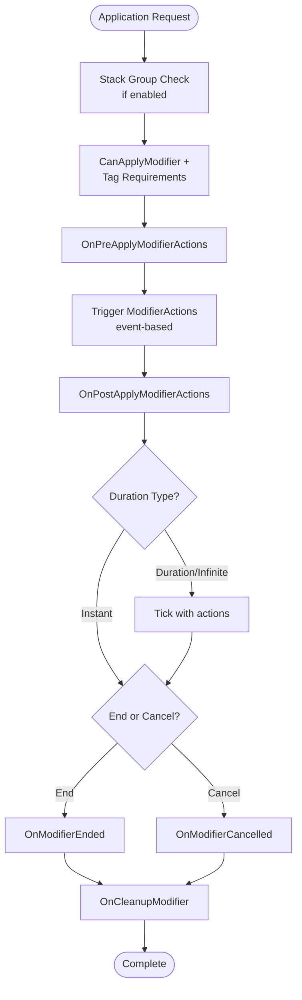

### 3. Event System

**Purpose:** Decoupled communication between abilities, modifiers, and game systems.

**Key Concepts:**
- **SimpleEventSubsystem**: GameInstance subsystem (local pub/sub)
- **ISimpleEventReplicator**: Interface for network event replication
- **Event Filtering**: By tag, domain, payload type, sender
- **Replication Methods**: Local, ToServer, ToClient, ToAllClients

**Event Flow:**
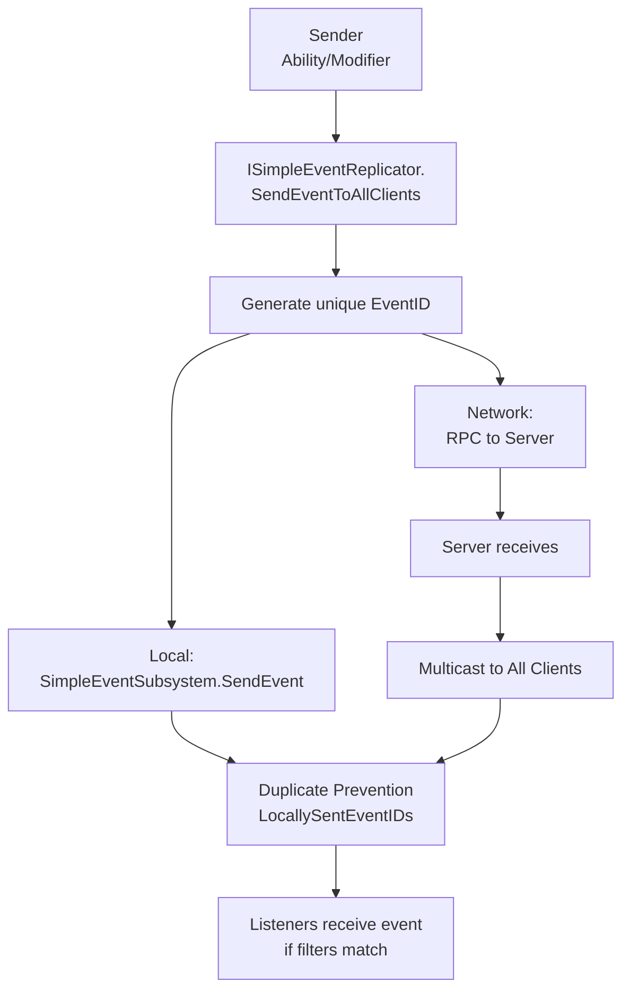

---

## Network Architecture

### Replication Strategy

**FastArraySerializer Pattern:**
- All replicated state uses Unreal's `FFastArraySerializer`
- Efficient delta compression (only changed items sent)
- Automatic callbacks on add/change/remove
- Supports both authority and local arrays

**Key Replicated Containers:**
- `FAbilityStateContainer` - Active abilities
- `FAbilitySnapshotContainer` - Prediction snapshots
- `FFloatAttributeContainer` - Float attributes
- `FStructAttributeContainer` - Struct attributes
- `FGameplayTagCounterContainer` - Gameplay tags
- `FAttributeModifierStateContainer` - Active modifiers
- `FAttributeModifierMutationContainer` - Modifier mutations for prediction

### Three Activation Patterns

#### 1. Local Only (No Replication)
**Use Case:** Single-player, cosmetic effects, local UI

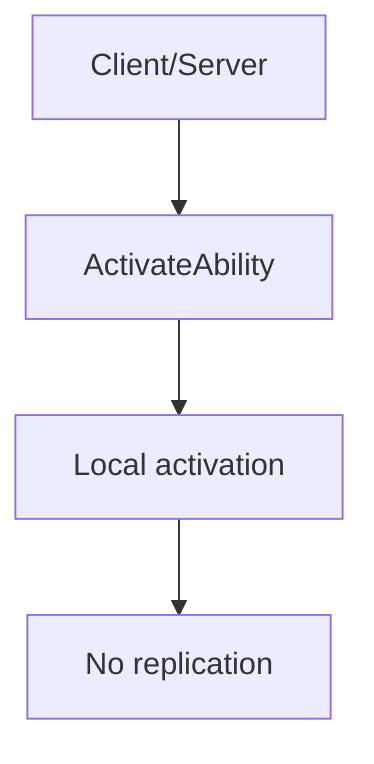

**Pros:** Zero network overhead
**Cons:** No synchronization, authority, or prediction

#### 2. Client-Predicted (Responsive with Rollback)
**Use Case:** Player actions requiring instant feedback (movement, attacks)

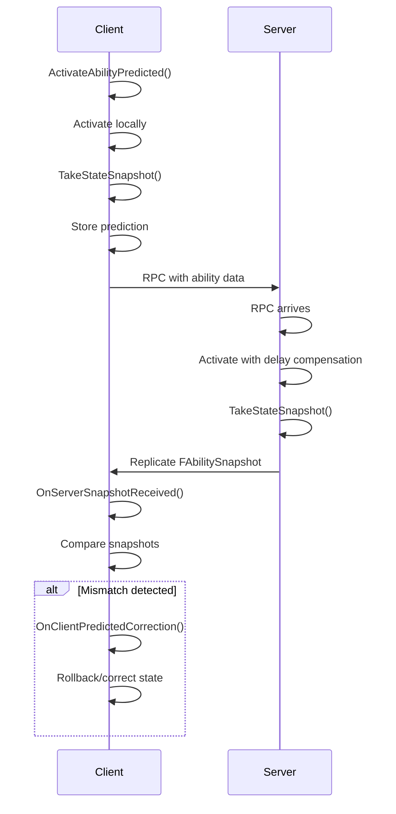

**Pros:** Instant feedback, smooth gameplay
**Cons:** Requires reconciliation logic, can rollback

#### 3. Server-Initiated (Authority-First)
**Use Case:** Server-driven logic (AI, random outcomes, item spawning)

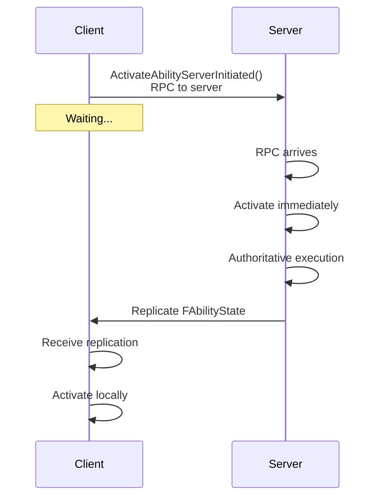

**Pros:** No prediction conflicts, guaranteed consistency
**Cons:** Input lag equal to ping time

### Prediction Reconciliation

**Snapshot System:**
1. Client takes snapshot: `TakeStateSnapshot(FMyAbilityState)`
2. Server takes same snapshot at ~same time
3. Server replicates snapshot to client
4. Client compares: `OnServerSnapshotReceived(ServerSnapshot, ClientSnapshot)`
5. Delegate: `OnSnapshotResolved.Execute(AuthorityData, ClientData)`
6. User code: Compare values, rollback if needed

**Example Snapshot Struct:**
```cpp
USTRUCT()
struct FDashAbilitySnapshot
{
    GENERATED_BODY()

    FVector StartLocation;
    FVector EndLocation;
    float DashSpeed;
    bool HitWall;
};
```

**Usage in Ability:**
```cpp
void UDashAbility::OnActivate_Implementation(const FInstancedStruct& Context)
{
    FVector DashDirection = CalculateDashDirection();

    // Take snapshot for prediction
    FDashAbilitySnapshot Snapshot;
    Snapshot.StartLocation = GetAvatarActor()->GetActorLocation();
    Snapshot.DashSpeed = DashSpeed;

    TakeStateSnapshot(FInstancedStruct::Make(Snapshot), OnDashResolved);

    // Perform dash
    PerformDash(DashDirection);
}

void UDashAbility::OnDashResolved(FInstancedStruct ServerSnapshot, FInstancedStruct ClientSnapshot)
{
    const FDashAbilitySnapshot* Server = ServerSnapshot.GetPtr<FDashAbilitySnapshot>();
    const FDashAbilitySnapshot* Client = ClientSnapshot.GetPtr<FDashAbilitySnapshot>();

    if (!Server || !Client) return;

    // Check for mismatch
    if (!Server->EndLocation.Equals(Client->EndLocation, 10.0f))
    {
        // Rollback and correct
        GetAvatarActor()->SetActorLocation(Server->EndLocation);
    }
}
```

---

## Key C++ Classes

### USimpleAbilityBase
**Location:** `Source/SimpleGameplayAbilitySystem/SimpleAbility/SimpleAbilityBase/SimpleAbilityBase.h`
**Parent:** `UObject`, `FTickableGameObject`
**Purpose:** Base class for all abilities (both gameplay and sub-abilities)

**Key Properties:**
- `FInstancedStruct AbilityContext` - Activation data passed to ability
- `bool CanTick` - Enable/disable tick
- `bool IsActive` - True between OnActivate and OnEnd/Cancel

**Key Methods:**
```cpp
bool ActivateAbility(FInstancedStruct ActivationContext);
void EndAbility(FGameplayTag EndStatus, FInstancedStruct EndContext);
void CancelAbility(FGameplayTag CancelStatus, FInstancedStruct CancelContext);

// Override in Blueprint/C++:
void OnPreActivate_Implementation();
void OnActivate_Implementation(const FInstancedStruct& ActivationContext);
void OnTick_Implementation(float DeltaTime);
void OnEnd_Implementation(FGameplayTag EndStatus, FInstancedStruct EndContext);
void OnCancel_Implementation(FGameplayTag CancelStatus, FInstancedStruct CancelContext);
void OnCleanUpAbility_Implementation();
```

**Event Dispatchers:**
- `FAbilityActivationDelegate OnActivationSuccess`
- `FAbilityActivationDelegate OnActivationFailed`
- `FAbilityStoppedDelegate OnAbilityEnded`
- `FAbilityStoppedDelegate OnAbilityCancelled`

### USimpleGameplayAbility
**Location:** `Source/SimpleGameplayAbilitySystem/SimpleAbility/SimpleGameplayAbility/SimpleGameplayAbility.h`
**Parent:** `USimpleAbilityBase`
**Purpose:** Main ability class with replication, requirements, and sub-ability support

**Key Properties:**
```cpp
FGuid AbilityID;                                    // Unique instance ID
EAbilityInstancingPolicy InstancingPolicy;          // Single vs Multiple
bool RequireGrantToActivate;                        // Must be granted first?
FGameplayTagContainer ActivationRequiredTags;       // Must have these tags
FGameplayTagContainer ActivationBlockingTags;       // Must NOT have these tags
UScriptStruct* RequiredContextType;                 // Enforce context struct type
TArray<TSubclassOf<AActor>> AvatarTypeFilter;      // Restrict to actor types
FGameplayTagContainer AbilityTags;                  // Classify this ability
FGameplayTagContainer TemporarilyAppliedTags;       // Added while active
FGameplayTagContainer PermanentlyAppliedTags;       // Added, stay after end
```

**Key Methods:**
```cpp
// Initialize (called by component)
void Initialize(USimpleGameplayAbilityComponent* Component, FGuid ID);

// Sub-abilities
USimpleSubAbility* ActivateSubAbility(
    TSubclassOf<USimpleSubAbility> AbilityClass,
    FInstancedStruct ActivationContext,
    EAbilityActivationResult& ActivationResult);

// Override in Blueprint/C++:
bool CanActivate_Implementation(const FInstancedStruct& ActivationContext);
USimpleAttributeComponent* GetAttributeComponent_Implementation();
void OnGranted_Implementation(USimpleGameplayAbilityComponent* GrantedAbilityComponent);

// Prediction
void TakeStateSnapshot(FInstancedStruct SnapshotData, const FOnSnapshotResolved& OnResolved);
void OnServerSnapshotReceived(int32 SnapshotCounter, const FInstancedStruct& AuthoritySnapshot, const FInstancedStruct& LocalSnapshot);

// Utility
USimpleGameplayAbilityComponent* GetAbilityComponent() const;
AActor* GetAvatarActor() const;
EAbilityNetworkRole GetNetworkRole() const;
bool HasAuthority() const;
double GetActivationTime() const;          // Server time when activated
double GetActivationDelay() const;         // Time since activation (for fast-forward)
```

**Instancing Policies:**
- `SingleInstance`: Only one instance active. If activated again while running, previous instance is cancelled (if `CanCancel()` returns true). If `CanCancel()` is false, new activation fails.
- `MultipleInstances`: Each activation creates a new instance, all run in parallel.

**Activation Policies:**
- `LocalOnly`: No replication, works on server or client
- `ClientOnly`: Only clients activate, no replication
- `ServerOnly`: Only server activates, no replication to clients
- `ClientPredicted`: Client activates instantly, server validates and reconciles
- `ServerInitiatedFromClient`: Client requests, server activates first, then replicates
- `ServerInitiated`: Server only, replicates to clients

### USimpleSubAbility
**Location:** `Source/SimpleGameplayAbilitySystem/SimpleAbility/SimpleSubAbility/SimpleSubAbility.h`
**Parent:** `USimpleAbilityBase`
**Purpose:** Lightweight helper abilities for reusable logic (non-replicated)

**Key Properties:**
```cpp
FGuid ParentAbilityID;
ESubAbilityCancellationPolicy CancellationPolicy;
UScriptStruct* RequiredContextType;
TArray<TSubclassOf<AActor>> AvatarTypeFilter;
```

**Cancellation Policies:**
- `CancelOnParentAbilityEndedOrCancelled`: Cancel if parent stops for any reason
- `CancelOnParentAbilityCancelled`: Cancel only if parent is cancelled
- `CancelOnParentAbilityEnded`: Cancel only if parent ends normally
- `IgnoreParentAbility`: Continues independently

**Key Methods:**
```cpp
void Initialize(USimpleGameplayAbility* ParentAbility, FGuid ParentAbilityID);
AActor* GetAvatarActor() const;
USimpleGameplayAbility* GetParentAbilityInstance() const;
USimpleGameplayAbilityComponent* GetParentAbilityComponent() const;

// Event replication (uses parent ability's ID)
void SendEventToServer(FGameplayTag EventTag, FInstancedStruct EventContext);
void SendEventToClient(FGameplayTag EventTag, FInstancedStruct EventContext);
void SendEvent(FGameplayTag EventTag, FInstancedStruct EventContext);
```

**Use Cases:**
- Montage playback with completion tracking
- VFX/SFX spawning with cleanup
- Timer-based delays
- Shared logic across multiple abilities

**Example:**
```cpp
UCLASS()
class UPlayMontageSubAbility : public USimpleSubAbility
{
    UPROPERTY(EditDefaultsOnly)
    UAnimMontage* MontageToPlay;

    virtual void OnActivate_Implementation(const FInstancedStruct& Context) override
    {
        ACharacter* Character = Cast<ACharacter>(GetAvatarActor());
        Character->PlayAnimMontage(MontageToPlay);

        // Wait for completion, then EndAbility()
    }
};
```

### USimpleGameplayAbilityComponent
**Location:** `Source/SimpleGameplayAbilitySystem/Components/SimpleGameplayAbilityComponent/SimpleGameplayAbilityComponent.h`
**Parent:** `UActorComponent`, `ISimpleEventReplicator`
**Purpose:** Manage ability lifecycle, replication, and prediction

**Key Properties:**
```cpp
// Setup
AActor* AvatarActor;                                  // Actor abilities act upon
TArray<USimpleAbilitySet*> AbilitySets;               // Auto-grant on BeginPlay
TArray<TSubclassOf<USimpleGameplayAbility>> GrantedAbilities;  // Authority list

// Replication (FastArrays)
FAbilityStateContainer AuthorityAbilityStates;        // Server states
TArray<FAbilityState> LocalAbilityStates;             // Client predicted states
FAbilitySnapshotContainer AuthorityAbilitySnapshots;  // Prediction snapshots
TArray<FAbilitySnapshot> LocalPendingAbilitySnapshots;

// Internal
TArray<USimpleGameplayAbility*> InstancedAbilities;   // Created instances
TArray<FAbilitySnapshot> DeferredSnapshots;           // Race condition handling
```

**Key Methods:**
```cpp
// Avatar
AActor* GetAvatarActor() const;
void SetAvatarActor(AActor* NewAvatarActor);  // Authority only
bool IsAvatarActorOfType(TSubclassOf<AActor> AvatarClass) const;

// Granting (Authority only)
void GrantAbility(TSubclassOf<USimpleGameplayAbility> AbilityClass);
void RevokeAbility(TSubclassOf<USimpleGameplayAbility> AbilityClass);

// Activation
bool ActivateAbility(
    TSubclassOf<USimpleGameplayAbility> AbilityClass,
    FInstancedStruct AbilityContext,
    FGuid& AbilityID);  // Local only, no replication

bool ActivateAbilityPredicted(
    TSubclassOf<USimpleGameplayAbility> AbilityClass,
    FInstancedStruct AbilityContext,
    FGuid& AbilityID);  // Client prediction

void ActivateAbilityServerInitiated(
    TSubclassOf<USimpleGameplayAbility> AbilityClass,
    FInstancedStruct AbilityContext,
    FGuid& AbilityID);  // Server first, then replicate

// Cancellation
void CancelAbility(FGuid AbilityInstanceID, FInstancedStruct CancellationContext);
void CancelAbilityPredicted(FGuid AbilityInstanceID, FInstancedStruct CancellationContext);
TArray<FGuid> CancelAbilitiesWithTags(FGameplayTagContainer Tags, FInstancedStruct Context);
TArray<FGuid> CancelAbilitiesWithClass(TSubclassOf<USimpleGameplayAbility> AbilityClass, FInstancedStruct Context);

// Snapshots (internal)
int32 AddGameplayAbilitySnapshot(FGuid AbilityID, FInstancedStruct SnapshotData);

// Utility
bool HasAuthority() const;
bool IsOwnedByLocalPlayer() const;
bool IsAnyAbilityActive() const;
double GetServerTime();  // Authority time or client estimation
USimpleGameplayAbility* GetAbilityInstanceByID(FGuid AbilityInstanceID);
USimpleGameplayAbility* GetAbilityInstanceByClass(TSubclassOf<USimpleGameplayAbility> AbilityClass);

// Override for custom time sync
USimpleTimeSynchronizer* GetTimeSynchronizerComponent_Implementation();
```

**ISimpleEventReplicator Implementation:**
```cpp
void SendEvent(FGameplayTag EventTag, FGameplayTag DomainTag, FInstancedStruct Payload, UObject* Sender, const TArray<UObject*>& ListenerFilter);
void SendEventToServer(...);
void SendEventToClient(...);
void SendEventToAllClients(...);

// RPCs
UFUNCTION(Server, Reliable)
void ServerSendEvent(...);
UFUNCTION(Client, Reliable)
void ClientSendEvent(...);
UFUNCTION(NetMulticast, Reliable)
void MulticastSendEvent(...);
```

**Internal Lifecycle:**
1. `BeginPlay()`: Grant abilities from AbilitySets
2. `ActivateAbilityPredicted()`: Create instance, check requirements, activate
3. Ability runs: `OnActivate()`, optional ticking
4. FastArray replication: `ClientOnAbilityStateAdded/Changed/Removed()`
5. Snapshot replication: `ClientOnAbilitySnapshotAdded()`
6. Resolution: `TryResolveSnapshot()` → `OnServerSnapshotReceived()`
7. End/Cancel: Remove from arrays, cleanup
8. Periodic: `CleanupOldAbilityStates()` removes ended abilities after 30s

### USimpleAttributeComponent
**Location:** `Source/SimpleGameplayAbilitySystem/Components/SimpleAttributeComponent/SimpleAttributeComponent.h`
**Parent:** `UActorComponent`, `ISimpleEventReplicator`
**Purpose:** Replicated attributes, tags, and modifier management

**Key Properties:**
```cpp
// Initialization
TArray<USimpleAttributeSet*> AttributeSets;
TArray<FFloatAttribute> DefaultFloatAttributes;
TArray<FStructAttribute> DefaultStructAttributes;
FGameplayTagContainer DefaultGameplayTags;

// Replicated state (FastArrays)
FGameplayTagCounterContainer AuthorityGameplayTags;
TArray<FGameplayTagCounter> LocalGameplayTags;

FFloatAttributeContainer AuthorityFloatAttributes;
TArray<FFloatAttribute> LocalFloatAttributes;

FStructAttributeContainer AuthorityStructAttributes;
TArray<FStructAttribute> LocalStructAttributes;

FAttributeModifierStateContainer AuthorityAttributeModifierStates;
TArray<FAttributeModifierState> LocalAttributeModifierStates;

FAttributeModifierMutationContainer AuthorityAttributeModifierMutations;
TArray<FAttributeModifierMutation> LocalAttributeModiferMutations;

// Prediction
TArray<FPredictedModifierSnapshot> PredictedModifierSnapshots;
TArray<FAttributeModifierMutation> PendingMutationQueue;

// Internal
TArray<USimpleAttributeModifier*> InstancedAttributeModifiers;
TArray<USimpleAttributeHandler*> InstancedAttributeHandlers;
```

**Float Attributes:**
```cpp
// Management (Authority only)
void AddFloatAttribute(FFloatAttribute AttributeToAdd, bool OverrideValuesIfExists = true);
void RemoveFloatAttribute(FGameplayTag AttributeTag);

// Queries
bool HasFloatAttribute(const FGameplayTag AttributeTag);
float GetFloatAttributeValue(EFloatAttributeValueType ValueType, FGameplayTag AttributeTag, bool& WasFound);
FFloatAttribute GetFloatAttributeCopy(FGameplayTag AttributeTag);
FFloatAttribute* GetFloatAttribute(FGameplayTag AttributeTag);  // Internal

// Modification
bool SetFloatAttributeValue(EFloatAttributeValueType ValueType, FGameplayTag AttributeTag, float NewValue, float& Overflow);
bool IncrementFloatAttributeValue(EFloatAttributeValueType ValueType, FGameplayTag AttributeTag, float Increment, float& Overflow);
bool OverrideFloatAttribute(FGameplayTag AttributeTag, FFloatAttribute NewAttribute);
float ClampFloatAttributeValue(const FFloatAttribute& Attribute, EFloatAttributeValueType ValueType, float NewValue, float& Overflow);
```

**Float Attribute Structure:**
```cpp
USTRUCT(BlueprintType)
struct FFloatAttribute : public FFastArraySerializerItem
{
    FName AttributeName;         // Display name
    FGameplayTag AttributeTag;   // Unique identifier
    float BaseValue;             // Base/max value
    float CurrentValue;          // Current/actual value
    FValueLimits ValueLimits;    // Min/max clamping
};

USTRUCT(BlueprintType)
struct FValueLimits
{
    bool UseMinBaseValue;
    float MinBaseValue;
    bool UseMaxBaseValue;
    float MaxBaseValue;
    bool UseMinCurrentValue;
    float MinCurrentValue;
    bool UseMaxCurrentValue;
    float MaxCurrentValue;
};
```

**Struct Attributes:**
```cpp
// Management (Authority only)
void AddStructAttribute(FStructAttribute AttributeToAdd, bool OverrideValuesIfExists = true);
void RemoveStructAttribute(FGameplayTag AttributeTag);

// Queries
bool HasStructAttribute(const FGameplayTag AttributeTag);
FInstancedStruct GetStructAttributeValue(FGameplayTag AttributeTag, bool& WasFound);
FStructAttribute GetStructAttributeCopy(FGameplayTag AttributeTag);
FStructAttribute* GetStructAttribute(FGameplayTag AttributeTag);  // Internal

// Modification
bool SetStructAttributeValue(FGameplayTag AttributeTag, FInstancedStruct NewValue);

// Handlers
USimpleAttributeHandler* GetAttributeHandler(FGameplayTag AttributeTag, TSubclassOf<USimpleAttributeHandler> AttributeHandlerClass);
USimpleAttributeHandler* GetStructAttributeHandlerInstance(FGameplayTag AttributeTag, TSubclassOf<USimpleAttributeHandler> HandlerClass);
```

**Struct Attribute Structure:**
```cpp
USTRUCT(BlueprintType)
struct FStructAttribute : public FFastArraySerializerItem
{
    FName AttributeName;
    FGameplayTag AttributeTag;
    UScriptStruct* StructType;                         // Type validation
    FInstancedStruct AttributeValue;                   // Actual data
    TSubclassOf<USimpleAttributeHandler> StructAttributeHandler;  // Custom logic
};
```

**Gameplay Tags:**
```cpp
void AddGameplayTag(FGameplayTag Tag);
void RemoveGameplayTag(FGameplayTag Tag);
bool HasGameplayTag(FGameplayTag Tag);
bool HasAllGameplayTags(FGameplayTagContainer Tags);
bool HasAnyGameplayTags(FGameplayTagContainer Tags);
FGameplayTagContainer GetActiveGameplayTags() const;
```

**Tag Implementation:**
- Reference-counted: Adding same tag twice = RefCount 2
- Removing decrements RefCount
- Tag removed from replication when RefCount reaches 0

**Attribute Modifiers:**
```cpp
// Local only
bool ApplyAttributeModifierToTarget(
    FGuid& ModifierID,
    TSubclassOf<USimpleAttributeModifier> ModifierClass,
    USimpleAttributeComponent* ModifierTarget,
    float Magnitude,
    FInstancedStruct ModifierContext);

// Client-predicted
bool ApplyAttributeModifierToTargetPredicted(
    FGuid& ModifierID,
    TSubclassOf<USimpleAttributeModifier> ModifierClass,
    USimpleAttributeComponent* ModifierTarget,
    float Magnitude,
    FInstancedStruct ModifierContext);

// Server-initiated
void ApplyAttributeModifierToTargetServerInitiated(
    FGuid& ModifierID,
    TSubclassOf<USimpleAttributeModifier> ModifierClass,
    USimpleAttributeComponent* ModifierTarget,
    float Magnitude,
    FInstancedStruct ModifierContext);

// Self-targeting variants
bool ApplyAttributeModifierToSelf(...);
bool ApplyAttributeModifierToSelfPredicted(...);
void ApplyAttributeModifierToSelfServerInitiated(...);

// Cancellation
void CancelAttributeModifier(FGuid ModifierID);
void CancelAttributeModifierPredicted(FGuid ModifierID);
void CancelAttributeModifiersWithTags(FGameplayTagContainer ModifierTags);
void CancelAttributeModifiersWithClass(TSubclassOf<USimpleAttributeModifier> ModifierClass);

// Queries
bool IsModifierWithTagsActive(FGameplayTagContainer ModifierTags) const;

// Stack groups
int32 GetModifierStackCountInGroup(FGameplayTag StackGroupTag) const;
TArray<USimpleAttributeModifier*> GetModifiersInStackGroup(FGameplayTag StackGroupTag) const;
USimpleAttributeModifier* GetOldestModifierInGroup(FGameplayTag StackGroupTag) const;
USimpleAttributeModifier* GetNewestModifierInGroup(FGameplayTag StackGroupTag) const;
```

**Event Dispatchers (144 total across all classes):**
```cpp
// Gameplay Tags
FOnGameplayTagAddedSignature OnGameplayTagAdded;
FOnGameplayTagRemovedSignature OnGameplayTagRemoved;

// Float Attributes (12 dispatchers)
FOnFloatAttributeAddedSignature OnFloatAttributeAdded;
FOnFloatAttributeRemovedSignature OnFloatAttributeRemoved;
FOnFloatAttributeValueChangedSignature OnFloatAttributeBaseValueChanged;
FOnFloatAttributeValueChangedSignature OnFloatAttributeCurrentValueChanged;
FOnFloatAttributeValueChangedSignature OnFloatAttributeMinBaseValueChanged;
FOnFloatAttributeValueChangedSignature OnFloatAttributeMinCurrentValueChanged;
FOnFloatAttributeValueChangedSignature OnFloatAttributeMaxBaseValueChanged;
FOnFloatAttributeValueChangedSignature OnFloatAttributeMaxCurrentValueChanged;
FOnFloatAttributeBoolChangedSignature OnUseMinBaseValueChanged;
FOnFloatAttributeBoolChangedSignature OnUseMinCurrentValueChanged;
FOnFloatAttributeBoolChangedSignature OnUseMaxBaseValueChanged;
FOnFloatAttributeBoolChangedSignature OnUseMaxCurrentValueChanged;
FOnFloatAttributeLimitReachedSignature OnMinBaseValueReached;
FOnFloatAttributeLimitReachedSignature OnMinCurrentValueReached;
FOnFloatAttributeLimitReachedSignature OnMaxBaseValueReached;
FOnFloatAttributeLimitReachedSignature OnMaxCurrentValueReached;

// Struct Attributes
FOnStructAttributeAddedSignature OnStructAttributeAdded;
FOnStructAttributeRemovedSignature OnStructAttributeRemoved;
FOnStructAttributeChangedSignature OnStructAttributeChanged;
```

### USimpleAttributeModifier
**Location:** `Source/SimpleGameplayAbilitySystem/Components/SimpleAttributeComponent/SimpleAttributeModifier/SimpleAttributeModifier.h`
**Parent:** `UObject`
**Purpose:** Bundles attribute changes into reusable effects

**Key Properties:**
```cpp
// Identity
FGuid ModifierID;
FInstancedStruct ModifierContext;

// Duration
EAttributeModifierDurationType DurationType;  // Instant, SetDuration, InfiniteDuration
float Duration;                               // Only for SetDuration
float TickInterval;                           // How often to apply actions
EDurationTickTagRequirementBehaviour TickRequirementsFailedBehaviour;  // Skip or Cancel
bool ResetScratchPadOnTick;

// Stacking
bool bUseStackGroup;
FGameplayTag StackGroupTag;
EDurationModifierReApplicationConfig OnReapplication;  // Reset/Extend/Refresh duration
bool bHasMaxStacksInGroup;
int32 MaxStacksInGroup;
EStackGroupOverflowBehavior OverflowBehavior;  // Deny/Replace/Extend

// Tags
FGameplayTagContainer ModifierTags;           // Classify this modifier
FGameplayTagContainer TemporarilyAppliedTags; // Added while active (duration only)
FGameplayTagContainer PermanentlyAppliedTags; // Added, stay after end

// Requirements
FGameplayTagContainer TargetRequiredTags;
FGameplayTagContainer TargetBlockingTags;
FGameplayTagContainer TargetBlockingModifierTags;

// State
float ModifierMagnitude;
int32 TickCount;
bool IsActive;

// Actions
FAttributeModifierActionScratchPad InitialScratchPadValues;
TArray<TObjectPtr<UModifierAction>> ModifierActions;  // Instanced subobjects

// References
USimpleAttributeComponent* InstigatorAttributeComponent;
USimpleAttributeComponent* TargetAttributeComponent;
FGuid GlobalEventSubscriptionID;  // SimpleEventSubsystem subscription

// Internal
float ActivationTime;
FAttributeModifierActionScratchPad ModifierActionScratchPad;
```

**Duration Types:**
- `Instant`: Apply actions once, finish immediately
- `SetDuration`: Apply for X seconds, optional ticking
- `InfiniteDuration`: Never ends, must be cancelled, optional ticking

**Stack Group Behaviors (Reapplication):**
- `AllowMultipleInstances`: No special handling, just add new instance
- `ResetDuration`: New application resets timer to full duration
- `ExtendDuration`: New application adds to remaining duration
- `RefreshDuration`: If remaining < new duration, set to new duration

**Overflow Behaviors (When MaxStacksInGroup reached):**
- `DenyNew`: Reject new application
- `ReplaceOldest`: Cancel oldest instance, apply new
- `ReplaceNewest`: Cancel newest instance, apply new
- `ExtendOldest`: Extend oldest duration, don't apply new
- `ExtendNewest`: Extend newest duration, don't apply new

**Key Methods:**
```cpp
void InitializeModifier(FGuid NewModifierID, USimpleAttributeComponent* Instigator, USimpleAttributeComponent* Target, float Magnitude, const FInstancedStruct Context, bool DoesReplicate);
bool ApplyModifier();
void EndModifier(FGameplayTag EndingStatus, FInstancedStruct EndingContext);
void CancelModifier(FGameplayTag EndingStatus, FInstancedStruct EndingContext);

// Duration management
float GetRemainingDuration() const;
void ExtendDuration(float AdditionalSeconds);
void SetRemainingDuration(float NewDuration);
float GetActivationTime() const;

// Override in Blueprint/C++
bool CanApplyModifier_Implementation() const;
void OnPreApplyModifierActions_Implementation();
void OnPostApplyModifierActions_Implementation();
void OnModifierEnded_Implementation(FGameplayTag EndingStatus, FInstancedStruct EndingContext);
void OnModifierCancelled_Implementation(FGameplayTag EndingStatus, FInstancedStruct EndingContext);
void OnCleanupModifier_Implementation();

// Internal
void OnClientReceivedServerActionsResult(FModifierActionStackResults ServerMutation, FModifierActionStackResults ClientMutation);
void TriggerActionsForEvents(FGameplayTagContainer EventTags);
FAttributeModifierActionScratchPad& GetModifierActionScratchPad();
```

**Event Dispatchers:**
```cpp
FOnModifierAppliedSignature OnModifierApplied;
FOnActionStackAppliedSignature OnActionStackApplied;
FOnModifierEndedSignature OnAttributeModifierEnded;
FOnModifierEndedSignature OnAttributeModifierCancelled;
```

**Scratchpad:**
Shared memory between modifier actions for coordination.

```cpp
USTRUCT(BlueprintType)
struct FAttributeModifierActionScratchPad
{
    TSet<FGameplayTag> BooleanTags;               // True/false flags
    TMap<FGameplayTag, float> FloatValues;        // Numeric values
    TMap<FGameplayTag, FInstancedStruct> StructValues;  // Complex data
};
```

**Example Usage:**
- Action 1: Calculate damage, store in scratchpad as `Calculation.FinalDamage`
- Action 2: Read `Calculation.FinalDamage`, apply to health
- Action 3: Check scratchpad for `WasCritical` tag, spawn VFX if true

### UModifierAction
**Location:** `Source/SimpleGameplayAbilitySystem/Components/SimpleAttributeComponent/SimpleAttributeModifier/ModifierActions/Base/ModifierAction.h`
**Parent:** `UObject`
**Purpose:** Individual operations within a modifier (damage, heal, activate ability, etc.)

**Key Properties:**
```cpp
FString Description;  // Editor label
EModifierActionPredictionPolicy PredictionPolicy;  // PredictIfPossible, ServerInitiate, ServerOnly, ClientOnly
FGameplayTagContainer EventTriggers;  // When to fire (default: AttributeModifierApplied)
FMemberReference SimpleEventTriggers;  // Custom filter function
```

**Prediction Policies:**
- `PredictIfPossible`: Try client prediction if `SupportsClientPrediction()` returns true
- `ServerInitiate`: Always let server execute first, replicate result
- `ServerOnly`: Server only, no replication
- `ClientOnly`: Purely cosmetic, client-side only

**Event Triggers:**
Actions fire when matching events occur. Default tag: `AttributeModifierApplied` (fires on initial application). Custom tags can trigger actions later (e.g., `Event.OnProjectileHit`).

**Key Methods:**
```cpp
void InitializeAction(USimpleAttributeModifier* NewOwningModifier);

// Override in Blueprint/C++
bool SupportsClientPrediction_Implementation() const;  // Can this action be predicted?
bool CanApply_Implementation() const;                  // Requirements check
FInstancedStruct ApplyAction_Implementation();         // DO THE WORK, return snapshot data
void OnCancelAction_Implementation();                  // Rollback/cleanup
void OnOwningModifierEnded_Implementation(USimpleAttributeModifier* Modifier);
void OnClientPredictedCorrection_Implementation(
    FAttributeModifierActionScratchPad ServerInputScratchPad,
    FInstancedStruct ServerResult,
    FAttributeModifierActionScratchPad ClientInputScratchPad,
    FInstancedStruct ClientResult);

// Utility
USimpleAttributeModifier* GetOwningModifier() const;
FAttributeModifierActionScratchPad& GetScratchPad();
void AddScratchPadTag(FGameplayTag ScratchPadTag);
void RemoveScratchPadTag(FGameplayTag ScratchPadTag);
float GetScratchPadValue(FGameplayTag ScratchPadTag, bool& WasFound);
bool HasScratchPadValue(FGameplayTag ScratchPadTag);
bool HasScratchPadTag(FGameplayTag ScratchPadTag);
void SetScratchPadValue(FGameplayTag ScratchPadTag, float Value);
void IncrementScratchPadValue(FGameplayTag ScratchPadTag, float IncrementAmount);
```

**Built-in Actions:**

#### 1. UChangeFloatAttributeAction
**Location:** `Source/.../ModifierActions/ChangeFloatAttributeAction/ChangeFloatAttributeAction.h`

```cpp
FGameplayTag AttributeToModify;
EFloatAttributeValueType ModifiedAttributeValueType;  // Base or Current
EAttributeModificationValueSource ModificationInputValueSource;
// Sources: Manual, FromMagnitude, FromScratchPad, FromOverflow, FromInstigatorAttribute, FromTargetAttribute, CustomInputValue
FGameplayTag ScratchPadValueTag;        // If FromScratchPad
float ManualInputValue;                  // If Manual
FGameplayTag SourceAttribute;            // If FromInstigatorAttribute or FromTargetAttribute
EFloatAttributeValueType SourceAttributeValueType;
FMemberReference CustomInputFunction;    // If CustomInputValue
bool ConsumeOverflow;                    // If FromOverflow, reset overflow to 0 after using
EFloatAttributeModificationOperation ModificationOperation;
// Operations: Add, Subtract, Multiply, Divide, Set, Custom
FMemberReference FloatOperationFunction;  // If Custom
```

**Example Configs:**
- Deal 50 damage: `AttributeToModify=Health.Current`, `ModificationInputValueSource=Manual`, `ManualInputValue=50`, `ModificationOperation=Subtract`
- Heal based on magnitude: `AttributeToModify=Health.Current`, `ModificationInputValueSource=FromMagnitude`, `ModificationOperation=Add`
- Set mana to max: `AttributeToModify=Mana.Current`, `ModificationInputValueSource=FromTargetAttribute`, `SourceAttribute=Mana.Base`, `ModificationOperation=Set`

#### 2. UChangeStructAttributeAction
**Location:** `Source/.../ModifierActions/ChangeStructAttributeAction/ChangeStructAttributeAction.h`

Mutates struct attributes through their registered AttributeHandler.

#### 3. UActivateGameplayAbilityAction
**Location:** `Source/.../ModifierActions/ActivateGameplayAbilityAction/ActivateGameplayAbilityAction.h`

Activates an ability when the modifier applies/ticks.

```cpp
TSubclassOf<USimpleGameplayAbility> AbilityToActivate;
EAttributeModifierAbilityActivationTarget ActivationTarget;  // Instigator or Target
FInstancedStruct AbilityContext;
```

**Use Cases:**
- On-hit effects: Projectile modifier activates stun ability on target
- Proc effects: Damage modifier has 20% chance to trigger lightning ability
- Chain reactions: Burn modifier ticks, each tick has chance to spread to nearby enemies

#### 4. UApplyAttributeModifierAction
**Location:** `Source/.../ModifierActions/ApplyAttributeModifierAction/ApplyAttributeModifierAction.h`

Applies another modifier (chaining/nesting modifiers).

```cpp
TSubclassOf<USimpleAttributeModifier> ModifierToApply;
EAttributeModifierApplicationTarget ApplicationTarget;  // Instigator or Target
float Magnitude;
FInstancedStruct ModifierContext;
```

**Use Cases:**
- Bleed on critical: Crit damage modifier applies bleed modifier if damage > threshold
- Buff chains: Shield modifier applies movement speed buff when applied
- Cleanse effects: Remove debuffs by applying a cleanse modifier

#### 5. UCancelAbilityAction
**Location:** `Source/.../ModifierActions/CancelAbilityAction/CancelAbilityAction.h`

Cancels active abilities by class or tags.

```cpp
ECancelAbilityFilterType FilterType;  // ByClass or ByTags
TSubclassOf<USimpleGameplayAbility> AbilityClassToCancel;
FGameplayTagContainer AbilityTagsToCancel;
ECancelAbilityActionTarget CancellationTarget;  // Instigator or Target
```

**Use Cases:**
- Stun effect: Cancels all abilities with `Ability.Cancelable` tag
- Interrupt: Damage modifier cancels channeled abilities on target
- Self-cancel: Dash ability applies modifier that cancels other movement abilities

#### 6. UCancelModifierAction
**Location:** `Source/.../ModifierActions/CancelModifierAction/CancelModifierAction.h`

Cancels active modifiers by class or tags (cleanse/dispel effects).

```cpp
ECancelModifierFilterType FilterType;  // ByClass or ByTags
TSubclassOf<USimpleAttributeModifier> ModifierClassToCancel;
FGameplayTagContainer ModifierTagsToCancel;
ECancelModifierActionTarget CancellationTarget;  // Instigator or Target
```

**Use Cases:**
- Cleanse: Remove all modifiers with `StatusEffect.Debuff` tag
- Immunity: Apply modifier that immediately cancels poison/burn modifiers
- Purge: Remove all buffs from target

### USimpleEventSubsystem
**Location:** `Source/SimpleGameplayAbilitySystem/SimpleEventSubsystem/SimpleEventSubsystem.h`
**Parent:** `UGameInstanceSubsystem`
**Purpose:** Local pub/sub event system (non-replicated)

**Key Methods:**
```cpp
void SendEvent(
    FGameplayTag EventTag,
    FGameplayTag DomainTag,
    FInstancedStruct Payload,
    UObject* Sender,
    TArray<UObject*> ListenerFilter);

FGuid ListenForEvent(
    UObject* Listener,
    bool OnlyTriggerOnce,
    FGameplayTagContainer EventFilter,
    FGameplayTagContainer DomainFilter,
    const FSimpleEventDelegate& EventReceivedDelegate,
    TArray<UScriptStruct*> PayloadFilter,
    TArray<UObject*> SenderFilter,
    bool OnlyMatchExactEvent = true,
    bool OnlyMatchExactDomain = true);

void StopListeningForEventSubscriptionByID(FGuid EventSubscriptionID);
void StopListeningForEventsByFilter(UObject* Listener, FGameplayTagContainer EventTagFilter, FGameplayTagContainer DomainTagFilter);
void StopListeningForAllEvents(UObject* Listener);
```

**Event Filtering:**
- **EventFilter**: Only trigger for events with these tags
- **DomainFilter**: Only trigger for events in these domains
- **PayloadFilter**: Only trigger if payload is one of these struct types
- **SenderFilter**: Only trigger if sender is in this list
- **OnlyMatchExactEvent**: If false, allow child tags (e.g., `Ability.Attack.Melee` matches `Ability.Attack`)
- **OnlyMatchExactDomain**: Same for domain tags

**Delegate Signature:**
```cpp
DECLARE_DYNAMIC_DELEGATE_FourParams(
    FSimpleEventDelegate,
    FGameplayTag, EventTag,
    FGameplayTag, DomainTag,
    FInstancedStruct, Payload,
    UObject*, Sender);
```

**Example Usage:**
```cpp
// Listener
FSimpleEventDelegate Delegate;
Delegate.BindDynamic(this, &UMyClass::OnProjectileHitReceived);

FGuid SubscriptionID = EventSubsystem->ListenForEvent(
    this,
    false,  // Not one-shot
    FGameplayTagContainer::CreateFromArray({HitEventTag}),
    FGameplayTagContainer::CreateFromArray({DomainTag}),
    Delegate,
    {FProjectileHitData::StaticStruct()},  // Only accept this payload type
    {},  // Accept any sender
    true, true);

// Sender
FProjectileHitData HitData;
HitData.HitActor = HitActor;
HitData.HitNormal = HitNormal;
HitData.ImpactPoint = ImpactPoint;

EventSubsystem->SendEvent(
    HitEventTag,
    DomainTag,
    FInstancedStruct::Make(HitData),
    this,
    {});
```

### ISimpleEventReplicator
**Location:** `Source/SimpleGameplayAbilitySystem/Interfaces/SimpleEventReplicator.h`
**Parent:** `UInterface`
**Purpose:** Replicate SimpleEventSubsystem events over the network

**Implemented By:**
- `USimpleGameplayAbilityComponent`
- `USimpleAttributeComponent`

**Methods:**
```cpp
void SendEvent(
    FGameplayTag EventTag,
    FGameplayTag DomainTag,
    FInstancedStruct Payload,
    UObject* Sender,
    const TArray<UObject*>& ListenerFilter);  // Local only

void SendEventToServer(...);      // Client→Server RPC
void SendEventToClient(...);      // Server→Client RPC
void SendEventToAllClients(...);  // Server→AllClients multicast RPC
```

**Implementation Details:**
- Each event gets a unique `FGuid EventID`
- `LocallySentEventIDs` set prevents duplicate processing of multicasts
- Events are forwarded to `SimpleEventSubsystem` after RPC
- Periodic cleanup: EventIDs older than 30s are removed

**Network Flow:**
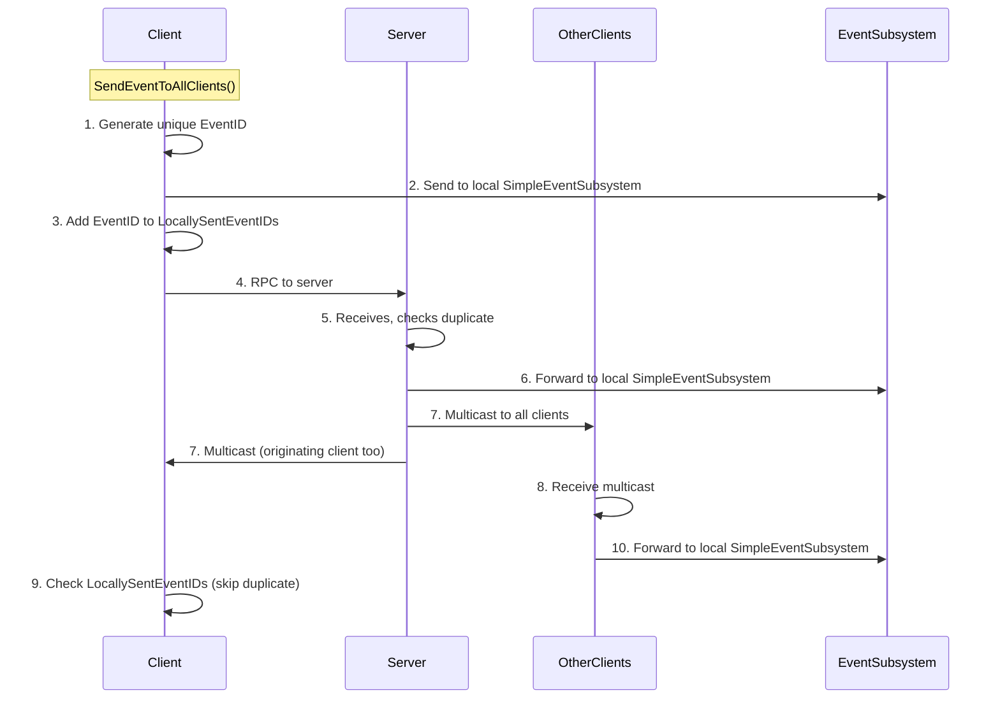

### USimpleAttributeHandler
**Location:** `Source/SimpleGameplayAbilitySystem/Components/SimpleAttributeComponent/AttributeHandler/SimpleAttributeHandler.h`
**Parent:** `UObject`
**Purpose:** Define how struct attributes are modified

**Key Methods:**
```cpp
// Override in Blueprint/C++
void ApplyModification_Implementation(
    FInstancedStruct& CurrentValue,
    const FInstancedStruct& ModificationData,
    FGameplayTagContainer& ModificationTags);
```

**Use Case:**
Struct attributes can hold complex data (inventory, status effects, combat state). Handlers encapsulate the logic for safely updating these structs.

**Example:**
```cpp
USTRUCT()
struct FInventoryAttribute
{
    TMap<FGameplayTag, int32> ItemCounts;
};

UCLASS()
class UInventoryAttributeHandler : public USimpleAttributeHandler
{
    virtual void ApplyModification_Implementation(
        FInstancedStruct& CurrentValue,
        const FInstancedStruct& ModificationData,
        FGameplayTagContainer& ModificationTags) override
    {
        FInventoryAttribute* Inventory = CurrentValue.GetMutablePtr<FInventoryAttribute>();
        const FInventoryModification* Mod = ModificationData.GetPtr<FInventoryModification>();

        if (Inventory && Mod)
        {
            Inventory->ItemCounts.FindOrAdd(Mod->ItemTag) += Mod->Amount;

            if (Mod->Amount > 0)
                ModificationTags.AddTag(FGameplayTag::RequestGameplayTag("Modification.ItemAdded"));
            else
                ModificationTags.AddTag(FGameplayTag::RequestGameplayTag("Modification.ItemRemoved"));
        }
    }
};
```

---

## Data Assets

### USimpleAbilitySet
**Location:** `Source/SimpleGameplayAbilitySystem/DataAssets/AbilitySet/SimpleAbilitySet.h`
**Parent:** `UDataAsset`
**Purpose:** Bundle abilities for batch granting

**Properties:**
```cpp
TArray<TSubclassOf<USimpleGameplayAbility>> AbilitiesToGrant;
```

**Usage:**
1. Create AbilitySet asset in editor
2. Add abilities to `AbilitiesToGrant` array
3. Assign to `SimpleGameplayAbilityComponent.AbilitySets`
4. On BeginPlay, component auto-grants all abilities

**Use Cases:**
- Character classes: WarriorAbilitySet, MageAbilitySet
- Item loadouts: SwordAbilitySet, BowAbilitySet
- Progression: Level1AbilitySet, Level2AbilitySet

### USimpleAttributeSet
**Location:** `Source/SimpleGameplayAbilitySystem/DataAssets/AttributeSet/SimpleAttributeSet.h`
**Parent:** `UDataAsset`
**Purpose:** Bundle attributes for initialization

**Properties:**
```cpp
TArray<FFloatAttribute> FloatAttributes;
TArray<FStructAttribute> StructAttributes;
```

**Usage:**
1. Create AttributeSet asset in editor
2. Define attributes (tags, initial values, limits)
3. Assign to `SimpleAttributeComponent.AttributeSets`
4. On BeginPlay, component initializes attributes

**Use Cases:**
- Character stats: HealthManaStaminaSet
- RPG attributes: StrengthDexterityIntelligenceSet
- Vehicle stats: SpeedArmorFuelSet

---

## Modifier Actions

### Creating Custom Actions

**1. In Blueprint:**
- Create Blueprint class inheriting from `ModifierAction`
- Override `CanApply()` - return true if requirements met
- Override `ApplyAction()` - do the work, return snapshot data
- Configure `EventTriggers` - when should this action fire?
- Set `PredictionPolicy` - can this be predicted?

**2. In C++:**
```cpp
UCLASS(BlueprintType, EditInlineNew)
class UMyCustomAction : public UModifierAction
{
    GENERATED_BODY()

public:
    UPROPERTY(EditAnywhere, BlueprintReadWrite)
    float CustomParameter;

    virtual bool SupportsClientPrediction_Implementation() const override
    {
        return true;  // This action is deterministic
    }

    virtual bool CanApply_Implementation() const override
    {
        // Check requirements
        return GetOwningModifier()->TargetAttributeComponent != nullptr;
    }

    virtual FInstancedStruct ApplyAction_Implementation() override
    {
        // Do the work
        USimpleAttributeModifier* Modifier = GetOwningModifier();
        USimpleAttributeComponent* Target = Modifier->TargetAttributeComponent;

        // Example: Spawn actor at target location
        AMyActor* SpawnedActor = SpawnActor(...);

        // Store result in scratchpad for other actions
        SetScratchPadValue(FGameplayTag::RequestGameplayTag("MyAction.Result"), 1.0f);

        // Return snapshot data for prediction
        FMyActionSnapshot Snapshot;
        Snapshot.SpawnedActorID = SpawnedActor->GetUniqueID();
        return FInstancedStruct::Make(Snapshot);
    }

    virtual void OnCancelAction_Implementation() override
    {
        // Cleanup: Destroy spawned actor
    }

    virtual void OnClientPredictedCorrection_Implementation(
        FAttributeModifierActionScratchPad ServerInputScratchPad,
        FInstancedStruct ServerResult,
        FAttributeModifierActionScratchPad ClientInputScratchPad,
        FInstancedStruct ClientResult) override
    {
        // Compare snapshots, rollback if needed
        const FMyActionSnapshot* ServerSnapshot = ServerResult.GetPtr<FMyActionSnapshot>();
        const FMyActionSnapshot* ClientSnapshot = ClientResult.GetPtr<FMyActionSnapshot>();

        if (ServerSnapshot && ClientSnapshot)
        {
            if (ServerSnapshot->SpawnedActorID != ClientSnapshot->SpawnedActorID)
            {
                // Mismatch: Destroy client actor, use server's
            }
        }
    }
};
```

### Action Execution Order

Actions fire based on `EventTriggers`:
1. Default tag: `AttributeModifierApplied` (on initial application)
2. Custom tags: Any tag sent via `TriggerActionsForEvents()`
3. SimpleEventSubsystem events: If `SimpleEventTriggers` function matches event

**Example Modifier:**
```cpp
Modifier: "DamageOverTime"
Duration: SetDuration, 10 seconds
TickInterval: 1 second

Actions:
1. ChangeFloatAttributeAction (Health -= 5)
   EventTriggers: [AttributeModifierApplied, AttributeModifierTicked]

2. ActivateGameplayAbilityAction (PainVFXAbility)
   EventTriggers: [AttributeModifierApplied]

3. ApplyAttributeModifierAction (SlowModifier)
   EventTriggers: [AttributeModifierApplied]

Timeline:
T=0s: Modifier applied
  → Action 1 fires (damage)
  → Action 2 fires (VFX)
  → Action 3 fires (slow)
T=1s: Tick 1
  → Action 1 fires (damage)
T=2s: Tick 2
  → Action 1 fires (damage)
...
T=10s: Duration expires, modifier ends
```

---

## Event System

### Architecture

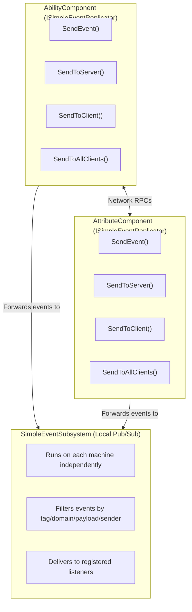

### Use Cases

**1. Ability-to-Ability Communication:**
```cpp
// Dash ability ends, notify other abilities
void UDashAbility::OnEnd_Implementation(...)
{
    FDashEndedEvent Event;
    Event.FinalLocation = GetAvatarActor()->GetActorLocation();

    GetAbilityComponent()->SendEventToAllClients(
        FGameplayTag::RequestGameplayTag("Ability.Dash.Ended"),
        FGameplayTag::RequestGameplayTag("Domain.Movement"),
        FInstancedStruct::Make(Event),
        this,
        {});
}

// Jump ability listens for dash end
void UJumpAbility::BeginPlay()
{
    FSimpleEventDelegate Delegate;
    Delegate.BindDynamic(this, &UJumpAbility::OnDashEnded);

    EventSubsystem->ListenForEvent(
        this,
        false,
        FGameplayTagContainer::CreateFromArray({DashEndedTag}),
        FGameplayTagContainer::CreateFromArray({MovementDomainTag}),
        Delegate,
        {FDashEndedEvent::StaticStruct()},
        {},
        true, true);
}

void UJumpAbility::OnDashEnded(FGameplayTag EventTag, FGameplayTag DomainTag, FInstancedStruct Payload, UObject* Sender)
{
    // Enable air-jump if dash just finished
    bCanAirJump = true;
}
```

**2. Modifier-to-Modifier Communication:**
```cpp
// Damage modifier sends event
Action: CustomModifierAction
{
    FDamageTakenEvent Event;
    Event.DamageAmount = FinalDamage;
    Event.DamageType = EDamageType::Fire;

    OwningModifier->InstigatorAttributeComponent->SendEventToAllClients(
        FGameplayTag::RequestGameplayTag("Event.DamageTaken"),
        FGameplayTag::RequestGameplayTag("Domain.Combat"),
        FInstancedStruct::Make(Event),
        OwningModifier,
        {});
}

// Shield modifier listens
Modifier: "Shield"
Actions:
{
    CustomModifierAction
    EventTriggers: [Event.DamageTaken]
    SimpleEventTriggers: nullptr

    ApplyAction()
    {
        // Reduce damage by shield amount
        // Cancel modifier if shield depleted
    }
}
```

**3. Game System Events:**
```cpp
// Weather system broadcasts
void UWeatherSystem::Tick()
{
    if (IsRaining())
    {
        FWeatherChangeEvent Event;
        Event.NewWeather = EWeatherType::Rain;

        EventSubsystem->SendEvent(
            WeatherChangedTag,
            EnvironmentDomainTag,
            FInstancedStruct::Make(Event),
            this,
            {});
    }
}

// Fire modifiers listen and cancel themselves
Modifier: "Burning"
Actions:
{
    CancelModifierAction
    EventTriggers: [Event.WeatherChanged]
    SimpleEventTriggers: "ShouldCancelBurn"  // Function checking if rain
}

bool ShouldCancelBurn(FGameplayTag EventTag, FGameplayTag DomainTag, FInstancedStruct Payload, UObject* Sender)
{
    const FWeatherChangeEvent* Event = Payload.GetPtr<FWeatherChangeEvent>();
    return Event && Event->NewWeather == EWeatherType::Rain;
}
```

---

## Blueprint Integration

### Key Metrics
- **144 BlueprintCallable functions** across 19 files
- **All major systems** fully exposed to Blueprints
- **Zero C++ required** for typical use cases

### Blueprint-Friendly Features

**1. Ability Creation:**
- Create Blueprint class inheriting from `SimpleGameplayAbility`
- Override `OnActivate` event
- Access `AbilityContext` to get activation data
- Call `EndAbility` or `CancelAbility` when done

**2. Modifier Creation:**
- Create Blueprint class inheriting from `SimpleAttributeModifier`
- Override `CanApplyModifier`, `OnPreApplyModifierActions`, etc.
- Add ModifierActions in details panel (instanced subobjects)
- Configure duration, tags, requirements

**3. Async Nodes:**
Located in `Source/SimpleGameplayAbilitySystem/AsyncActions/`

- `UWaitForSubAbility`: Wait for sub-ability to complete
- `UWaitForClientSubAbility`: Wait for client sub-ability
- `UWaitForGameplayTag`: Wait for tag to be added/removed
- `UWaitForFloatAttributeChange`: Wait for float attribute change
- `UWaitForStructAttributeChange`: Wait for struct attribute change
- `UWaitForSimpleEvent`: Wait for event from SimpleEventSubsystem

**Example Blueprint:**
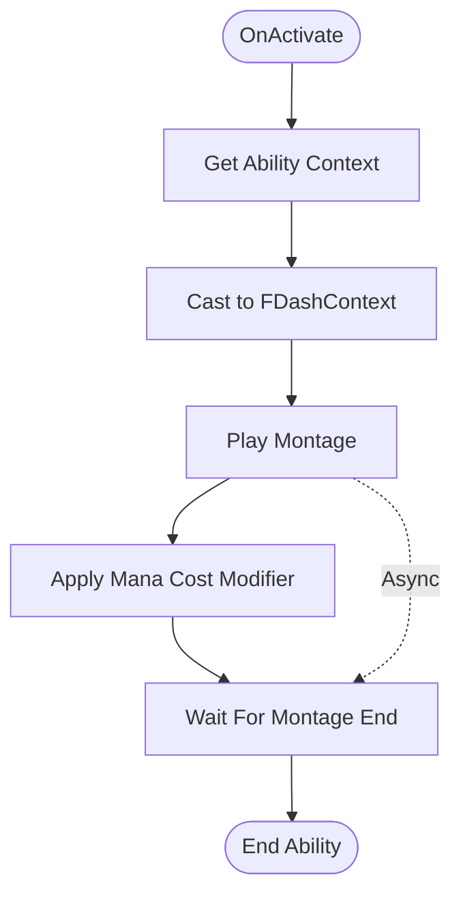

### Function Selectors

Blueprint-friendly function references for custom logic:

**1. For ModifierActions:**
- `Prototype_ShouldRespondToEvent`: Filter events
- `Prototype_GetCustomFloatInputValue`: Custom input values
- `Prototype_ApplyFloatAttributeOperation`: Custom operations

**2. Usage:**
```cpp
// In ChangeFloatAttributeAction
UPROPERTY(EditAnywhere, Category="Config", meta=(
    FunctionReference,
    AllowFunctionLibraries,
    PrototypeFunction="/Script/SimpleGameplayAbilitySystem.FunctionSelectors.Prototype_GetCustomFloatInputValue",
    DefaultBindingName="GetCustomInputValue"))
FMemberReference CustomInputFunction;
```

**3. In Blueprint:**
Create function matching signature:
```
Function: GetCustomInputValue
Inputs: Modifier (SimpleAttributeModifier), Context (InstancedStruct)
Output: float

Blueprint:
    Get Custom Input Value
        ↓
    [Get Context]
        ↓
    [Cast to FMyContext]
        ↓
    [Calculate complex value]
        ↓
    [Return float]
```

---

## Gameplay Debugger

### Activation

**Console Command:**
```
showdebug SGAS
```

**Keyboard:**
- `'` (apostrophe) - Toggle gameplay debugger
- Navigate categories with number keys

### Categories

**1. Ability Component (Category 0)**
- Lists all active abilities
- Shows AbilityID, Class, Status, NetworkRole
- Displays ActivationTimestamp, EndingTimestamp
- Shows ActivationContext and EndingContext
- Pagination: Next/Prev page

**2. Attribute Component (Category 1)**
- **View Mode 0: Float Attributes**
  - Tag, BaseValue, CurrentValue
  - Min/Max limits if enabled
- **View Mode 1: Struct Attributes**
  - Tag, StructType
  - Formatted struct contents (nested properties)
- **View Mode 2: Gameplay Tags**
  - Tag name, RefCount
- Pagination and view mode switching

**3. Attribute Modifier (Category 2)**
- Lists all active modifiers
- Shows ModifierID, Class, Duration info
- Displays Magnitude, TickCount
- Shows applied tags
- Stack group info

### Usage Example

```
1. PIE (Play In Editor)
2. Press ' (apostrophe)
3. Select actor with SGAS components
4. Press 0 for Ability Component
5. Press 1 for Attribute Component
6. Press 2 for Attribute Modifier
7. Navigate with category-specific hotkeys
```

**Debugging Workflow:**
```
Issue: "My ability isn't activating"

Steps:
1. showdebug SGAS
2. Category 0: Check if ability is in AuthorityAbilityStates
   - If not present: Check requirements (tags, CanActivate)
   - If present but wrong status: Check network role mismatch
3. Category 1: Verify required tags are present
   - View Mode 2: Check ActivationRequiredTags
4. Category 2: Check if blocking modifiers are active
```

---

## Common Patterns

### Component Placement

**Pattern 1: Persistent Attributes (Recommended for Players)**
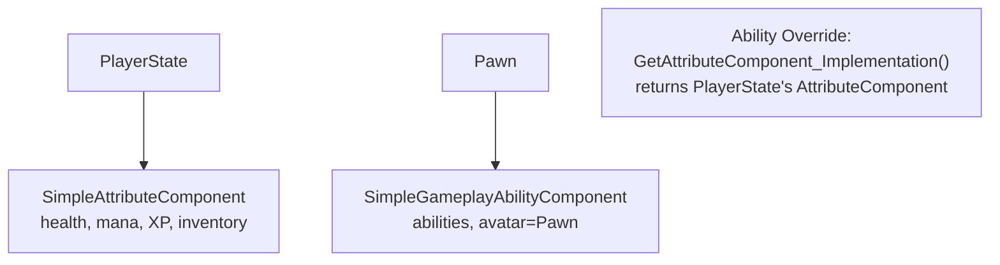

**Pros:**
- Attributes persist across pawn respawns
- Works with character swapping
- Clean separation of identity (PlayerState) and actions (Pawn)

**Cons:**
- Requires custom `GetAttributeComponent()` override
- Slightly more setup

**Pattern 2: Pawn-Centric (Simpler)**
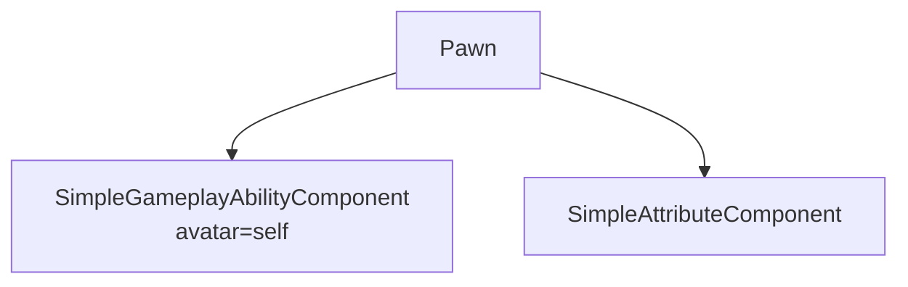

**Pros:**
- Simpler setup, no overrides needed
- Works great for AI, destructible objects, NPCs

**Cons:**
- Attributes destroyed when pawn dies
- Not suitable for player characters with respawn

**Pattern 3: Cosmetic Abilities**
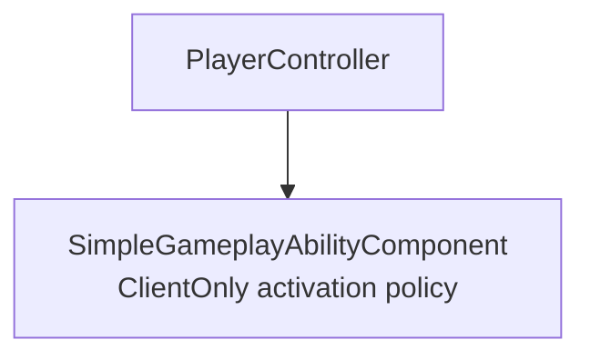

**Pros:**
- No replication overhead
- Perfect for UI abilities, camera effects, local audio

**Cons:**
- Can't interact with gameplay systems
- Client-only, no authority

### Ability Patterns

**Pattern 1: Simple Instant Ability**
```cpp
UCLASS()
class UFireballAbility : public USimpleGameplayAbility
{
    UPROPERTY(EditDefaultsOnly)
    TSubclassOf<AActor> ProjectileClass;

    UPROPERTY(EditDefaultsOnly)
    TSubclassOf<USimpleAttributeModifier> ManaCostModifier;

    virtual void OnActivate_Implementation(const FInstancedStruct& Context) override
    {
        // Apply mana cost
        FGuid ModifierID;
        GetAttributeComponent()->ApplyAttributeModifierToSelf(ModifierID, ManaCostModifier, 0, FInstancedStruct());

        // Spawn projectile
        FVector SpawnLocation = GetAvatarActor()->GetActorLocation() + GetAvatarActor()->GetActorForwardVector() * 100.0f;
        GetWorld()->SpawnActor<AActor>(ProjectileClass, SpawnLocation, GetAvatarActor()->GetActorRotation());

        // End immediately
        EndAbility(FGameplayTag(), FInstancedStruct());
    }
};
```

**Pattern 2: Duration Ability with Sub-Ability**
```cpp
UCLASS()
class UDashAbility : public USimpleGameplayAbility
{
    UPROPERTY(EditDefaultsOnly)
    TSubclassOf<USimpleSubAbility> DashMontageSubAbility;

    UPROPERTY(EditDefaultsOnly)
    float DashDistance;

    virtual void OnActivate_Implementation(const FInstancedStruct& Context) override
    {
        // Add blocking tag
        GetAttributeComponent()->AddGameplayTag(FGameplayTag::RequestGameplayTag("State.Dashing"));

        // Play montage via sub-ability
        EAbilityActivationResult Result;
        FDashMontageContext MontageContext;
        MontageContext.Montage = DashMontage;
        ActivateSubAbility(DashMontageSubAbility, FInstancedStruct::Make(MontageContext), Result);

        // Perform dash movement
        FVector DashTarget = GetAvatarActor()->GetActorLocation() + GetAvatarActor()->GetActorForwardVector() * DashDistance;
        // ... movement logic
    }

    virtual void OnEnd_Implementation(FGameplayTag EndStatus, FInstancedStruct EndContext) override
    {
        // Remove blocking tag
        GetAttributeComponent()->RemoveGameplayTag(FGameplayTag::RequestGameplayTag("State.Dashing"));
    }
};
```

**Pattern 3: Predicted Ability with Snapshot**
```cpp
UCLASS()
class UPredictedDashAbility : public USimpleGameplayAbility
{
    virtual void OnActivate_Implementation(const FInstancedStruct& Context) override
    {
        FVector StartLocation = GetAvatarActor()->GetActorLocation();

        // Perform dash
        FVector EndLocation = PerformDash();

        // Take snapshot for reconciliation
        FDashSnapshot Snapshot;
        Snapshot.StartLocation = StartLocation;
        Snapshot.EndLocation = EndLocation;
        Snapshot.DashTime = GetWorld()->GetTimeSeconds();

        TakeStateSnapshot(FInstancedStruct::Make(Snapshot), FOnSnapshotResolved::CreateUObject(this, &UPredictedDashAbility::OnSnapshotResolved));

        EndAbility(FGameplayTag(), FInstancedStruct());
    }

    void OnSnapshotResolved(FInstancedStruct AuthoritySnapshot, FInstancedStruct ClientSnapshot)
    {
        const FDashSnapshot* Server = AuthoritySnapshot.GetPtr<FDashSnapshot>();
        const FDashSnapshot* Client = ClientSnapshot.GetPtr<FDashSnapshot>();

        if (!Server || !Client) return;

        // Check mismatch
        if (!Server->EndLocation.Equals(Client->EndLocation, 50.0f))
        {
            // Rollback: Teleport to server position
            GetAvatarActor()->SetActorLocation(Server->EndLocation);

            // Optional: Play correction VFX
        }
    }
};
```

### Modifier Patterns

**Pattern 1: Instant Damage**
```
Modifier: "InstantDamage"
DurationType: Instant
ModifierMagnitude: (passed at application time)

Actions:
1. ChangeFloatAttributeAction
   - AttributeToModify: Health.Current
   - ModificationInputValueSource: FromMagnitude
   - ModificationOperation: Subtract
   - EventTriggers: [AttributeModifierApplied]
```

**Pattern 2: Damage Over Time**
```
Modifier: "Poison"
DurationType: SetDuration
Duration: 10 seconds
TickInterval: 1 second
TemporarilyAppliedTags: [StatusEffect.Poison]

Actions:
1. ChangeFloatAttributeAction (Health -= 5)
   - EventTriggers: [AttributeModifierApplied, AttributeModifierTicked]
2. ActivateGameplayAbilityAction (PoisonVFXAbility)
   - EventTriggers: [AttributeModifierApplied]
```

**Pattern 3: Stacking Buff**
```
Modifier: "Rage"
DurationType: InfiniteDuration
bUseStackGroup: true
StackGroupTag: Buff.Rage
bHasMaxStacksInGroup: true
MaxStacksInGroup: 10
OverflowBehavior: DenyNew

Actions:
1. ChangeFloatAttributeAction (Damage multiplier)
   - AttributeToModify: DamageMultiplier.Current
   - ModificationInputValueSource: FromScratchPad
   - ScratchPadValueTag: Calculation.TotalStacks
   - ModificationOperation: Add
   - EventTriggers: [AttributeModifierApplied]

OnPreApplyModifierActions (Blueprint):
{
    // Calculate damage bonus based on stack count
    int32 StackCount = TargetAttributeComponent->GetModifierStackCountInGroup(StackGroupTag);
    float Bonus = StackCount * 0.05f;  // 5% per stack
    SetScratchPadValue("Calculation.TotalStacks", Bonus);
}
```

**Pattern 4: Conditional Modifier (Cleanse)**
```
Modifier: "Cleanse"
DurationType: Instant
TargetRequiredTags: []  // No requirements

Actions:
1. CancelModifierAction
   - FilterType: ByTags
   - ModifierTagsToCancel: [StatusEffect.Debuff]
   - CancellationTarget: Target
   - EventTriggers: [AttributeModifierApplied]
```

### Network Patterns

**Pattern 1: Client Input → Server Validation**
```
1. Client presses button
2. Client→Server: Input RPC (lightweight, just button press)
3. Server validates: ActivateAbilityServerInitiated()
4. Server→Client: Replicate ability activation
5. Client plays VFX/SFX
```

**Use:** Turn-based games, actions with server-side RNG, anti-cheat critical actions

**Pattern 2: Client Prediction → Server Correction**
```
1. Client presses button
2. Client: ActivateAbilityPredicted() (instant local feedback)
3. Client→Server: RPC with ability ID + context
4. Server: Validate and activate
5. Server→Client: Replicate snapshot
6. Client: Compare snapshot, rollback if needed
```

**Use:** Movement abilities, attacks, instant feedback required

**Pattern 3: Local Only**
```
1. Client presses button
2. Client: ActivateAbility() (local only)
3. No network traffic
```

**Use:** UI abilities, cosmetic effects, single-player

### Debugging Patterns

**Pattern 1: Add Debug Logging**
```cpp
virtual void OnActivate_Implementation(const FInstancedStruct& Context) override
{
    UE_LOG(LogTemp, Warning, TEXT("[%s] Ability activated on %s, NetworkRole: %d"),
        *GetName(),
        HasAuthority() ? TEXT("Server") : TEXT("Client"),
        (int32)GetNetworkRole());

    // Your logic
}
```

**Pattern 2: Use Event Dispatchers**
```cpp
// In Blueprint
OnActivationSuccess.AddDynamic(this, &UMyClass::HandleAbilityActivated);

void UMyClass::HandleAbilityActivated(USimpleAbilityBase* AbilityInstance)
{
    UE_LOG(LogTemp, Warning, TEXT("Ability activated: %s"), *AbilityInstance->GetClass()->GetName());
}
```

**Pattern 3: Gameplay Debugger**
```
1. showdebug SGAS
2. Check Category 0: Is ability in AuthorityAbilityStates?
3. Check Category 1: Do I have required tags?
4. Check Category 2: Are blocking modifiers active?
```

---

## File Navigation

### Quick Reference Map

**Core Abilities:**
- Base class: `Source/SimpleGameplayAbilitySystem/SimpleAbility/SimpleAbilityBase/SimpleAbilityBase.h`
- Gameplay ability: `Source/SimpleGameplayAbilitySystem/SimpleAbility/SimpleGameplayAbility/SimpleGameplayAbility.h`
- Sub-ability: `Source/SimpleGameplayAbilitySystem/SimpleAbility/SimpleSubAbility/SimpleSubAbility.h`
- Types/enums: `Source/SimpleGameplayAbilitySystem/SimpleAbility/SimpleAbilityTypes.h`

**Components:**
- Ability component: `Source/SimpleGameplayAbilitySystem/Components/SimpleGameplayAbilityComponent/SimpleGameplayAbilityComponent.h`
- Attribute component: `Source/SimpleGameplayAbilitySystem/Components/SimpleAttributeComponent/SimpleAttributeComponent.h`
- Attribute types: `Source/SimpleGameplayAbilitySystem/Components/SimpleAttributeComponent/SimpleAttributeComponentTypes.h`
- Time synchronizer: `Source/SimpleGameplayAbilitySystem/Components/SimpleTimeSynchronizerComponent/SimpleTimeSynchronizer.h`

**Modifiers:**
- Modifier base: `Source/SimpleGameplayAbilitySystem/Components/SimpleAttributeComponent/SimpleAttributeModifier/SimpleAttributeModifier.h`
- Modifier types: `Source/SimpleGameplayAbilitySystem/Components/SimpleAttributeComponent/SimpleAttributeModifier/SimpleAttributeModifierTypes.h`
- Attribute handler: `Source/SimpleGameplayAbilitySystem/Components/SimpleAttributeComponent/AttributeHandler/SimpleAttributeHandler.h`

**Modifier Actions:**
- Base action: `Source/SimpleGameplayAbilitySystem/Components/SimpleAttributeComponent/SimpleAttributeModifier/ModifierActions/Base/ModifierAction.h`
- Action types: `Source/SimpleGameplayAbilitySystem/Components/SimpleAttributeComponent/SimpleAttributeModifier/ModifierActions/ModifierActionTypes.h`
- Change float: `Source/.../ModifierActions/ChangeFloatAttributeAction/ChangeFloatAttributeAction.h`
- Change struct: `Source/.../ModifierActions/ChangeStructAttributeAction/ChangeStructAttributeAction.h`
- Activate ability: `Source/.../ModifierActions/ActivateGameplayAbilityAction/ActivateGameplayAbilityAction.h`
- Apply modifier: `Source/.../ModifierActions/ApplyAttributeModifierAction/ApplyAttributeModifierAction.h`
- Cancel ability: `Source/.../ModifierActions/CancelAbilityAction/CancelAbilityAction.h`
- Cancel modifier: `Source/.../ModifierActions/CancelModifierAction/CancelModifierAction.h`

**Events:**
- Event subsystem: `Source/SimpleGameplayAbilitySystem/SimpleEventSubsystem/SimpleEventSubsystem.h`
- Event types: `Source/SimpleGameplayAbilitySystem/SimpleEventSubsystem/SimpleEventTypes.h`
- Event replicator interface: `Source/SimpleGameplayAbilitySystem/Interfaces/SimpleEventReplicator.h`

**Data Assets:**
- Ability set: `Source/SimpleGameplayAbilitySystem/DataAssets/AbilitySet/SimpleAbilitySet.h`
- Attribute set: `Source/SimpleGameplayAbilitySystem/DataAssets/AttributeSet/SimpleAttributeSet.h`

**Async Actions:**
- Wait for sub-ability: `Source/SimpleGameplayAbilitySystem/AsyncActions/WaitForSubAbility/WaitForSubAbility.h`
- Wait for client sub-ability: `Source/SimpleGameplayAbilitySystem/AsyncActions/WaitForClientSubAbility/WaitForClientSubAbility.h`
- Wait for tag: `Source/SimpleGameplayAbilitySystem/AsyncActions/WaitForGameplayTag/WaitForGameplayTag.h`
- Wait for float attribute: `Source/SimpleGameplayAbilitySystem/AsyncActions/WaitForAttributeChange/FloatAttribute/WaitForFloatAttributeChange.h`
- Wait for struct attribute: `Source/SimpleGameplayAbilitySystem/AsyncActions/WaitForAttributeChange/StructAttribute/WaitForStructAttributeChange.h`
- Wait for event: `Source/SimpleGameplayAbilitySystem/SimpleEventSubsystem/WaitForSimpleEvent/WaitForSimpleEvent.h`

**Debugger:**
- Ability debugger: `Source/SimpleGameplayAbilitySystemDebugger/Public/GameplayDebuggerCategory_AbilityComponent.h`
- Attribute debugger: `Source/SimpleGameplayAbilitySystemDebugger/Public/GameplayDebuggerCategory_AttributeComponent.h`
- Modifier debugger: `Source/SimpleGameplayAbilitySystemDebugger/Public/GameplayDebuggerCategory_AttributeModifier.h`

**Utilities:**
- FastArray macros: `Source/SimpleGameplayAbilitySystem/UtilityClasses/FastArraySerializerMacros.h`
- Function selectors: `Source/SimpleGameplayAbilitySystem/BlueprintFunctionLibraries/FunctionSelectors/FunctionSelectors.h`
- Node helpers: `Source/SimpleGameplayAbilitySystem/BlueprintFunctionLibraries/NodeHelpers/NodeHelpers.h`
- Default tags: `Source/SimpleGameplayAbilitySystem/DefaultTags/DefaultTags.h`
- Interfaces: `Source/SimpleGameplayAbilitySystem/Components/Interfaces/SimpleAbilitySystemInterfaces.h`

**Editor:**
- Struct attribute customization: `Source/SimpleGameplayAbilitySystemEditor/Private/StructAttributeCustomization.cpp`

### Directory Structure

```
SimpleGameplayAbilitySystem/
├── Source/
│   ├── SimpleGameplayAbilitySystem/           (Runtime Module)
│   │   ├── SimpleAbility/
│   │   │   ├── SimpleAbilityBase/
│   │   │   ├── SimpleGameplayAbility/
│   │   │   ├── SimpleSubAbility/
│   │   │   └── SimpleAbilityTypes.h
│   │   ├── Components/
│   │   │   ├── SimpleGameplayAbilityComponent/
│   │   │   ├── SimpleAttributeComponent/
│   │   │   │   ├── SimpleAttributeModifier/
│   │   │   │   │   ├── ModifierActions/
│   │   │   │   │   │   ├── Base/
│   │   │   │   │   │   ├── ChangeFloatAttributeAction/
│   │   │   │   │   │   ├── ChangeStructAttributeAction/
│   │   │   │   │   │   ├── ActivateGameplayAbilityAction/
│   │   │   │   │   │   ├── ApplyAttributeModifierAction/
│   │   │   │   │   │   ├── CancelAbilityAction/
│   │   │   │   │   │   └── CancelModifierAction/
│   │   │   │   │   └── SimpleAttributeModifier.h
│   │   │   │   ├── AttributeHandler/
│   │   │   │   └── SimpleAttributeComponent.h
│   │   │   ├── SimpleTimeSynchronizerComponent/
│   │   │   └── Interfaces/
│   │   ├── DataAssets/
│   │   │   ├── AbilitySet/
│   │   │   └── AttributeSet/
│   │   ├── SimpleEventSubsystem/
│   │   │   ├── SimpleEventSubsystem.h
│   │   │   ├── SimpleEventTypes.h
│   │   │   └── WaitForSimpleEvent/
│   │   ├── AsyncActions/
│   │   │   ├── WaitForSubAbility/
│   │   │   ├── WaitForClientSubAbility/
│   │   │   ├── WaitForGameplayTag/
│   │   │   └── WaitForAttributeChange/
│   │   ├── BlueprintFunctionLibraries/
│   │   │   ├── FunctionSelectors/
│   │   │   └── NodeHelpers/
│   │   ├── Interfaces/
│   │   ├── UtilityClasses/
│   │   ├── DefaultTags/
│   │   └── Module/
│   ├── SimpleGameplayAbilitySystemEditor/     (Editor Module)
│   │   ├── Public/
│   │   │   ├── SimpleGameplayAbilitySystemEditor.h
│   │   │   └── StructAttributeCustomization.h
│   │   └── Private/
│   │       ├── SimpleGameplayAbilitySystemEditor.cpp
│   │       └── StructAttributeCustomization.cpp
│   └── SimpleGameplayAbilitySystemDebugger/   (Debugger Module)
│       ├── Public/
│       │   ├── SimpleGameplayAbilitySystemDebugger.h
│       │   ├── GameplayDebuggerCategory_AbilityComponent.h
│       │   ├── GameplayDebuggerCategory_AttributeComponent.h
│       │   └── GameplayDebuggerCategory_AttributeModifier.h
│       └── Private/
│           ├── SimpleGameplayAbilitySystemDebugger.cpp
│           ├── GameplayDebuggerCategory_AbilityComponent.cpp
│           ├── GameplayDebuggerCategory_AttributeComponent.cpp
│           └── GameplayDebuggerCategory_AttributeModifier.cpp
├── Content/                                    (Blueprint assets)
├── Config/                                     (Plugin config)
├── Resources/                                  (Icons, etc.)
└── SimpleGameplayAbilitySystem.uplugin        (Plugin descriptor)
```

### Finding Specific Functionality

**"I need to..."**

- **Create an ability**: Inherit from `USimpleGameplayAbility`, override `OnActivate()`
- **Create a modifier**: Inherit from `USimpleAttributeModifier`, add `ModifierActions`
- **Create a custom action**: Inherit from `UModifierAction`, override `ApplyAction()`
- **Listen for events**: Use `USimpleEventSubsystem::ListenForEvent()`
- **Send events across network**: Use `ISimpleEventReplicator::SendEventToAllClients()`
- **Add attributes at runtime**: Use `USimpleAttributeComponent::AddFloatAttribute()`
- **Create a data asset**: Right-click in Content Browser → Create Data Asset → Choose type
- **Debug abilities/attributes**: `showdebug SGAS` in console
- **Extend struct attributes**: Create `USimpleAttributeHandler` subclass
- **Wait for events in Blueprint**: Use `UWaitForSimpleEvent` async node
- **Customize editor UI**: Modify `StructAttributeCustomization.cpp`

---

## Advanced Topics

### Custom Time Synchronization

Override `GetTimeSynchronizerComponent()` in both AbilityComponent and AttributeComponent to use custom network time sync:

```cpp
USimpleTimeSynchronizer* UMyAbilityComponent::GetTimeSynchronizerComponent_Implementation()
{
    return MyGameState->CustomTimeSyncComponent;
}
```

Default implementation uses `GetWorld()->GetGameState()->GetServerWorldTimeSeconds()`.

### Extending Float Attribute Actions

Create custom input sources and operations:

**Custom Input:**
```cpp
UFUNCTION(BlueprintCallable)
static float GetCustomInputValue(USimpleAttributeModifier* Modifier, FInstancedStruct Context)
{
    const FMyContext* Ctx = Context.GetPtr<FMyContext>();
    return Ctx ? Ctx->CalculatedValue : 0.0f;
}
```

Bind in `ChangeFloatAttributeAction.CustomInputFunction`.

**Custom Operation:**
```cpp
UFUNCTION(BlueprintCallable)
static float CustomFloatOperation(float CurrentValue, float InputValue, USimpleAttributeModifier* Modifier)
{
    // Example: Exponential scaling
    return CurrentValue * FMath::Pow(1.1f, InputValue);
}
```

Bind in `ChangeFloatAttributeAction.FloatOperationFunction`.

### FastArraySerializer Deep Dive

All replicated state uses `FFastArraySerializer` for efficient delta compression:

**How it works:**
1. Server modifies array (add/remove/change items)
2. Unreal marks items dirty with `MarkItemDirty()` or `MarkArrayDirty()`
3. Replication: Only changed items sent to clients
4. Client receives delta: `PostReplicatedAdd()`, `PostReplicatedChange()`, `PreReplicatedRemove()` callbacks fire
5. Delegates bound to these callbacks notify component

**Custom FastArray Example:**
```cpp
USTRUCT()
struct FMyCustomItem : public FFastArraySerializerItem
{
    GENERATED_BODY()

    UPROPERTY()
    int32 MyData;

    void PreReplicatedRemove(const struct FMyCustomContainer& InArraySerializer);
    void PostReplicatedAdd(const struct FMyCustomContainer& InArraySerializer);
    void PostReplicatedChange(const struct FMyCustomContainer& InArraySerializer);
};

USTRUCT()
struct FMyCustomContainer : public FFastArraySerializer
{
    GENERATED_BODY()

    UPROPERTY()
    TArray<FMyCustomItem> Items;

    FOnMyCustomItemAdded OnItemAdded;

    void PostReplicatedAdd(const TArrayView<int32>& AddedIndices, int32 FinalSize)
    {
        for (int32 Index : AddedIndices)
            OnItemAdded.ExecuteIfBound(Items[Index]);
    }

    bool NetDeltaSerialize(FNetDeltaSerializeInfo& DeltaParms)
    {
        return FFastArraySerializer::FastArrayDeltaSerialize<FMyCustomItem, FMyCustomContainer>(Items, DeltaParms, *this);
    }
};

template<>
struct TStructOpsTypeTraits<FMyCustomContainer> : public TStructOpsTypeTraitsBase2<FMyCustomContainer>
{
    enum { WithNetDeltaSerializer = true };
};
```

### Prediction Edge Cases

**Race Condition: Snapshot Arrives Before Ability Activates**

Handled by `DeferredSnapshots` queue:
1. Client receives snapshot for ability not yet active
2. Snapshot added to `DeferredSnapshots`
3. When ability activates, `ProcessDeferredSnapshots()` checks queue
4. Matching snapshot applied retroactively

**Misprediction Handling:**

Client predicted wrong, server corrects:
1. Server snapshot arrives
2. `OnServerSnapshotReceived()` called
3. User delegate: `OnSnapshotResolved.Execute(AuthorityData, ClientData)`
4. User code compares values
5. If mismatch: Rollback client state, apply corrections

**Preventing Exploits:**

- Server always validates requirements (tags, CanActivate())
- Server snapshots are authoritative, client must reconcile
- Modifiers with server-side RNG use `ServerInitiate` policy
- Abilities with spawn logic use `ServerOnly` or `ServerInitiate`

### Modifier Action Event System

Actions can respond to multiple event types:

**1. Default Event (AttributeModifierApplied):**
Fires once when modifier first applies.

**2. Tick Event (AttributeModifierTicked):**
Fires each tick for duration modifiers.

**3. Custom Events via EventTriggers:**
```cpp
// In modifier action
EventTriggers = [Event.OnProjectileHit, Event.OnEnemyDeath]

// In ability/modifier
OwningModifier->TriggerActionsForEvents(FGameplayTagContainer::CreateFromArray({HitEventTag}));
```

**4. SimpleEventSubsystem Events via Function Filter:**
```cpp
// In modifier action
SimpleEventTriggers = "ShouldRespondToEvent"

// Blueprint function
bool ShouldRespondToEvent(FGameplayTag EventTag, FGameplayTag DomainTag, FInstancedStruct Payload, UObject* Sender)
{
    return EventTag.MatchesTag(FGameplayTag::RequestGameplayTag("Event.Weather")) && IsRaining();
}

// When SimpleEventSubsystem broadcasts Event.Weather.Rain
→ Function called
→ Returns true
→ Action fires
```

### Performance Considerations

**1. FastArrays are Efficient:**
- Only changed items replicate
- Bandwidth scales with change frequency, not array size
- 1000 abilities but only 1 activates = only 1 item replicated

**2. Prediction Reduces Perceived Lag:**
- Client-predicted abilities feel instant
- Server validation happens in background
- Rollbacks are rare if prediction logic matches server

**3. Event System Overhead:**
- Local events (SimpleEventSubsystem) are cheap
- Network events (ISimpleEventReplicator) use RPCs
- Use `ListenerFilter` to reduce unnecessary deliveries

**4. Optimization Tips:**
- Use `LocalOnly` activation for cosmetic abilities
- Batch modifier applications (apply multiple modifiers at once)
- Limit tick intervals for duration modifiers (1s instead of 0.1s)
- Use stack groups to limit modifier instances
- Prefer instant modifiers over duration when possible

---

## Glossary

**Ability**: Discrete gameplay action with lifecycle (OnActivate, OnEnd/Cancel)

**Attribute**: Replicated stat (float or struct) with event dispatching

**Modifier**: Bundle of attribute changes with duration and actions

**Action**: Individual operation within a modifier (damage, heal, etc.)

**Event**: Pub/sub message with optional network replication

**Snapshot**: Prediction state capture for reconciliation

**FastArray**: Efficient array replication via delta compression

**Scratchpad**: Shared memory between modifier actions

**Stack Group**: Grouping of modifier instances for reapplication logic

**Instancing Policy**: SingleInstance vs MultipleInstances

**Activation Policy**: LocalOnly, ClientPredicted, ServerInitiated, etc.

**Prediction Policy**: How actions handle prediction (PredictIfPossible, ServerInitiate, etc.)

**Context**: FInstancedStruct data passed to abilities/modifiers

**Domain**: Event categorization for filtering

**Avatar**: Actor abilities act upon (can differ from component owner)

**Replicator**: Interface for network event replication

**Handler**: Custom logic for struct attribute modification

---

## Additional Resources

| Resource | Link |
|----------|------|
| **Documentation** | https://straytrain.github.io/SimpleGameplayAbilitySystem/ |
| **GitHub** | https://github.com/strayTrain/SimpleGameplayAbilitySystem |
| **Issues** | https://github.com/strayTrain/SimpleGameplayAbilitySystem/issues |
| **Discussions** | https://github.com/strayTrain/SimpleGameplayAbilitySystem/discussions |  
