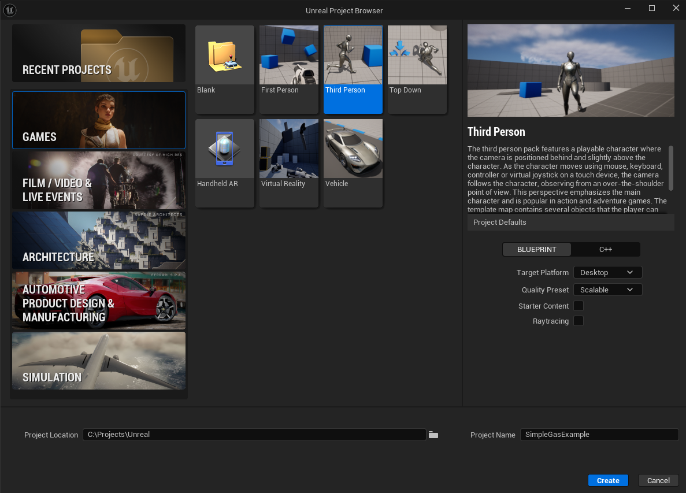
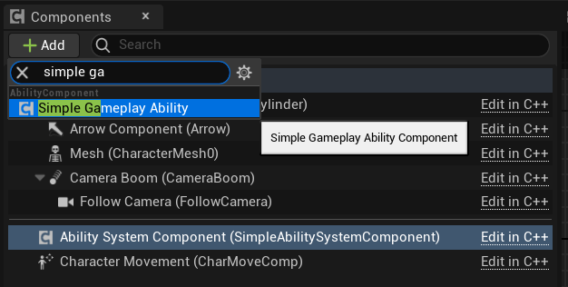
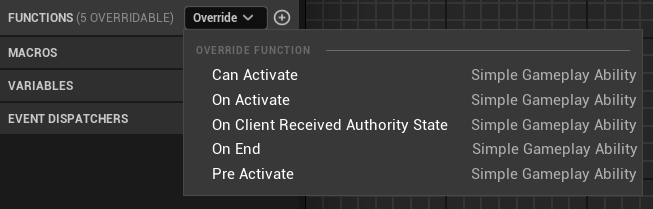
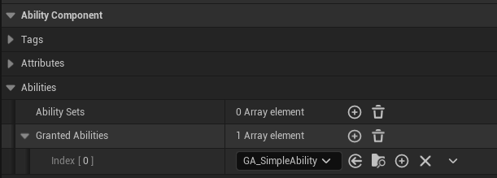
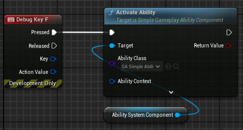

# Basic setup

For this example, we are going to use the third person template that comes with Unreal. 

The end result will be a non replicated ability that activates and writes a log to the screen.

## Setting up the ability component

To interact with SimpleGAS we need to use a **SimpleAbilityComponent**. Typically you add this to either the player pawn or the player controller but you can place the component on any actor that is able to be replicated.

Let's add the component to the player pawn:

Once added we can take a look at what we can modify on this component:

For this example, we're only going to focus on the **Abilities** section. 
We need to create an ability first, so lets do that and then return to the ability component setup.

## Creating an ability

Start by creating a new blueprint subclassed from **SimpleGameplayAbility**

Let's open the newly created ability and take a look at the class defaults:

Going from top to bottom:  
- **Activation Policy** defines how this ability is replicated.  
- **Instancing Policy** defines how we instance this ability. Instance meaning do we create a new ability object per execution of this ability or do we reuse a previously created instance for performance?  
- **Activation Required Tags** the owning ability component must have these tags in order for this ability to activate.  
- **Activation Blocking Tags** the owning ability component must NOT have these tags in order for this ability to activate.  
- **Require Grant To Activate** should the owning ability component be required to have this ability granted before this ability can activate?  
    - This is normally set to true but set to false in the case of non gameplay critical cosmetic abilities e.g. A hit reaction ability  
- **Ability Tags** A list of tags that can be used to identify this ability e.g. "AbilityTypes.Ranged", "AbilityTypes.Cosmetic" etc.  
This can be used later to cancel groups of abilities.  
    - 
- **Temporarily Applied Tags** these tags will be added to the owning ability component while this ability is activated and removed once it ends. e.g. We add a "PlayerStatus.Rooted" to signify that the player should not be able to move while this ability is active and as soon as the ability ends, the tag is removed and the player can move again.
- **Permanently Applied Tags** these tags are added to the owning ability component when this ability activates and stay even after the ability ends. These tags need to be manually removed at a later time.

We don't need to change any of these defaults for now. Let's move on to adding functionality by looking at what functions we're able to override:  

Explaining what they do in the order that they're called in:
- **CanActivate** A function you can implement that returns a boolean representing if this ability can be activated (this is an additional custom check on top of checking activation tag requirements)
- **PreActivate** Called if CanActivate returns true. Here you can place logic like resource cost modification e.g. Lower the players Energy attribute by 1 when this ability activates
- **OnActivate** The actual logic of the ability goes here.
- **OnEnd** Called when an ability is ended. You normally place cleanup logic here.
- **OnClientReceivedAuthorityState** Called when a predicted ability receives a state update from the server. We will ignore this for now.

Lets override **OnActivate** and **OnEnd** to implement our ability:  
  
  
Every ability needs to be ended explicitly. You can end an ability with **EndAbility**, **EndSuccess** and **EndCancel**. **EndSuccess** and **EndCancel** are simply wrappers for common ending status tags.  
When ending an ability, we can return an **EndStatus** tag as well as an **EndingContext** struct. This mechanism can be used to listen for abilities ending. We'll explore more of this in a later section.  

Now that we have out ability set up, let's activate it.  
The first step is to grant it to our ability component:  

Finally, we can activate our ability like so:  

and here is the result:  
