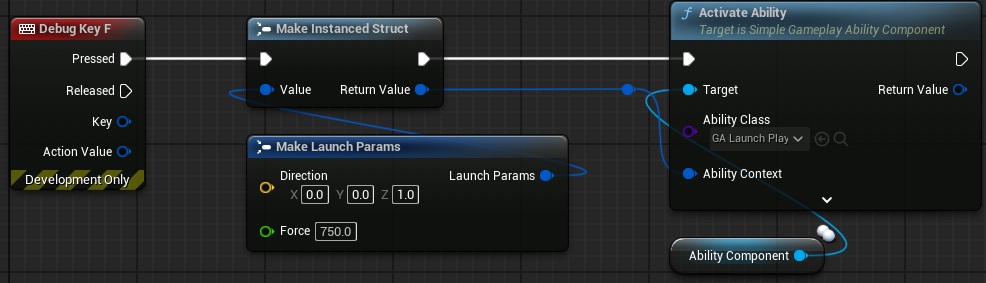
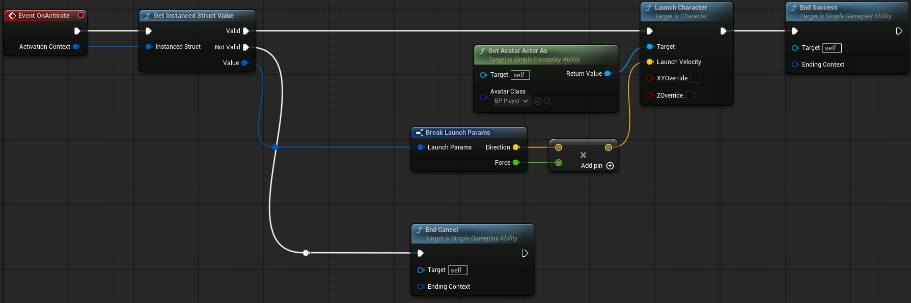
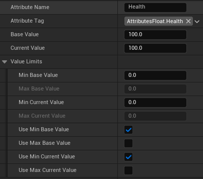
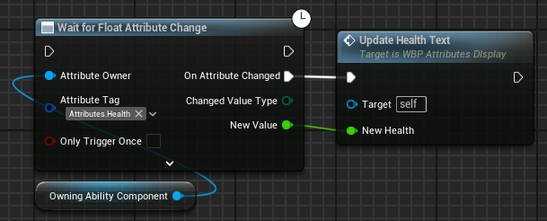

# Simple Gameplay Ability System (SimpleGAS)

[SimpleGAS](https://github.com/strayTrain/SimpleGameplayAbilitySystem) is a streamlined alternative to Epic's [**Gameplay Ability System (GAS)**](https://dev.epicgames.com/documentation/en-us/unreal-engine/gameplay-ability-system-for-unreal-engine) with a focus on developer experience and ease of understanding.

## Why Use SimpleGAS?

- **GAS** is powerful but comes with a steep learning curve, has a lot of boilerplate code and requires some knowledge of C++ to use.  
- **SimpleGAS** aims to be more accessible by allowing for purely blueprint based setup and operation. It has less features than **GAS** but in return is easier to use, understand and extend.

## Some problems that SimpleGAS can help you solve:

---

  
As you add more game mechanics, you find yourself with giant blueprints that do too many things

You can use a `SimpleAbility` to  break down your game mechanics into smaller, more manageable pieces.  
  * Abilities are reusable and can be combined to create more complex mechanics.
  * Abilities can take any struct as an input

e.g. Activating an ability which launches the player using a custom struct called LaunchParams

Inside the ability

  
You want to create status effects (like burning or stunned) that change gameplay stats like health

`SimpleGameplayAbilityComponent` supports **Attributes**. 
- An Attribute represents a stat like health, strength, stamina etc.
- Attributes are straightforward to set up:  
  
- There are two types of Attribute that you can create:
  - Float attributes to represent numerical stats  
  - Struct attributes which use an arbitrary struct to represent more complex stats  
- When attributes change they automatically send events which are easy to listen for.  
  - e.g. Setting up a widget to update the display of the player's health when the attribute changes  
    
- You can collect attributes into [data assets](https://dev.epicgames.com/documentation/en-us/unreal-engine/data-assets-in-unreal-engine) called **Attribute Sets** and reuse them between different `AbilityComponents`.

`SimpleGameplayAbilityComponent` also supports **Attribute Modifiers**.
- Attribute modifiers are a subtype of `SimpleGameplayAbility` can change multiple attributes at once.
- They can apply over time or instantly.
- They can also trigger side effects like activating abilities or applying more status effects. 

You can use attribute modifiers to achieve a wide range of effects:
- Apply a buff that increases the player's health and damage permanently.
- Deal damage to a target
  - If they have an attribute called `Armor`, reduce that value and if it drops below 0 reduce the leftover damage from `Health`.
  - If they don't have an `Armor` attribute, deal damage directly to `Health`.
- Deal damage to a target player
  - If they are blocking, reduce the incoming damage by a percentage.
  - If they are parrying, cancel the damage and apply a stun effect to the attacker instead.
- Apply a burning status effect that deals damage over 5 seconds.
  - When it is first applied it does 10 damage and then 2 damage every second for 5 seconds.
  - It adds fire particles to the target on application
  - When removed, the fire explodes, causing nearby targets to also burn.

  
You want to make a multiplayer game but aren't sure how to structure your code

- SimpleGAS was designed with multiplayer in mind and has built-in support for replication of Abilities, Attributes and Attribute Modifiers.
- Abilities and Attribute Modifiers also can be [client predicted](https://en.wikipedia.org/wiki/Client-side_prediction) allowing for a smooth experience even with high latency.
  - Abilities can take snapshots of their state (using arbitrary structs) which you can use to detect and fix differences between the client and server simulation.
    - This allows the client version of the ability to react immediately to player input while having a flexible way to correct any differences with the authoritative server version.
  - Attribute Modifiers can apply immediately on the client and then get automatically corrected if the server doesn't successfully apply them. e.g:
    - The client predicts a hit and applies a damage `AttributeModifier` which reduces the target's `Health` attribute and triggers a hit reaction ability.
    - The server decides the hit was blocked
    - As soon as the client receives the server's decision it reverts the `Health` attribute change (sending an event for the corrected value) and cancels the hit reaction ability.

---