# SimpleGAS: A More Approachable Gameplay Ability System

**SimpleGAS** is an alternative to Epic's Gameplay Ability System that focuses on developer experience. It's designed to be easier to understand while still giving you the tools to create complex gameplay mechanics.

## What problems does this plugin solve?

Imagine you're building a multiplayer game where characters can do special moves - maybe casting fireballs, teleporting, or healing teammates. Each of these abilities needs:

- A way to activate (button press, etc.)
- Rules for when it can be used (cooldowns, resource costs)
- Visual effects and animations
- Network synchronization

Without a system to orchestrate all this, you'd end up writing custom code for each ability leading to messy, duplicated logic scattered throughout your project.

[Epic's Gameplay Ability System (GAS)](https://dev.epicgames.com/documentation/en-us/unreal-engine/gameplay-ability-system-for-unreal-engine) provides a powerful framework for solving these problems but comes with a steep learning curve and a requirement that you can code a little bit of C++.    
SimpleGAS aims to provide much of the same functionality as Epic's GAS but with full blueprint support and a more approachable design.

---

## Some highlight features:

Easily pass contextual information to abilities

You can pass any struct as context to abilities when activating them:  
  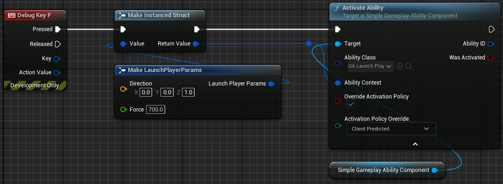  
Within the ability, you can access this context payload to make decisions about how the ability should behave:  
  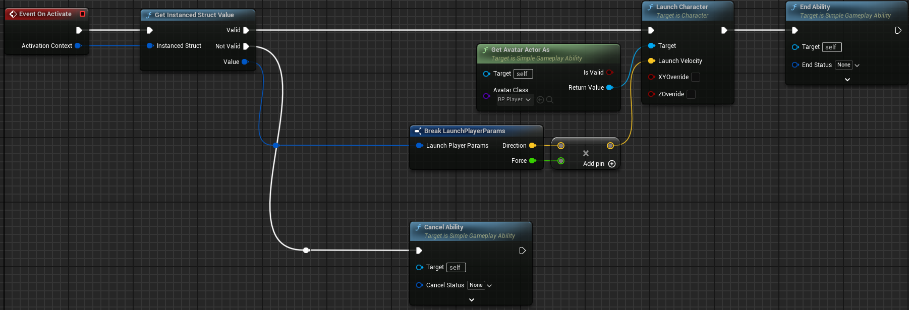

Client prediction with intuitive rollback

Abilities can be executed predictively on the client and then the prediction can be corrected if the server disagrees with the outcome.  

### How does it work?:  
  1. You create a struct that describes a snapshot of the ability state at the time of the ability activation: (I called my structs `S_HitResultSnapshot` and `S_HitResultSnapshotCollection` in the example below)  
    
  2. Within your ability, when you reach a point where the client and server need to agree on the outcome, you can take a snapshot of the ability's state using the struct you created earlier. Both the client and server version of the ability does this.
    
  3. The server then replicates the result of its snapshot to the client and if the client result differs from the server result, the correction callback function is run. In this function you can adjust the client state to match the server state.  
    

An event system to help you decouple your blueprints

SimpleGAS comes bundled with the [Simple Event Subsystem](https://github.com/strayTrain/SimpleEventSubsystemPlugin) plugin which allows you to send and receive events from almost anywhere in your game. The benefit of this is that you can have your blueprints communicate without needing to know about each other. This makes it easier to keep your code clean and organized.  

### How does it work?
You call the subsystem to send an event from one blueprint:   
  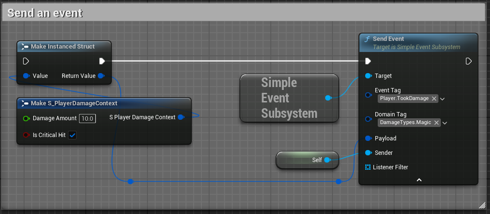  
And receive them in another (or the same) blueprint:   
  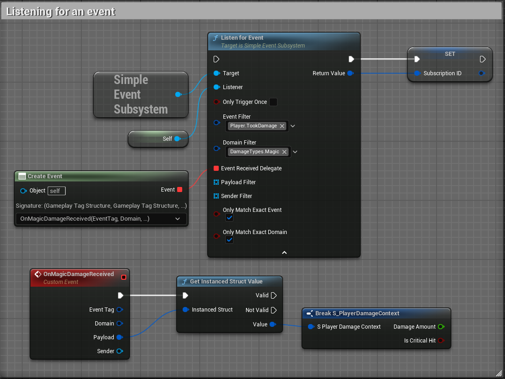

SimpleGAS makes use of this system to make it easy to react to [many different kinds of events](pages/event_reference/event_reference.html). For example, you can listen for when an an attribute changes.   
  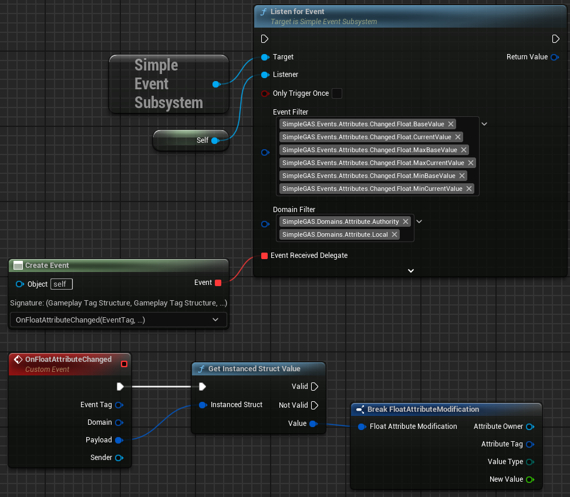

A replicated Attribute system that supports floats and structs

Attributes are defined fully in blueprints using a gameplay tag.  
Here's an example of a float attribute:  
    
And here's an example of a struct attribute:  
  

They're straightforward to update and automatically replicate and send events when they change.  
    
    

With a [bit of setup](pages/concepts/attributes/attributes.html#struct-attribute-handlers), you can even get automatic events for each member of a struct attribute that gets changed.  
  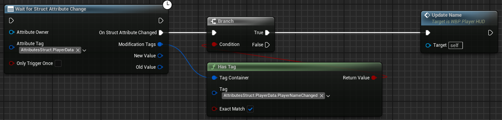

An Attribute Modifier system that helps you create complex status effects

Attributes Modifiers are SimpleGAS's version of Gameplay Effects. They allow you to modify multiple attributes at once and trigger side effects like activating cosmetic abilities, sending events or applying more modifiers.  

This is what an attribute modifier configuration looks like:  
  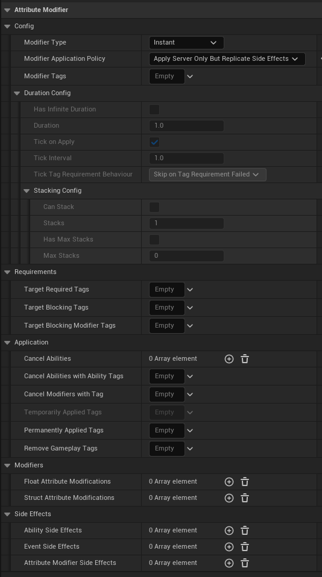

Attribute Modifiers come with overridable functions that allow you to run custom logic at various points in the modifier's lifecycle:  
  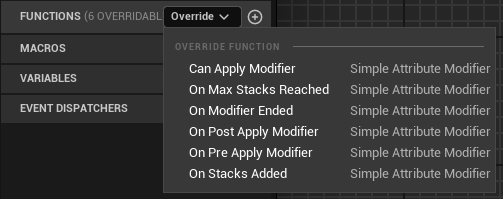

You can set up several common scenarios with minimal setup:  
1. Reduce the player's Armour by an amount and if the damage makes the Armour go below 0, remove the leftover damage from the Health attribute.  
  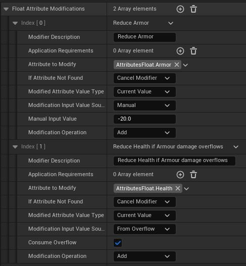
2. Use a custom calculation function to decide how much damage to apply.  
  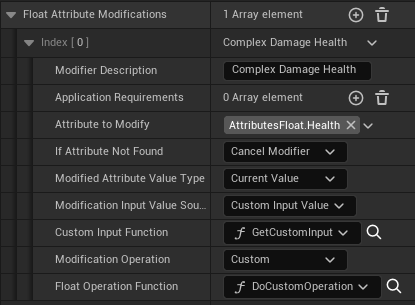  
  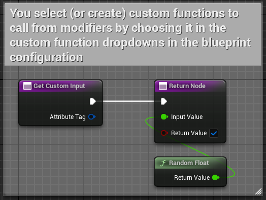  
  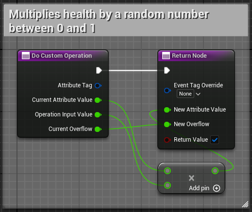
3. ... and more complicated setups like:
  - A melee damage modifier that applies damage and activates a knockback ability on the target but if they have a `PlayerStatus.Parrying` tag, activate the knockback on the instigator instead.  
  - A modifier that damages both the instigator and target if the target has a `PlayerStatus.DamageReflection` tag.
  - A damage over time modifier that applies a set amount of damage every second for a set duration and at the end of the duration, applies a big burst of damage for every stack of the modifier that was applied.

---