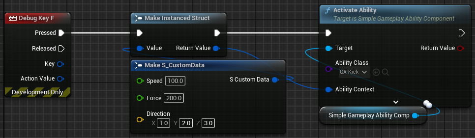

{: .warning }
These docs are a work in progress. If you have any questions or need help, please reach out on the repository's [Discussions](https://github.com/strayTrain/SimpleGameplayAbilitySystem/discussions) page.

# Simple Gameplay Ability System (SimpleGAS)

[SimpleGAS](https://github.com/strayTrain/SimpleGameplayAbilitySystem) provides an alternative to Unreal Engine's built-in [**Gameplay Ability System (GAS)**](https://dev.epicgames.com/documentation/en-us/unreal-engine/gameplay-ability-system-for-unreal-engine), focusing on developer experience and flexibility.

## Why Use SimpleGAS?

**GAS** is powerful but comes with a steep learning curve and requires a lot of boilerplate code to get started.  
**SimpleGAS** aims to streamline the process by allowing for purely blueprint based setup and operation.

## Some problems that SimpleGAS can help you solve:

  
As you add more game mechanics, you find yourself with giant blueprints that do too much

As you add more things that your player can do, your blueprint complexity goes up. This makes it trickier to refactor and and  causes headaches in teams where multiple people are trying to add new functionality in the Player blueprint at the same time.

You can create a `SimpleAbility` to add new functionality to your player. Each ability is it's own blueprint and has straightforward methods of activation and extension.

Abilities also support arbitrary structs as inputs. e.g. If you have a `LaunchPlayer` ability, you can pass in a struct containing info about the direction and force to launch the player with

  
You wish there was a unified way of managing gameplay stats like Health or Stamina

- You have some stats on your Player like Health or Stamina and the same stats on enemy characters. To change the Health value on a player or enemy you must either have them inherit from the same class or do some work figuring out which type of class you're dealing with in order to change the correct variable. 
  - SimpleGAS supports **Attributes** that can help you simplify this interaction. Add an AbilityComponent to an Actor, define some attributes for it and you're ready to go. 
  - **Attributes** support numerical values for common stats like Health, Stamina, Energy etc and also arbitrary structs for more complex stats
  - Attributes send events that you can easily listen for, simplifying your UI code 
  - **Attribute Sets** allow you to define several attributes at once in a reusable file. Player and Enemy actors both have Health and Stamina? Create one attribute set, assign it on their ability components and you're ready to go.

  
Chain reactions like attacking -> getting parried -> play animation are annoying to set up

  
You want to make a multiplayer game but it's confusing to structure your game for it

