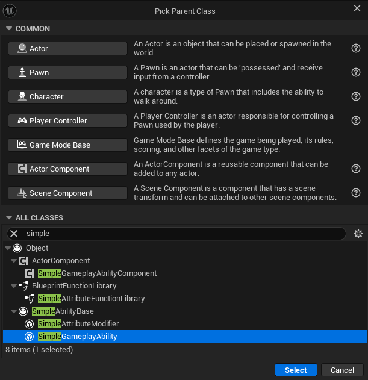
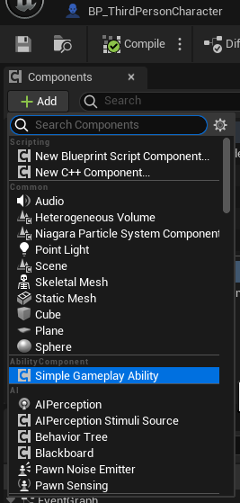
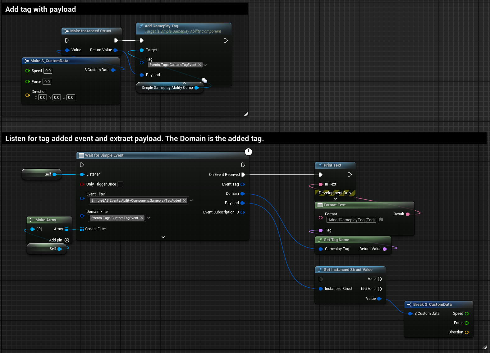
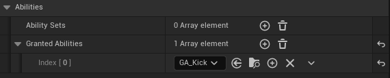
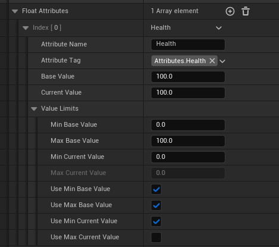

# Walkthrough

---

Let's implement the Kick ability example in full from the [High Level Overview](high_level_overview.html) using SimpleGAS.  

<video width="640" height="360" controls>
<source src="../videos/kick_result.mp4" type="video/mp4">
Your browser does not support the video tag.
</video>

To reiterate the what the ability does:
1. The ability is client predicted
2. We do a spinning kick
3. At the high point of the kick we do an overlap check in a sphere to see if we hit anything and apply a damage modifier to the hit actors
4. We take a snapshot of all the actors we hit and the modifier we applied to them
5. If we hit something on the client but it didn't hit on the server, we cancel the modifier we applied locally (which will also cancel the hit reaction animation)

## Creating the required blueprints

To start, we need to create the following blueprints:
1. A **SimpleGameplayAbility** subclass for the kick ability. I called it GA_Kick.
    
2. A **SimpleAttributeModifier** subclass for the damage modifier. I called it AM_KickDamage.
    

## Setting up the ability component
Add a **SimpleAbilityComponent** to the player pawn.  
    

Let's take a look at the component's class default variables and what they do:

### Tags
* These are replicated gameplay tags that are used to represent the "state" of the ability component. e.g. `PlayerState.Stunned`, `PlayerState.Dead`, etc.
* These are used by **abilities** and **attribute modifiers** to determine if they can be applied or not.  
e.g. *"Can I apply this damage modifier to the player if they are stunned?"*  
    * Another use case is checking for a tag like `PlayerState.MovementDisabled` in the pawn logic to determine if the player can move.  
    This is useful because a gameplay ability can apply and remove tags from the ability component i.e you can use tags to allow abilities to automatically stop the player from moving while the ability is running.
  
{: .tip }
You can use whatever naming scheme you want for your tags. I like to use `PlayerState.*` for the tags that represent the state of the player but any tag will work.  

* You can add and remove tags using the **AddGameplayTag** and **RemoveGameplayTag** functions.
    
* There is an optional pin for a payload. The reason this exists is that whenever a gameplay tag is added or removed, it sends a SimpleEvent that can be listened to by other blueprints. The payload is a way to send extra data with the event.
    
* When listening for the events the **EventTag** for an added tag is `SimpleGAS.Events.AbilityComponent.GameplayTagAdded` and for a removed tag is `SimpleGAS.Events.AbilityComponent.GameplayTagRemoved`
    * The **DomainTag** is the tag that was added or removed.  
  
### Abilities
    * **GrantedAbilities** are the abilities that this component can activate. They are an array of class references to **Gameplay Ability** blueprints.
        
    * **AbilitySets** are are an array of a `DataAsset` that defines a group of abilities to grant. This is useful when you have different ability components that can activate the same abilities.
    * To create an **AbilitySet** data asset, right-click in the content browser and go to `Create -> Miscellaneous -> Data Asset` for the data asset class select `Ability Set`
  
### Attributes
    * A **FloatAttribute** represents a single numerical value like Health, Stamina, Lives etc:
        