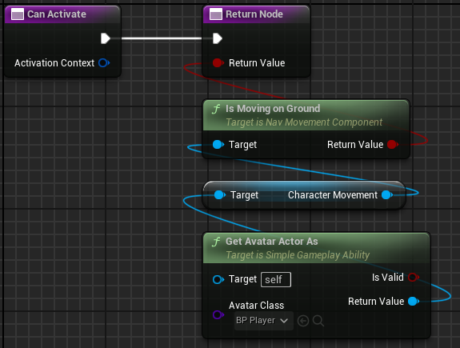
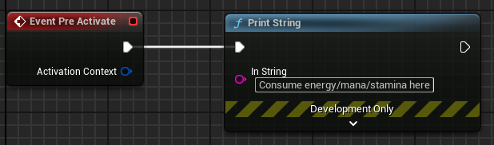
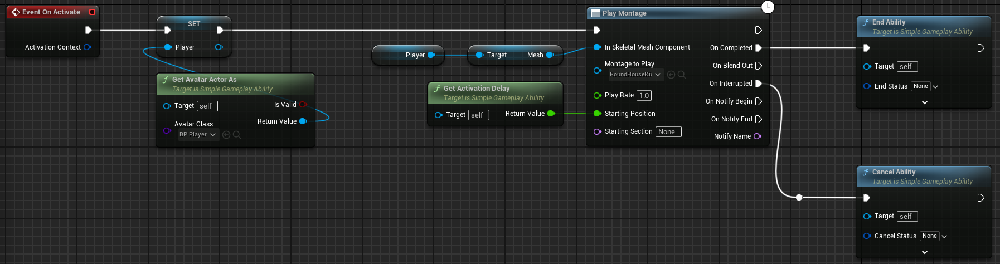
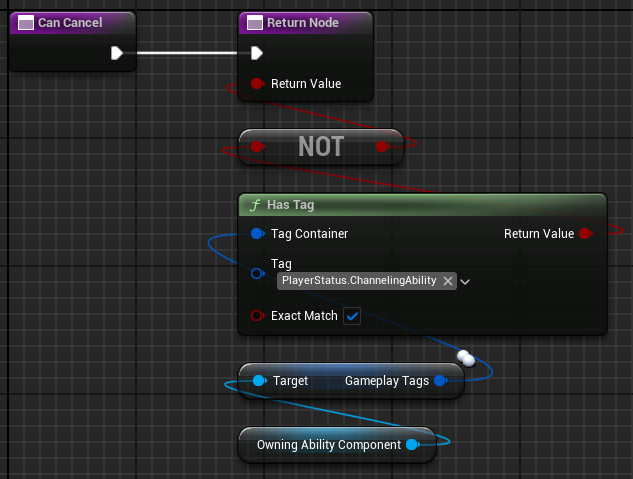
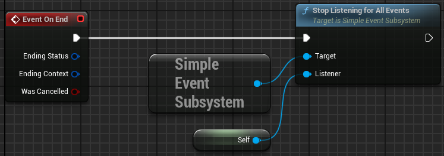

# Simple Gameplay Abilities

## Overview

Simple Gameplay Abilities are self-contained units of gameplay logic that define actions or behaviors in your game. They provide a structured way to implement discrete gameplay actions like attacks, spells, skills, or movement abilities.

  

    Table of contents
  

{: .no_toc .text-delta }

1. TOC
{:toc}

## Properties

| Name        | Type | Description |
|:-------------|:------------------|:------------------|
| CanTick | Bool | When enabled, the ability will receive OnTick events every frame. |
| ActivationPolicy | Enum | Controls where and how the ability can be activated:   - `LocalOnly`: Activates on client or server but doesn't replicate (best for single-player or cosmetic effects).   - `ClientOnly`: Only activates on clients (for client-side effects).   - `ServerOnly`: Only activates on server without replicating to clients.   - `ClientPredicted`: Client activates immediately then sends request to server; supports state snapshots and prediction.   - `ServerInitiatedFromClient`: Client requests activation, server runs first, then replicates to client.   - `ServerAuthority`: Only activates on server but replicates to clients. |
| InstancingPolicy | Enum | Controls ability instance management:   - `SingleInstance`: Only one instance exists; reused for each activation (better performance).   - `MultipleInstances`: New instance created for each activation (easier state management). |
| ActivationRequiredTags | GameplayTagContainer | Tags that must be present on the ability component for activation to succeed. |
| ActivationBlockingTags | GameplayTagContainer | Tags that will block the ability from activating if present on the ability component. |
| Cooldown | Float | Time in seconds before the ability can be activated again (0 = no cooldown). |
| RequiredContextType | UScriptStruct* | If set, ability will only activate if given an activation context of this struct type. |
| AvatarTypeFilter | TArray<TSubclassOf<AActor>> | Avatar actor must be one of these types for activation to succeed. If empty, any avatar type is allowed. |
| bRequireGrantToActivate | Bool | If true, the ability component must have this ability granted to it before activation. |
| AbilityTags | GameplayTagContainer | Tags that classify this ability (e.g., "Ability.Attack.Melee", "Ability.Movement.Dash"). |
| TemporarilyAppliedTags | GameplayTagContainer | Tags applied to the ability component when activated and automatically removed when the ability ends. |
| PermanentlyAppliedTags | GameplayTagContainer | Tags applied to the ability component when activated but not automatically removed when the ability ends. |

## Implementable Functions

These functions can be overridden in your ability blueprint to define its behavior.

### CanActivate

Use this function to add custom requirements for ability activation such as resource costs or state checks.

**Parameters:**

| Input | Type | Description |
|:-------------|:------------------|:------|
| ActivationContext | FInstancedStruct | The context data passed during activation attempt |

| Output | Type | Description |
|:-------------|:------------------|:------|
| Return Value | bool | True if the ability can activate, false otherwise |

**Example:**

### PreActivate

Called before OnActivate if CanActivate returns true. Use this for setup or to consume resources.

**Parameters:**

| Input | Type | Description |
|:-------------|:------------------|:------|
| ActivationContext | FInstancedStruct | The context data passed during activation |

**Example:**

### OnActivate

The main execution function for the ability. Define your ability's core behavior here.

**Parameters:**

| Input | Type | Description |
|:-------------|:------------------|:------|
| ActivationContext | FInstancedStruct | The context data passed during activation |

**Example:**

### OnTick

Called every frame while the ability is active if CanTick is true.

**Parameters:**

| Input | Type | Description |
|:-------------|:------------------|:------|
| DeltaTime | float | Time elapsed since the last frame |

### CanCancel

Check if the ability can be cancelled when requested.

**Parameters:**

| Output | Type | Description |
|:-------------|:------------------|:------|
| Return Value | bool | True if the ability can be cancelled, false otherwise |

**Example:**

### OnEnd

Called when the ability ends, either normally or through cancellation.

**Parameters:**

| Input | Type | Description |
|:-------------|:------------------|:------|
| EndingStatus | FGameplayTag | Tag indicating how the ability ended |
| EndingContext | FInstancedStruct | Context data for the ending |
| WasCancelled | bool | True if ended by cancellation, false if ended normally |

**Example:**

## Callable Functions

These functions can be called from within your ability blueprint.

### ActivateSubAbility

Activates another ability as a child of this ability.

**Parameters:**

| Input | Type | Description |
|:-------------|:------------------|:------|
| AbilityClass | TSubclassOf<USimpleGameplayAbility> | The class of the ability to activate |
| ActivationContext | FInstancedStruct | Context data to pass to the sub-ability |
| CancelIfParentEnds | bool | If true, sub-ability is cancelled when this ability ends |
| CancelIfParentCancels | bool | If true, sub-ability is cancelled when this ability is cancelled |
| SubAbilityActivationPolicy | ESubAbilityActivationPolicy | Controls how the sub-ability is replicated |

| Output | Type | Description |
|:-------------|:------------------|:------|
| Return Value | FGuid | The ID of the activated sub-ability |

### EndAbility

Ends the ability normally.

**Parameters:**

| Input | Type | Description |
|:-------------|:------------------|:------|
| EndStatus | FGameplayTag | Tag indicating why the ability ended |
| EndingContext | FInstancedStruct | Optional context data for ending |

### CancelAbility

Attempts to cancel the ability.

**Parameters:**

| Input | Type | Description |
|:-------------|:------------------|:------|
| CancelStatus | FGameplayTag | Tag indicating why the ability was cancelled |
| CancelContext | FInstancedStruct | Optional context data for cancellation |
| ForceCancel | bool | If true, bypasses the CanCancel check |

### SendEvent

Sends a gameplay event from this ability.

**Parameters:**

| Input | Type | Description |
|:-------------|:------------------|:------|
| EventTag | FGameplayTag | The main tag identifying the event |
| DomainTag | FGameplayTag | Secondary tag qualifying the event domain |
| EventContext | FInstancedStruct | Structured data for the event |
| ReplicationPolicy | ESimpleEventReplicationPolicy | Controls how the event replicates |

### GetAvatarActor

Gets the avatar actor for this ability.

**Parameters:**

| Output | Type | Description |
|:-------------|:------------------|:------|
| Return Value | AActor* | The avatar actor or null if none exists |

### GetAvatarActorAs

Gets the avatar actor cast to a specific type.

**Parameters:**

| Input | Type | Description |
|:-------------|:------------------|:------|
| AvatarClass | TSubclassOf<AActor> | The class to cast to |

| Output | Type | Description |
|:-------------|:------------------|:------|
| IsValid | bool | True if cast succeeded, false otherwise |
| Return Value | AActor* | The avatar actor cast to the requested type, or null if cast failed |

### ApplyAttributeModifierToTarget

Applies an attribute modifier to a target component.

**Parameters:**

| Input | Type | Description |
|:-------------|:------------------|:------|
| TargetComponent | USimpleGameplayAbilityComponent* | The component to apply the modifier to |
| ModifierClass | TSubclassOf<USimpleAttributeModifier> | The modifier class to apply |
| Context | FInstancedStruct | Context data for modifier application |

| Output | Type | Description |
|:-------------|:------------------|:------|
| ModifierID | FGuid | The ID of the applied modifier |

### IsAbilityActive

Checks if the ability is currently active.

**Parameters:**

| Output | Type | Description |
|:-------------|:------------------|:------|
| Return Value | bool | True if the ability is active, false otherwise |

### GetActivationTime

Gets the server time when this ability was activated.

**Parameters:**

| Output | Type | Description |
|:-------------|:------------------|:------|
| Return Value | double | The server timestamp when the ability was activated |

### GetActivationDelay

Gets the time difference between when this ability was activated and now.

**Parameters:**

| Output | Type | Description |
|:-------------|:------------------|:------|
| Return Value | double | Time elapsed since activation in seconds |

### GetActivationContext

Gets the context that was passed when activating this ability.

**Parameters:**

| Output | Type | Description |
|:-------------|:------------------|:------|
| Return Value | FInstancedStruct | The cached activation context |

### WasActivatedOnServer

Determines if this ability was activated on the server.

**Parameters:**

| Output | Type | Description |
|:-------------|:------------------|:------|
| Return Value | bool | True if activated on server, false otherwise |

### WasActivatedOnClient

Determines if this ability was activated on the client.

**Parameters:**

| Output | Type | Description |
|:-------------|:------------------|:------|
| Return Value | bool | True if activated on client, false otherwise |

### GetServerRole

Gets the current server role for this ability.

**Parameters:**

| Output | Type | Description |
|:-------------|:------------------|:------|
| Return Value | EAbilityServerRole | Either Server or Client depending on where the code is running |

