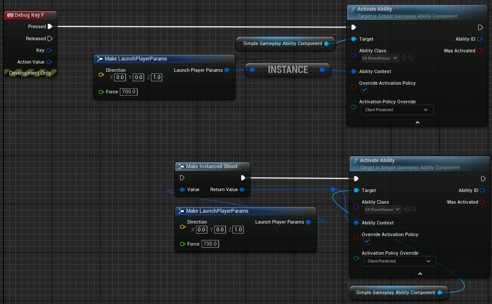
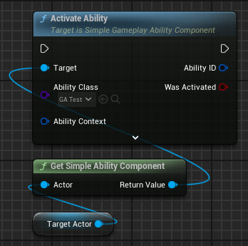
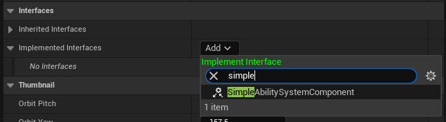
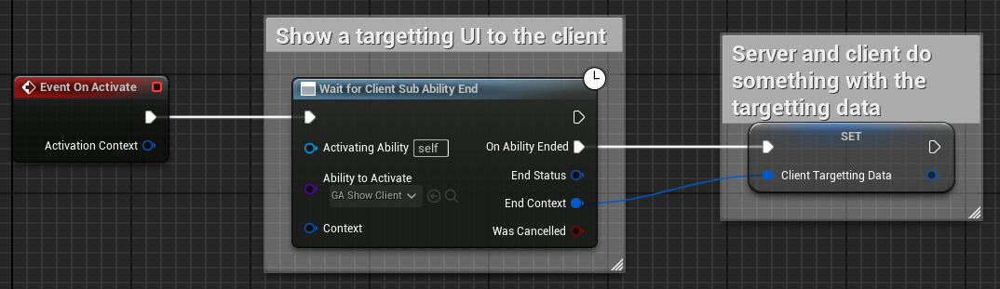
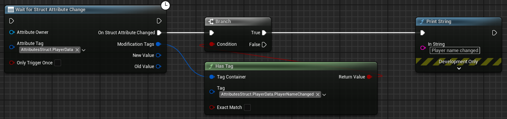
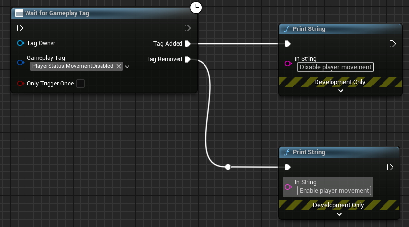

# Utility Nodes
{: .no_toc }

  

    Table of contents
  

{: .no_toc .text-delta }

1. TOC
{:toc}

## General Utility Nodes

### ToInstancedStruct

A pure style function that takes in a struct and returns an `FInstancedStruct` of that struct type. This can look a bit cleaner than using the `MakeInstancedStruct` node in some cases.

### ISimpleAbilitySystemComponent interface

This is an interface that you can implement on the actor that owns the `SimpleGameplayAbilityComponent`. It has a single function called `GetSimpleAbilitySystemComponent` that returns the `SimpleGameplayAbilityComponent` of the actor. This way, you don't need to get the component from the actor every time you want to use it.  
In addition, any function that requires a `SimpleGameplayAbilityComponent` as input can now take an actor as input instead and a `GetSimpleAbilitySystemComponent` node will be created automatically:  
    

To add this interface to your actor, go to the actor's class settings and add the `ISimpleAbilitySystemComponent` interface:  
    

## Abilities

### WaitForClientSubAbilityEnd

Activates a non replicated sub ability only on the client and waits for it to end before proceeding.
The server also waits for the client sub ability to end before proceeding and will receive the client data as well. 

Example use case:
- You have an ability that requires targeting a location.
- You want to show a targeting UI to the client but not on the server.
- You want to wait for the client to finish targeting before proceeding.

**Parameters:**

| Input | Type | Description |
|:-------------|:------------------|:------|
| AbilityToActivate | SimpleGameplayAbility class reference | The sub ability to activate |
| Context | FInstancedStruct | Context to pass to the ability |

| Output | Type | Description |
|:-------------|:------------------|:------|
| EndStatus | FGameplayTag | The status returned by the sub ability's `EndAbility` function |
| EndContext | FGameplayTag | The context by the sub ability's `EndAbility` function |
| WasCancelled | Bool | True if the sub ability was cancelled, false if ended normally. |

**Example:**

### WaitForServerSubAbilityEnd

Activates a non replicated sub ability only on the server and waits for it to end before proceeding.
The client also waits for the server sub ability to end before proceeding and will receive the server data as well. 

Example use case:
- You have an ability that can only be run on the server but the client needs to wait for it to finish before proceeding.

**Parameters:**

| Input | Type | Description |
|:-------------|:------------------|:------|
| AbilityToActivate | SimpleGameplayAbility class reference | The sub ability to activate |
| Context | FInstancedStruct | Context to pass to the ability |

| Output | Type | Description |
|:-------------|:------------------|:------|
| EndStatus | FGameplayTag | The status returned by the sub ability's `EndAbility` function |
| EndContext | FGameplayTag | The context by the sub ability's `EndAbility` function |
| WasCancelled | Bool | True if the sub ability was cancelled, false if ended normally. |

### WaitForLocalSubAbilityEnd

Activates a non replicated sub ability and waits for it to end before proceeding.
There is no result syncing between the server and client so this is best used for cosmetic local abilities or single player games.

Example use case:
- You want to wait for a sub ability (e.g. a `PlayMontage` ability) to finish before proceeding.

**Parameters:**

| Input | Type | Description |
|:-------------|:------------------|:------|
| AbilityToActivate | SimpleGameplayAbility class reference | The sub ability to activate |
| Context | FInstancedStruct | Context to pass to the ability |

| Output | Type | Description |
|:-------------|:------------------|:------|
| EndStatus | FGameplayTag | The status returned by the sub ability's `EndAbility` function |
| EndContext | FGameplayTag | The context by the sub ability's `EndAbility` function |
| WasCancelled | Bool | True if the sub ability was cancelled, false if ended normally. |

## Attributes

### WaitForFloatAttributeChange

Waits for a float attribute to change before proceeding. Useful for updating your UI or triggering events based on attribute changes.

**Parameters:**

| Input | Type | Description |
|:-------------|:------------------|:------|
| AttributeOwner | SimpleGameplayAbilityComponent object reference | The ability component we want to listen for changes on |
| AttributeTag | FGameplayTag | The float attribute tag we want to listen for changes for |
| OnlyTriggerOnce | Bool | If true once the attribute has changed once we stop listening. If false, we trigger whenever the attribute changes until the [listener is removed](../../concepts/event_system/event_subsystem.html#stopping-listening) |

| Output | Type | Description |
|:-------------|:------------------|:------|
| ChangedValueType | Enum | Represents which part of the float attribute changed. Options are:   - `CurrentValue`   - `BaseValue`   - `MaxCurrentValue`   - `MinCurrentValue`   - `MaxBaseValue`   - `MinBaseValue` |
| NewValue | Float | The new value of the float e.g. `ChangedValueType` = `CurrentValue` then `NewValue` = the new `CurrentValue` |

**Example:**

### WaitForStructAttributeChange

Waits for a struct attribute to change before proceeding. Useful for updating your UI or triggering events based on attribute changes.

**Parameters:**

| Input | Type | Description |
|:-------------|:------------------|:------|
| AttributeOwner | SimpleGameplayAbilityComponent object reference | The ability component we want to listen for changes on |
| AttributeTag | FGameplayTag | The struct attribute tag we want to listen for changes for |
| OnlyTriggerOnce | Bool | If true once the attribute has changed once we stop listening. If false, we trigger whenever the attribute changes until the [listener is removed](../../concepts/event_system/event_subsystem.html#stopping-listening) |

| Output | Type | Description |
|:-------------|:------------------|:------|
| ModificationTags | FGameplayTagContainer | Represents which member of the struct changed. This will only have data if the changed attribute uses a [`StructAttributeHandler`](../../concepts/attributes/attributes.html#struct-attribute-handlers) |
| NewValue | FInstancedStruct | The new value of the struct attribute |
| OldValue | FInstancedStruct | The value of the struct attribute before being modified |

**Example:**

## Gameplay Tags

### WaitForGameplayTag

Waits for a gameplay tag to be added or removed from a `GameplayAbilityComponent`.

**Parameters:**

| Input | Type | Description |
|:-------------|:------------------|:------|
| TagOwner | SimpleGameplayAbilityComponent object reference | The ability component we want to listen for tag changes on |
| GameplayTag | FGameplayTag | The tag we want to listen for changes for |
| OnlyTriggerOnce | Bool | If true once the tag has changed once we stop listening. If false, we trigger whenever the tag changes until the [listener is removed](../../concepts/event_system/event_subsystem.html#stopping-listening) |

There is no output for this node. It will trigger a `TagAdded` or `TagRemoved` exec pin.

**Example:**
