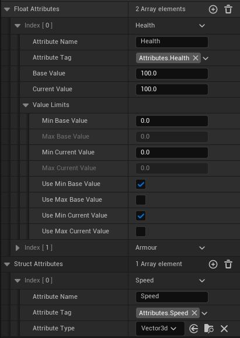
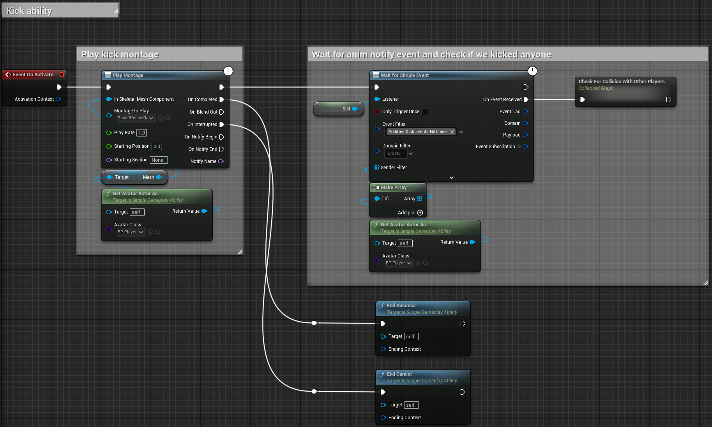
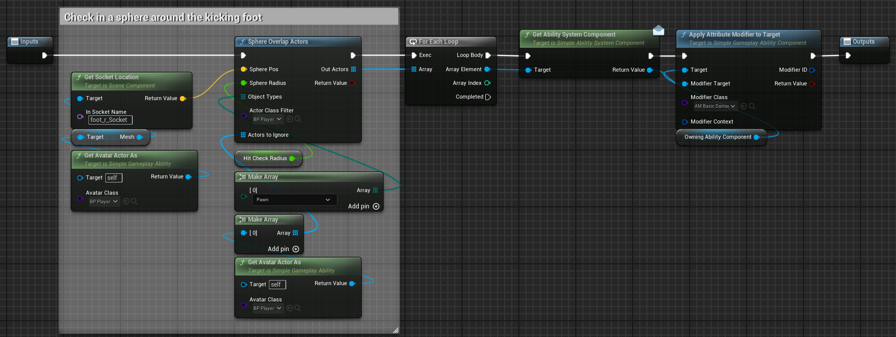
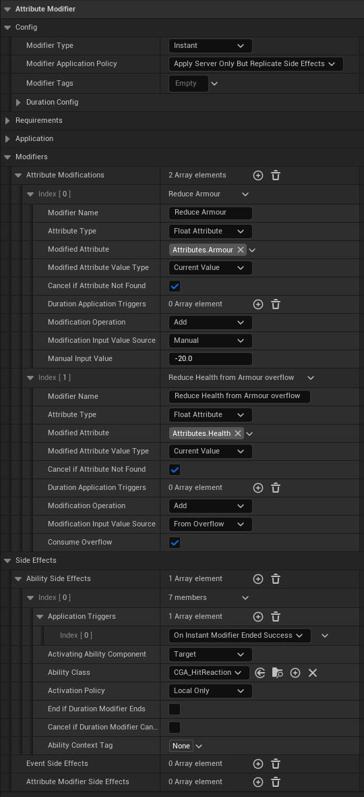
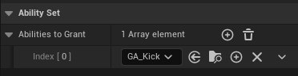

  
# What using SimpleGAS typically looks like

1. **Define attributes that the AbilityComponent has**
    * 
2. **Create an ability** that defines what happens when the ability is activated. 
    * A typical ability might be a player playing an attack animation, checking for a target and  modifying an attribute like Health using an **Instant** modifier on the target
    * 
    * Inside the collapsed graph  
        
    * Settings for `AM_BasicDamage`  
        
3. **Grant the ability** to the activating ability component
    * 
4. **Activate the ability** when the player presses a button or some other condition is met
    * 
5. **Outside of the ability**, you might have a a widget that listens for events about attributes changing (sent through the **SimpleAbilitySubsystem** automatically by the attribute modifier) and update the UI based on the player's health attribute
    * 
6. **Result**  
We deal 20 damage to the target. The damage first removes armor and then health. On successful application the target activates a cosmetic hit reaction ability.    
    <video width="640" height="360" controls>
    <source src="../videos/kick_result.mp4" type="video/mp4">
    Your browser does not support the video tag.
    </video>