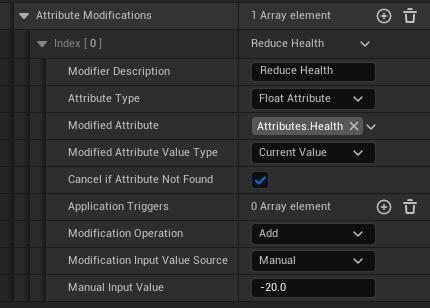
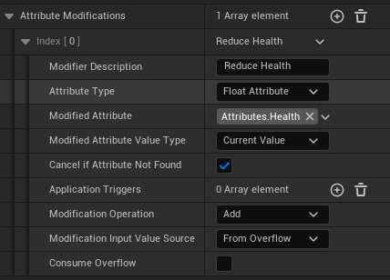
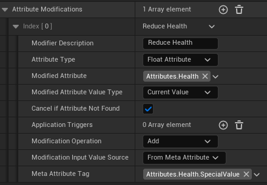

# Attribute Modifiers

Let's take a look at the `SimpleAttributeModifier` class. 

  
Config

* `Modifier Type` is an enum that determines how the modifier is applied. It has two options:
    * `Instant`
        * The modifier is applied immediately and then removed.
        * This is useful for one off effects like applying damage and then playing a hit reaction animation.
    * `Duration`
        * The modifier sticks around for a set amount or infinite amount of time.
        * This is useful for effects like applying a damage over time effect.
        * Duration modifiers support stacking and can be cancelled by other modifiers.
* `Modifier Application Policy` is an enum that controls how/if the modifier is replicated. There are three options:
    * `Apply Server Only`
        * The modifier is only applied on the server and will not apply in the client version of the ability.
        * This is useful for deterring cheating because the client won't run the code that applies the modifier.
        * Any `Side Effects` like activating abilities or sending events will only run on the server.
    * `Apply Server Only But Replicate Side Effects`
        * The modifier is only applied on the server but the side effects are replicated to the client. 
            * e.g. Only the server modifies health but upon replicating the `Attribute State` to the client, the client will activate any side effects like playing a hit reaction animation.
        * This is useful for effects that need to be seen by the client but not affect the game state.
    * `Apply Client Predicted`
        * The modifier is run on the client immediately assuming the server will allow it including applying `Side Effects`. 
            * If the server rejects the modifier, the client will rollback the modifier and cancel any running side effects.
        * This is useful for reducing perceived latency for the client.
* `ModifierTags` are tags that can be used to identify the modifier. 
    * These are useful for checking if a modifier is already applied to an attribute.
    * They behave similarly to the `AbilityTags` in the `SimpleGameplayAbility` class.
    * Similarly, there is a function on the `AbilityComponent` to cancel modifiers with matching tags
        

  
Duration Config

Modifiers have additional variables that are only editable when the `Modifier Type` is set to `Duration`.
Duration modifiers work like regularly repeating instant modifiers. Every time the modifier is applied it is referred to as a `tick`.

If your modifier is of type `Duration` you will have the following additional variables:  
* `HasInfiniteDuration` is a boolean that determines if the modifier has a set duration or sticks around until manually removed.
    * Enabling this will disable the `Duration` variable.
* `Duration` is how long the Duration type modifier will stick around for.
    * This is a float that represents the time in seconds.
* `TickOnApply` is a boolean that determines if the modifier should tick immediately upon application or wait until the next tick interval to start modifications
* `TickInterval` is a float that determines how often the modifier should tick.
    * This is a float that represents the time in seconds.
    * e.g. If you set this to 1, the modifier will tick every second. If the modifier `Duration` is 2.5 seconds it will tick 2 times if `TickOnApply` is false and 3 times if true.
* `TickTagRequirementBehavior` is an enum that determines how the modifier should behave if the modifiers' tag requirements are not met. The options are:
    * `SkipOnTagRequirementFailed` will skip the current tick but continue counting down the duration.
        * e.g. In a Duration modifier of 2 seconds with an interval of 1 second:
            1. You pass the tag requirements when the modifier was applied but then fail before the first tick.
            2. The first tick is skipped
            3. The blocking tag was removed in between the first and second tick 
            4. The second tick will apply the modifier.
            5. 2 seconds have passed and the modifier is removed.
    * `PauseOnTagRequirementFailed` will pause the modifier until the requirements are met.
        * This setting freezes the modifier until the requirements are met.
        * As a side effect, a modifier that is expected to last 2 seconds can last forever if the tick requirements are not met after application (but won't do anything).
    * `CancelOnTagRequirementFailed` will cancel the modifier if it fails tag requirements at any point
        * e.g. You have a burning modifier that periodically applies damage and has a tag requirement that the target doesn't have `PlayerStatus.Wet`. As soon as the target has this tag, the burning modifier will be removed.

  
Stacking Config

Duration modifiers support the concept of stacking. This means that if you apply the same modifier multiple times, the modifier will stack on top of itself.
This doesn't mean that a modifier with a stack count of 2 will apply the effect twice or have a longer duration. Rather there is a `Stacks` variable that you can use in your modifier logic.  
e.g. A burning effect that deals `1 + Stacks` damage per tick.
You add a stack by applying the modifier again with the same tag.

* `CanStack` is a boolean that determines if the modifier supports stacking.
    * If this is set to false, reapplying the modifier will refresh the duration instead of adding a stack.
* `Stacks` is an integer that represents the number of times the modifier has been applied.
    * This is the variable that you read from in your modifier logic to determine the effect of the modifier.
* `HasMaxStacks` is a boolean that determines if the modifier has a maximum number of stacks.
    * Enabling this will enable the `MaxStacks` variable.
* `MaxStacks` is an integer that represents the maximum number of stacks the modifier can have.
    * If the modifier reaches this number of stacks, it will not stack again.
    * When reaching max stacks, the modifiers' `OnMaxStacksReached` event is called (more on available events after the variables section).

  
Requirements

These determine if the modifier can be applied or not.

* `TargetRequiredTags` the target ability component of this modifier must have all of these tags to apply the modifier.
* `TargetBlockingTags` the target ability component of this modifier must NOT have any of these tags to apply the modifier.
* `TargetBlockingModifierTags` the target ability component of this modifier must NOT have an active duration modifier with these `ModifierTags` to apply the modifier.
    * e.g. If you want to make sure that only one `ModifierDamageType.Burning` modifier can be applied at a time, you would set this to `ModifierDamageType.Burning`.

  
Application

If the modifier passes the tag requirements:
* `CancelAbilities` is an array of class references to `SimpleGameplayAbility` blueprints.
    * This refers to abilities on the target ability component
    * These abilities will be cancelled.
* `CancelAbilitiesWithAbilityTags` will cancel abilities on the target ability component that have any of these tags.
* `CancelModifiersWithTags` will cancel any active Duration type modifiers running on the target ability component that have `ModifierTags` that match
* `TemporarilyAppliedTags` are tags that are temporarily added to the target ability component while the modifier is active.
    * This is disables for Instant type modifiers.
* `PermanentlyAppliedTags` are tags that are permanently added to the target ability component.
    * These tags need to be removed manually.
    * Supported by both Instant and Duration type modifiers.
* `RemoveTags` are tags that are removed from the target ability component.
    * Supported by both Instant and Duration type modifiers.

  
Modifiers

Modifiers are where the bulk of the work happens. These change the attributes on the target ability component.
The options shown to you in a modifier change depending on the type of attribute you are modifying.  

There are two types of modifiers:

Float Modifiers

The idea behind float modifiers is that they take an attribute and say: `Attribute = Attribute Operation InputValue`  
Where `Operation` is an enum that determines how the attribute will be changed and `Value` is the value that will be used in the operation.  
e.g `Health` = `Health` `Add` `FromAnotherAttribute`  
e.g `Health` = `Health` `Multiply` `0.5`  

* `ModifierDescription` is a cosmetic string that describes what the modifier does and displays it in the editor window. This field is optional
* `AttributeType` is an enum that determines what type of attribute you are modifying. In the above screenshot we set it to `Float Attribute`.
* `ModifiedAttribute` is a gameplay tag representing the attribute that you are modifying.
* `ModifiedAttributeValueType` determines which part of the `Float Attribute` you are changing. 
    * This option only appears when the `AttributeType` is set to `Float Attribute`.
    * The options are:
        * `BaseValue`
        * `CurrentValue`
        * `MaxCurrentValue`
        * `MaxBaseValue`
        * `MinCurrentValue`
        * `MinBaseValue`
* `CancelIfAttributeNotFound` is a boolean that determines if the modifier should cancel if the attribute is not found on the target ability component.
* `ApplicationTriggers` determines when this modifier will apply. The triggers are an array of an enum that represents different "phases" of the modifier application. 
    * If left empty it will apply every tick for a `Duration` or once for an `Instant` type modifier
    * These are a list of the phases:
        * `OnInstantModifierEndedSuccess`
        * `OnInstantModifierEndedCancel`
        * `OnDurationModifierInitiallyAppliedSuccess`
        * `OnDurationModifierEndedSuccess`
        * `OnDurationModifierEndedCancel`
        * `OnDurationModifierTickSuccess`
        * `OnDurationModifierTickCancel`
    * If your modifier is an `Instant` type modifier, the `OnDurationModifier` triggers will not be called.
    * If used in conjunction with Duration modifiers you can have effects like *when first applied do burst damage of 20 and then apply 5 damage every second for 4 seconds*.
* `ModificationOperation` is an enum that determines how the modifier will change the float attribute. The options are:
    * `Add`
    * `Multiply`
    * `Override`
    * There is no `Subtract` or `Divide` operation because you can achieve this by using negative values and reciprocals.
        * e.g. `Add -20` or `Multiply 0.5`
* `ModificationInputValueSource` determines where we get the input value from:
    * `Manual`
        * A hardcoded value. 
        * e.g. Health = `Health Add -20` to reduce health by 20
            
    * `FromOverflow`
        * If the previous modifier reduced an attribute beyond its minimum/maximum value, the overflow value is used.
        * e.g If you have 20 Armour with a min current value of 0 and you reduce it by 30, Armour get's clamped to 0 and the overflow value is set to -10.
        * So, if we're modifying `Health` after `Armour` and set the input source to `FromOverflow`, we add -10 to `Health`. 
            * If Armour was set to 30 instead of 20, the overflow value would be 0 and Health would effectively be untouched.
        * Using `FromOverflow` adds an extra option called `ConsumeOverflow`
            * Setting this to true will set the overflow to 0 after using it, even if there is overflow left over
            * e.g. `Shield = 10, Armour = 10, Health = 100`. You apply 50 damage to shield and the overflow if 40. You apply 40 damage to Armour and the overflow is 30 but because Armour has `ConsumeOverflow` set to true, the overflow is set to 0 afterwards and health is untouched.
        
    * `FromInstigatorAttribute`
        * The input value is a `Float Attribute` from the instigator ability component. If the attribute doesn't exist a value of 0 is used and a warning will get printed to the log.
    * `FromTargetAttribute`
        * The input value is a `Float Attribute` from the target ability component. If the attribute doesn't exist a value of 0 is used and a warning will get printed to the log.
    * `FromMetaAttribute`
        * You supply a gameplay tag and a function on the Modifier class is called to get the value. You can use this if you have complex calculations that need to be done to get the input value.
            
            

Struct Modifiers

Struct modifiers are simpler than Float modifiers but require blueprint code to work.

I'll skip the fields it shares with the Float modifier and focus on the unique one:
* `StructOperationTag` is a gameplay tag that represents what we want to do with the struct. e.g. `Attributes.Speed.AddBonus`
    * 

  
Side Effects

Side effects happen are non attribute related changes that happen alongside the modifier. There are three types of side effects:
* `AbilitySideEffects` are abilities that are activated as a part of the modifier
    * A common use case is applying a damage modifier and then activating a hit reaction ability.
* `EventSideEffects` are events that are sent as a part of the modifier through the `SimpleEventSubsystem`
* `AttributeModifierSideEffects` are attribute modifiers that are applied in addition to this one.
    * This is useful for chaining attribute modifiers together.

Like the `Modifiers` section from earlier we can choose what "phase" of the modifier application we want to trigger the side effect.  
So it's possible to have a modifier that, upon failing to apply to the target, can apply a different modifier to the instigator.  
e.g. A failed stun attempt by the instigator on the target applies a slow modifier to the instigator instead.

