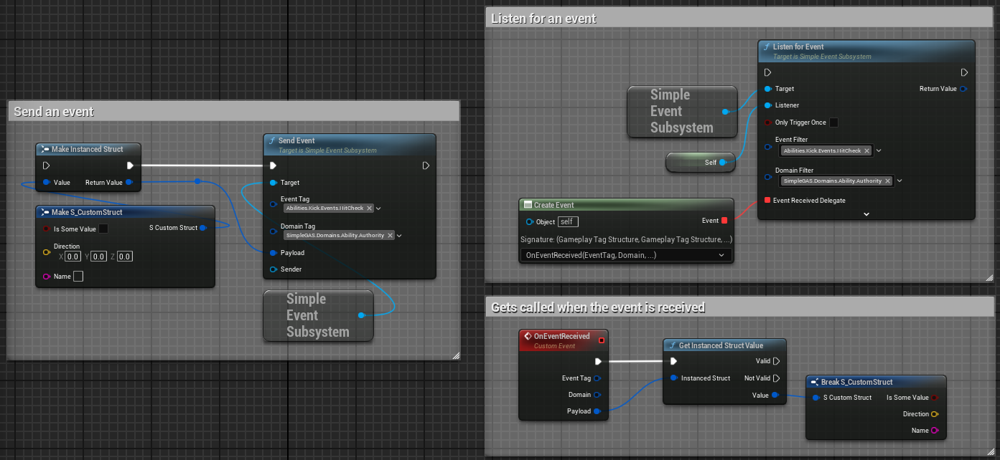

# Simple Event Subsystem

## What is the Simple Event Subsystem?

The Simple Event Subsystem is a powerful communication tool that lets different parts of your game talk to each other using gameplay tags. It's like a message board where game systems can post updates and others can listen for specific types of messages they care about.


## Why Use an Event System?

Game systems often need to communicate with each other:
- Your UI needs to know when the player's health changes
- Your achievement system needs to know when an enemy is defeated
- Your audio system needs to know when to play a sound effect

Rather than creating direct dependencies between these systems, the event subsystem lets them communicate indirectly through events. This creates more flexible, maintainable code.

## How It Works

### The Basics

1. **Senders** dispatch events with:
   - An **Event Tag** that describes what happened (e.g., "Player.TookDamage")
   - A **Domain Tag** that categorizes the event (e.g., "Combat")
   - An optional **Payload** with additional data
   - An optional **Sender** reference

2. **Listeners** subscribe to events they care about and receive callbacks when matching events occur

### Sending Events

Here's how you might send an event when a player takes damage:

```cpp
// Create a damage info struct
FDamageInfo DamageInfo;
DamageInfo.Amount = 25.0f;
DamageInfo.DamageType = EDamageType::Fire;
DamageInfo.Location = HitLocation;

// Send the event
AbilityComponent->SendEvent(
    GameplayTags.Player.TookDamage,    // Event Tag
    GameplayTags.Combat,               // Domain Tag
    FInstancedStruct::Make(DamageInfo), // Payload
    DamageInstigator                   // Sender
);
```

In Blueprints, it looks like this:



### Listening for Events

To receive events, you subscribe with filters that specify which events you want:

```cpp
// Get the event subsystem
USimpleEventSubsystem* EventSystem = GetGameInstance()->GetSubsystem<USimpleEventSubsystem>();

// Create tag containers for filtering
FGameplayTagContainer EventFilter;
EventFilter.AddTag(GameplayTags.Player.TookDamage);

FGameplayTagContainer DomainFilter;
DomainFilter.AddTag(GameplayTags.Combat);

// Set up payload filtering (optional)
TArray<UScriptStruct*> PayloadFilter;
PayloadFilter.Add(FDamageInfo::StaticStruct());

// Listen for events
FSimpleEventDelegate Callback;
Callback.BindUObject(this, &UMyComponent::OnPlayerTookDamage);

EventSystem->ListenForEvent(
    this,               // Listener
    false,              // Only trigger once?
    EventFilter,        // Event tags to listen for
    DomainFilter,       // Domain tags to listen for
    Callback,           // Function to call
    PayloadFilter,      // Payload types to accept
    TArray<AActor*>()   // Sender filter (empty = accept all)
);
```

When an event matching your filters is sent, your callback function is called:

```cpp
void UMyComponent::OnPlayerTookDamage(
    FGameplayTag EventTag, 
    FGameplayTag DomainTag,
    FInstancedStruct Payload, 
    AActor* Sender)
{
    // Check if the payload is what we expect
    if (const FDamageInfo* DamageInfo = Payload.GetPtr<FDamageInfo>())
    {
        // Update UI, play sound, etc.
        UpdateDamageIndicator(DamageInfo->Amount, DamageInfo->Location);
        PlayDamageSound(DamageInfo->DamageType);
    }
}
```

## Advanced Features

### Filtering Options

The event system gives you several ways to filter events:

- **Event Tag Filtering**: Listen only for specific events
- **Domain Tag Filtering**: Listen only for events in specific domains
- **Payload Type Filtering**: Listen only for events with specific payload types
- **Sender Filtering**: Listen only for events from specific actors

### One-Time Events

You can listen for an event that will automatically unsubscribe after it's triggered once:

```cpp
EventSystem->ListenForEvent(
    this,            // Listener
    true,            // Only trigger once = true
    EventFilter,
    DomainFilter,
    Callback
);
```

This is great for things like waiting for a door to open or a timer to complete.

### Stopping Listening

When you're no longer interested in events (or when your object is being destroyed), you should stop listening:

```cpp
// Stop listening for specific events
EventSystem->StopListeningForEventsByFilter(this, EventFilter, DomainFilter);

// Or stop listening for all events
EventSystem->StopListeningForAllEvents(this);
```

## Common Uses in SimpleGAS

The event subsystem is used throughout SimpleGAS:

1. **Ability Events**: When abilities are activated, ended, or cancelled
2. **Attribute Changes**: When health, mana, or other attributes change
3. **Tag Changes**: When gameplay tags are added or removed
4. **Game State Changes**: When the game enters different states (combat, exploration, etc.)

## Tips for Using the Event System

- **Organize with Tag Hierarchies**: Use hierarchical tags to create flexible event systems
- **Descriptive Tags**: Create clear, descriptive event tags like "Player.Ability.Activated"
- **Keep Payloads Simple**: Don't put too much data in event payloads
- **Clean Up Listeners**: Always remove listeners when objects are destroyed
- **Handle Missing Payloads**: Check if payloads exist and are the expected type

The Simple Event Subsystem gives your game a structured way to communicate between systems without creating tight dependencies, making your code more maintainable and extensible.