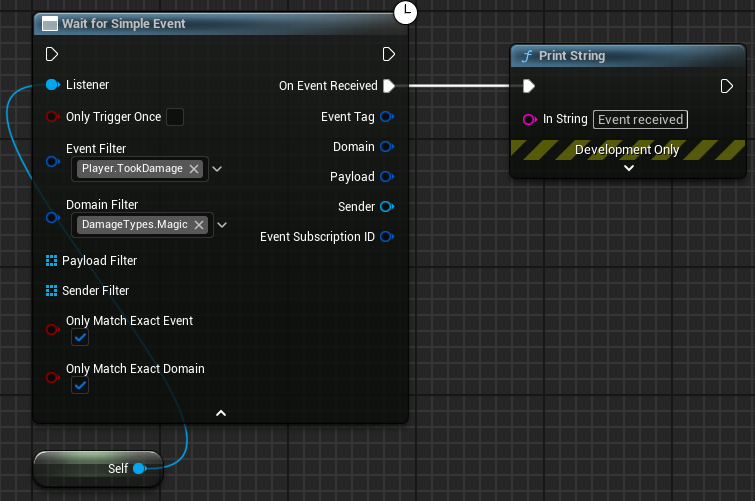
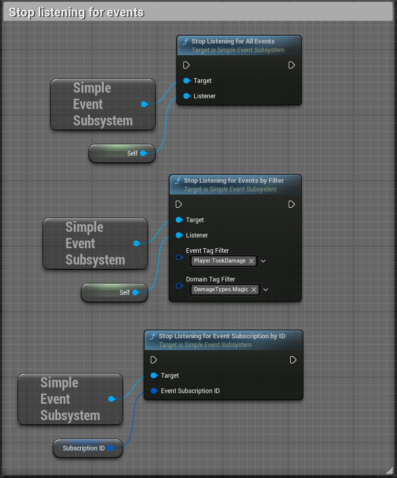
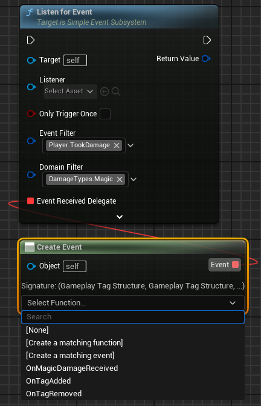

# Events using Simple Event Subsystem

## What is the Simple Event Subsystem?

The [Simple Event Subsystem](https://github.com/strayTrain/SimpleEventSubsystemPlugin) is a subsystem that lets different parts of your game talk to each other using gameplay tags with arbitrary struct payloads.  
It's like a message board where game systems can post updates and others can listen for specific types of messages they care about.

## Why Use an Event System?

Game systems often need to communicate with each other:
- Your UI needs to know when the player's health changes
- Your achievement system needs to know when an enemy is defeated
- Your audio system needs to know when to play a sound effect

Rather than creating direct dependencies between these systems, the event subsystem lets them communicate indirectly through events. This creates more flexible, maintainable code.

## How It Works

You can access the subsystem from any blueprint that can access the GameInstance (e.g. Actors, ActorComponents, PlayerController, Widgets) using the `GetSimpleEventSubsystem` node.  
Do this by right-clicking in the blueprint editor and searching for `GetSimpleEventSubsystem`. 

### Sending Events

- **Senders** dispatch events with these arguments:
    - `Event Tag`: describes what happened (e.g., "Player.TookDamage")
    - `Domain Tag`: categorizes the event (e.g., "DamageType.Magic")
    - (optional) `Payload`: adds additional context
        - This can be any struct type, and is passed in as an instanced struct
    - (optional) `Sender`: an actor reference representing the source of the event
    - (optional) `ListenerFilter`: an actor array representing the listeners that should receive the event

### Listening for Events

- **Listeners** subscribe to events with these arguments:
    - `Listener`: the object that will execute the callback function
    - `OnlyTriggerOnce`: a boolean that determines if the listener should only trigger once and then stop listening or trigger every time the event is sent
    - (optional) `Event Filter`: a gameplay tag container that filters the events the listener is interested in. If left empty, the listener will accept any event.
    - (optional) `Domain Filter`: a gameplay tag container that filters the domains the listener is interested in. If left empty, the listener will accept any domain.
    - `Event Received Delegate`: the function that will be called when the event is received
    - (optional) `Payload Filter`: an array of struct types that the listener is interested in. If left empty, the listener will accept any payload.
    - (optional) `Sender Filter`: an array of actors that the listener is interested in. If left empty, the listener will accept events from all senders.
    - `OnlyMatchExactEvent`: a boolean that determines if the listener should only trigger if the event tag matches exactly or if it can match any parent tags.
    - `OnlyMatchExactDomain`: a boolean that determines if the listener should only trigger if the domain tag matches exactly or if it can match any parent tags.
- Calling `ListenForEvent` will return a GUID that identifies the event subscription. You can use this GUID to stop listening for the event later.

For convenience there is also an async version of the `ListenForEvent` function:
 

### Stopping Listening

When you're no longer interested in events, you can stop listening by calling one of these functions:

### Tips

- To make creating callback functions in `ListenForEvent` easier, drag off the `EventReceivedDelegate` pin and select `Create Event` to create or select an event function
    