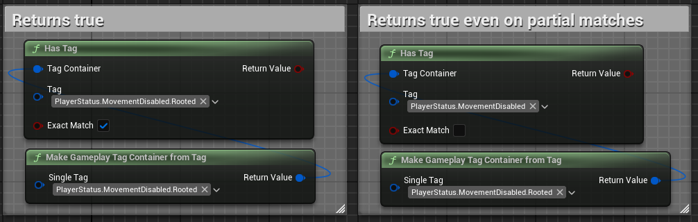
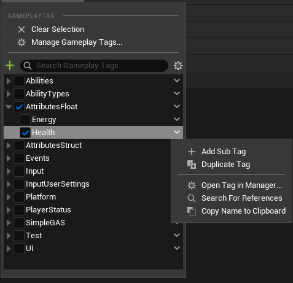

# Gameplay Tags

Gameplay tags give you a clean way to label and categorize things in your game. Think of them like keywords or hashtags that you can attach to game elements to give them meaning and make them searchable.

In SimpleGAS, gameplay tags are used for things like:
- Controlling when abilities can activate
- Identifying attributes
- Filtering events
- Marking game states (like "Player.Stunned" or "Combat.InProgress")

## Why Use Tags Instead of Strings?

1. **Hierarchy**: Tags can form parent-child relationships (like `PlayerState.MovementDisabled.Rooted` and `PlayerState.MovementDisabled.Stunned`)
    - Useful for answering questions like "What type of movement disable is this?" or "Is this a movement disable tag?"
2. **Optimized Queries**: The gameplay tag system is optimized for container operations and hierarchical queries that would be a hassle to implement with plain strings
    - For example, you can easily check if a tag is a child of another tag
        
3. **Editor Support**: The tag picker UI prevents typos and makes it easy to see which tags are used throughout the project for future you who totally remembers what they were doing when they added that tag months ago  
    

## Want to Learn More?

Tom Looman has written [an excellent article](https://www.tomlooman.com/unreal-engine-gameplaytags-data-driven-design) that dives deeper into gameplay tags and their uses in Unreal Engine.