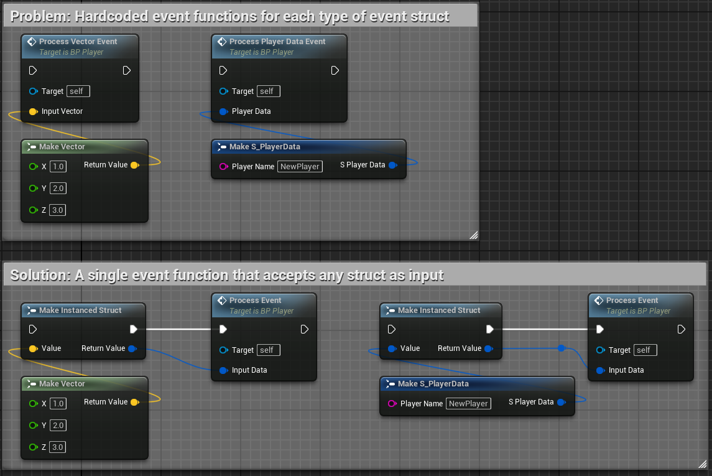
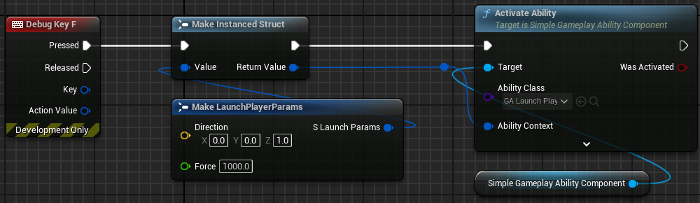
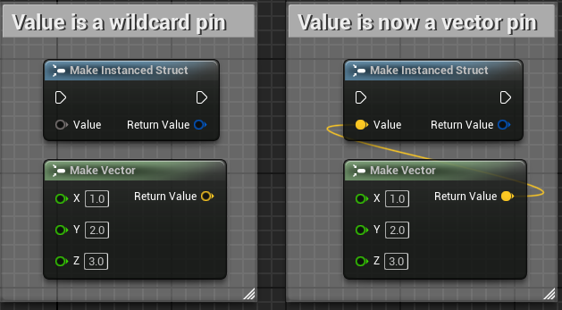
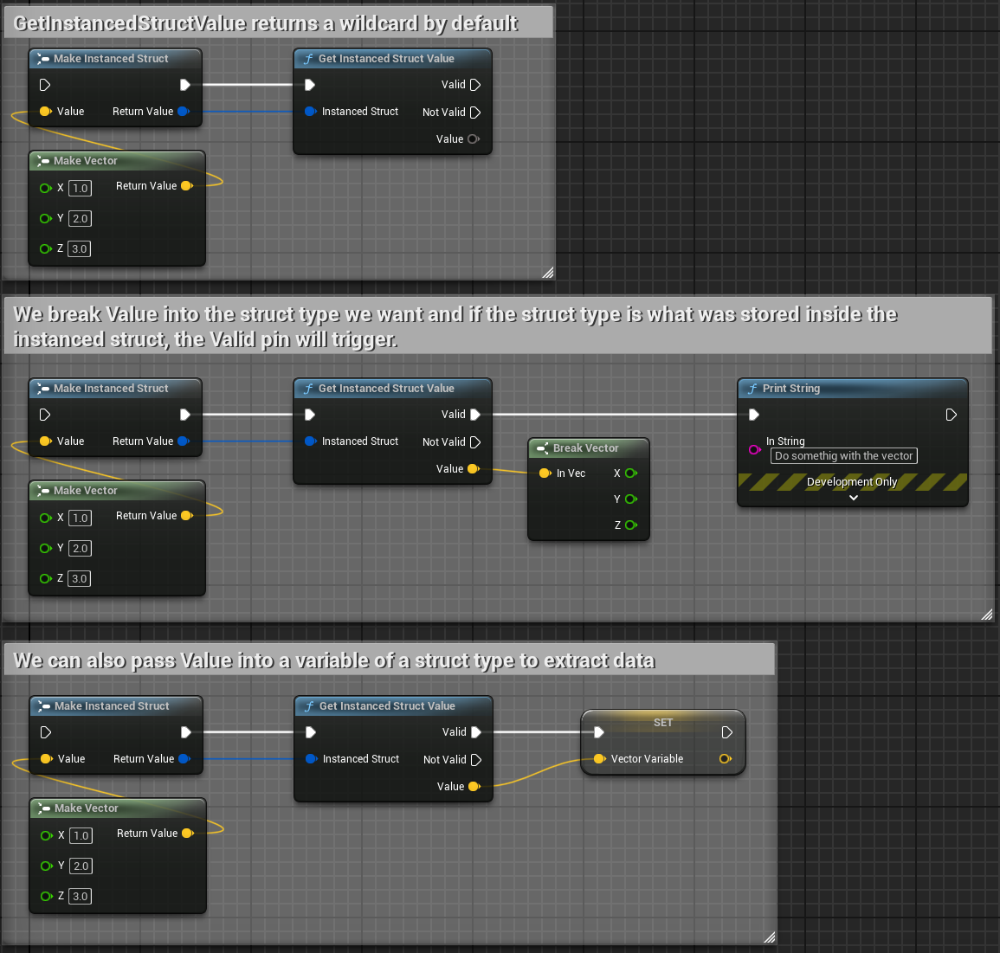

# Instanced Structs

An `FInstancedStruct` is a container that can hold any Unreal Engine struct type. Think of it like a box that can store different types of struct data at runtime that you can use to pass around data even though you don't know the exact type of data ahead of time.  

e.g. Imagine we had a function that processes an event. For each event type we need to create a function with a different signature. This can lead to a lot of duplicated code and maintenance headaches.  
    

Instanced Structs are usually used in SimpleGAS to pass in context data for Abilities, Events, and Effects. e.g. If we have a `LaunchPlayer` ability we create a `LaunchPlayerParams` struct that contains the direction and force to launch the player with and then pass that into the ability.  
    

## Working with Instanced Structs

### Creating an Instanced Struct
To create an Instanced Struct we use the `MakeInstancedStruct` node. It takes one input which is the struct that we want it to contain. The input pin is a wildcard meaning that we can plug any struct type into it and the pin will match the type of the struct.
    

### Reading from an Instanced Struct
To extract the data from an Instanced Struct we use the `GetInstancedStructValue` node. 
    
