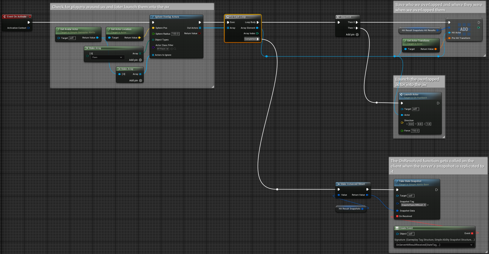
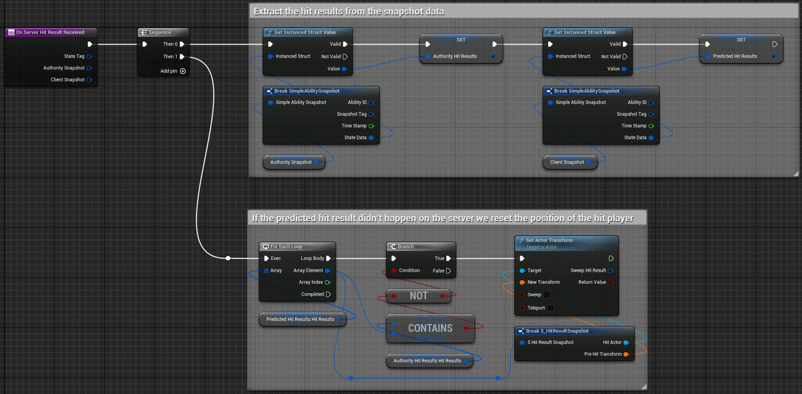

# Replication and Prediction in SimpleGAS

## The Golden Rule: Server Authority

In SimpleGAS, the server is always the ultimate authority. This means:
- The server decides what's "real" in your game
- Clients can propose or predict what happens, but the server gets final say
- If there's a conflict between client and server, the server wins

This approach prevents cheating and keeps your game consistent across all players, but it creates a challenge: **lag**. Players hate waiting for server confirmation before seeing their actions take effect.

That's where prediction comes in!

## Abilities: Synchronized Actions

### How Abilities Replicate

When a player activates an ability (like casting a fireball), SimpleGAS creates an **AbilityState** struct:

```cpp
struct FAbilityState
{
    FGuid AbilityID;                 // Unique identifier
    TSubclassOf<USimpleAbilityBase> AbilityClass;  // What ability is this?
    double ActivationTimeStamp;      // When was it activated?
    FInstancedStruct ActivationContext;  // Extra data passed at activation
    EAbilityStatus AbilityStatus;    // Is it running, ended, canceled?
    TArray<FSimpleAbilitySnapshot> SnapshotHistory;  // Record of state changes
};
```

For server-initiated abilities, the flow works like this:
1. Client requests ability activation
2. Server validates and creates an authoritative AbilityState
3. This AbilityState gets replicated to clients via `AuthorityAbilityStates` 
4. Clients receive the AbilityState and activate their local version

SimpleGAS handles all this synchronization automatically. Your ability classes define the behavior, and the AbilityComponent manages the replication.

### Client Prediction: Instant Feedback

But waiting for the server feels sluggish, especially with high ping. That's why SimpleGAS supports client prediction:

1. Client immediately activates ability locally (feels snappy!)
2. Client sends activation request to server
3. Server validates and activates its authoritative version
4. Server replicates back the "official" state
5. Client compares its predicted version against server's version
6. If they match, great! If not, client corrects itself

This is controlled through the `ActivationPolicy` property on abilities:

```
Replicated:
ClientPredicted: Run on client immediately, correct if server disagrees
ServerInitiatedFromClient: Request from client, but wait for server to activate first  
ServerAuthority: Can only activate on server but still replicate to clients

Non Replicated:
LocalOnly: Can activate on client or server, but no replication
ClientOnly: Can only activate on client
ServerOnly: Can only activate on server
```

### State Snapshots: Tracking What's Important

During an ability's lifecycle, important moments can be captured as "snapshots" with `TakeStateSnapshot()` and a custom struct:  

<a href="../../../images/index_4.png" target="_blank">

</a> 
<a href="../../../images/index_5.png" target="_blank">

</a> 

## Attributes: Synchronized Stats

Attributes like health, stamina, or speed use a similar strategy:

1. Server maintains authoritative attributes in `AuthorityFloatAttributes` and `AuthorityStructAttributes`
2. Client keeps local copies in `LocalFloatAttributes` and `LocalStructAttributes`
3. When server changes attributes, changes are replicated to clients

This parallel structure means:
- Server always has the final say on attribute values
- Clients have immediate access to read attributes
- When replicated values arrive, clients update their local copies

Behind the scenes, SimpleGAS handles this with `FFastArraySerializer` to efficiently replicate only changed attributes.

## Attribute Modifiers: Smart Effects

Attribute modifiers (like damage-over-time effects or buffs) are specialized abilities that modify attributes. They follow similar replication rules, with some automation for convenience:

1. Modifiers can be client-predicted using `ModifierApplicationPolicy`
2. The side effects (VFX, sounds, activated abilities) get cleaned up automatically if the server rejects the modifier
3. Predictive modifiers show immediate feedback but correct themselves if invalid

Example: When a player hits an enemy with fire damage:

```
1. Client shows immediate hit effect and reduces enemy health
2. Server validates hit and replicates official damage
3. If client and server agree, nothing changes visually
4. If client was wrong, health bar "springs back" and effects are removed
```

This automatic handling means you don't need to manually reconcile prediction errors for modifiers - the system cleans up predicted effects that didn't actually happen.

## FInstancedStruct: Flexible Data Replication

SimpleGAS uses `FInstancedStruct` to replicate dynamic data:
- Allows arbitrary structs to be replicated
- Lets you pass any data structure through the network

However, keep these things in mind:
1. Struct properties must be replicable types
2. Complex nested structs can be bandwidth-intensive

When using `FInstancedStruct` in your abilities:
- Keep payloads as small as practical
- Use basic types where possible