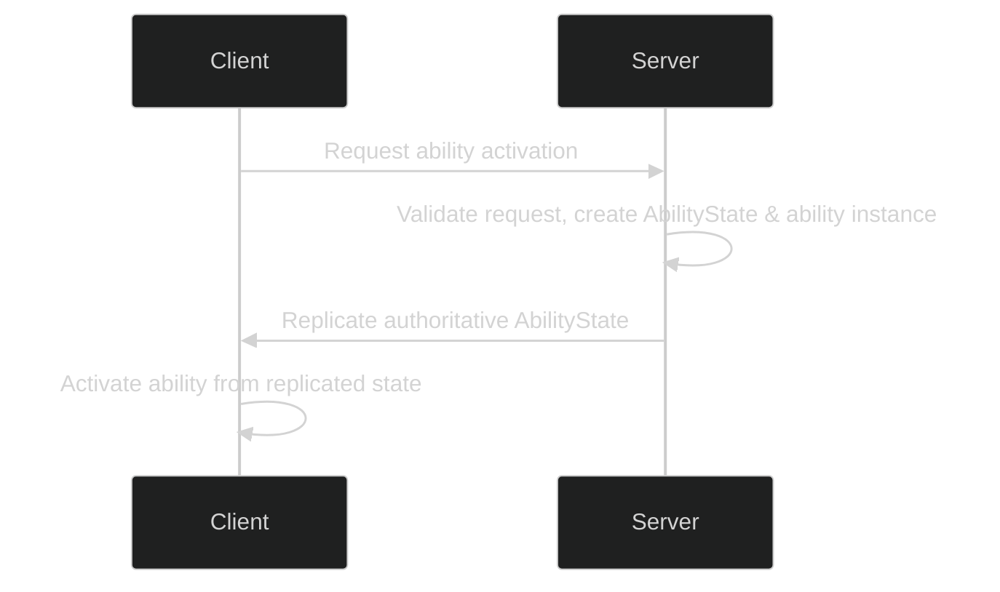
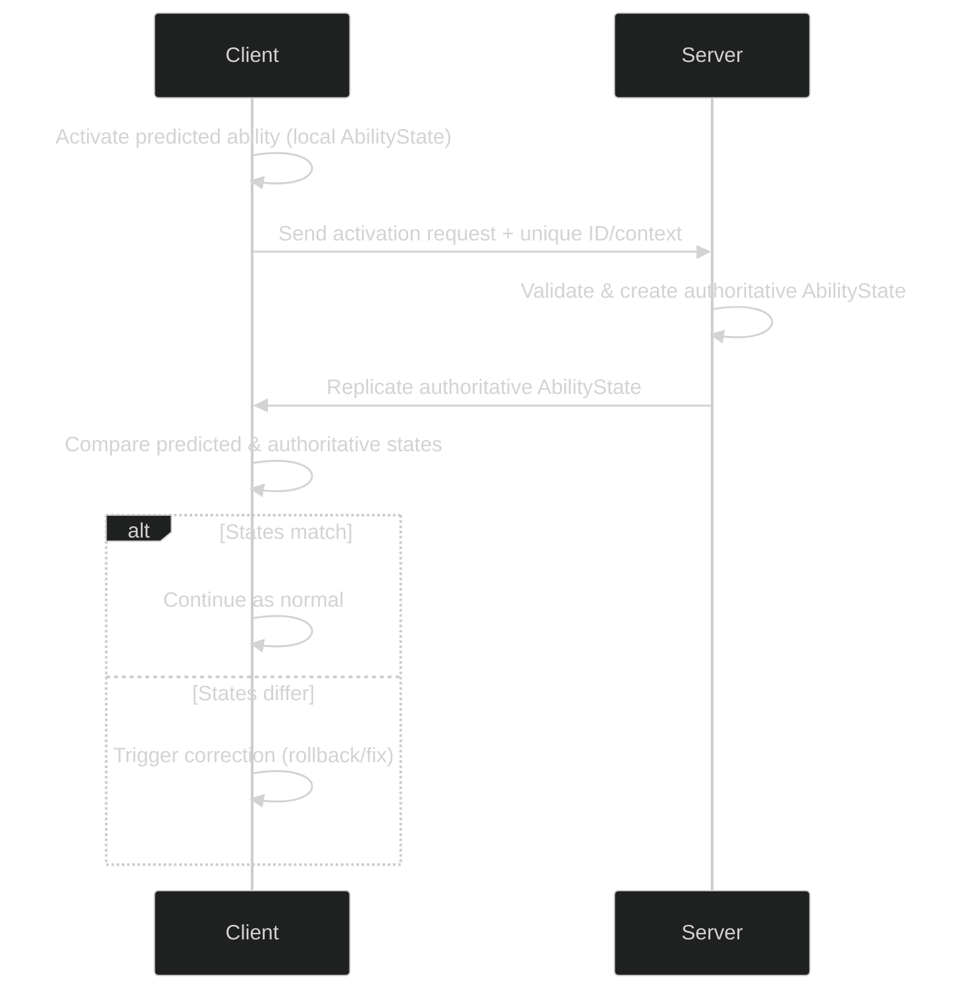
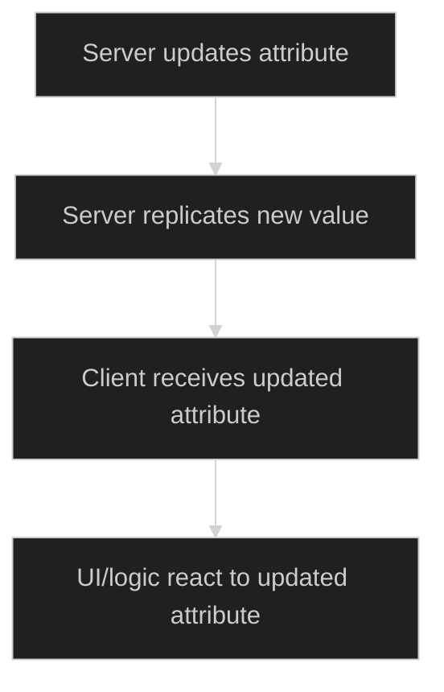
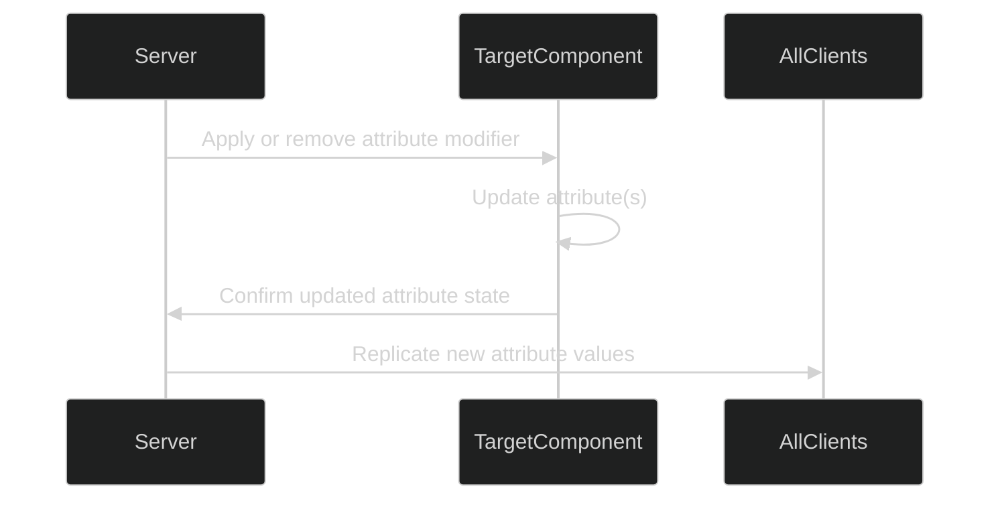
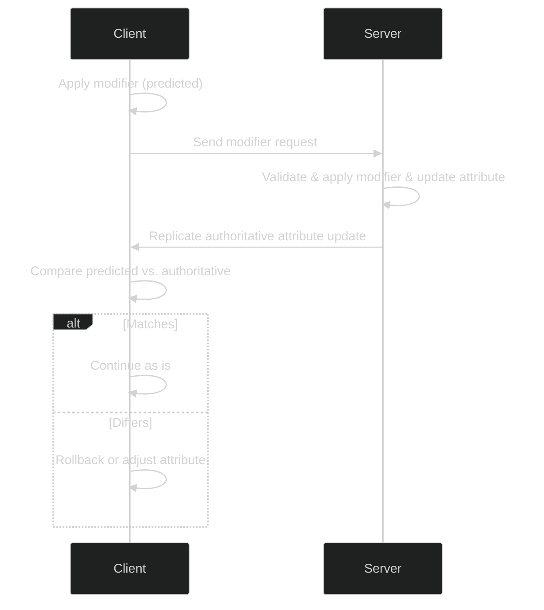

# Replication and Prediction

SimpleGAS provides built-in replication and optional client prediction for abilities, attributes, and attribute modifiers. This allows for responsive gameplay on clients while ensuring the server remains authoritative.

---

## Ability Replication

### Overview

When a **SimpleGameplayAbility** is activated on the server, it creates an **AbilityState** struct to track the ability’s status and any snapshots. This **AbilityState** is added to an authoritative array on the server and replicated to all clients. Upon receiving the new state, each client activates the corresponding ability instance (if needed) to stay in sync with the server.

### Server-Initiated Ability Example

- **Server** is always authoritative; it creates and manages the definitive state.
- **Client** simply reacts to the replicated state.

---

## Ability Prediction

### Overview

For a more responsive experience, you can enable **client-predicted** abilities. The client immediately activates the ability, assuming the server will confirm it. Internally, the client maintains a **predicted AbilityState**, while the server holds the authoritative one.

### Client-Predicted Ability Example

### State Snapshots

A **StateSnapshot** is a custom struct that captures the ability’s internal data at a given moment.  
- Both client and server can record snapshots during the ability’s lifecycle.  
- When the server replicates its snapshot, the client compares it to the predicted snapshot and corrects any differences if needed.

**Example workflow**:  
1. **Client** does an overlap check and stores a list of hit actors in a snapshot.  
2. **Server** does the same check and replicates its snapshot to the client.  
3. **Client** compares snapshots; if they differ, the client corrects its local state.

---

## Attribute Replication

### Overview

Attributes (like Health or Stamina) are maintained by the **AbilityComponent**. Whenever the server changes an attribute, it replicates the updated value(s) to clients.

- **Server** ensures all attributes remain authoritative.  
- **Clients** display or use the replicated attribute data for UI and gameplay logic.

---

## Attribute Modifier Replication

### Overview

An **AttributeModifier** can change one or more attributes on the target’s AbilityComponent, either instantly or over time (e.g., DoT or HoT). By default, modifiers run on the server, and their effects are replicated to clients.

---

## Attribute Modifier Prediction

### Overview

Attribute modifiers can also be **client predicted**, reducing perceived latency for immediate effects (e.g., showing damage feedback right away). The client applies the modifier optimistically, then corrects if the server disagrees.

- **Predicted Modifiers** can be rolled back or corrected when the authoritative server data arrives.  
- **Side effects** (e.g., visuals, sounds) can also be started immediately on the client, then canceled if the server rejects the modifier.

---

## Key Takeaways

1. **Server Authority:** All final states (abilities, attributes, modifiers) are owned by the server.  
2. **Prediction:** Enhances responsiveness by letting the client assume success. Mismatches trigger correction.  
3. **Snapshots & Mispredictions:** Use snapshots to pinpoint differences and fix them cleanly.  
4. **Design Trade-offs:** Decide where to predict carefully—too much prediction can lead to frequent rollbacks; too little can feel laggy.

With these systems, you can build responsive multiplayer gameplay while maintaining consistent, authoritative server control.