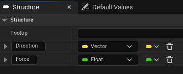
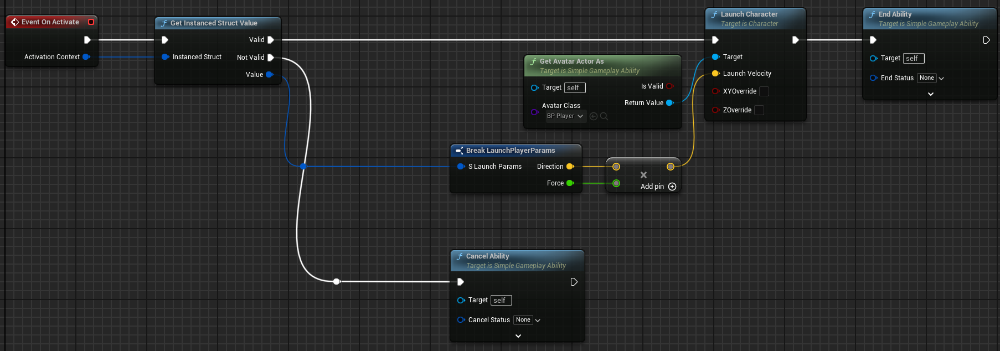
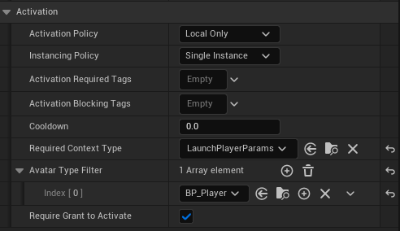

# Basic Setup

In this example we're going to
- Add SimpleGAS to the [Third Person Character](https://dev.epicgames.com/documentation/en-us/unreal-engine/third-person-template-in-unreal-engine?application_version=5.5) template. 
- Create an ability that launches the player into the air and activates it from player input.

<video width="320" height="240" controls>
    <source src="/videos/LaunchPlayerResult.mp4" type="video/mp4">
    Your browser does not support the video tag.
</video>

Before we start make sure you've [installed the SimpleGAS plugin](../installation.html) and enabled it in your project.

Step 1: Add the SimpleAbilitySystemComponent to the Player Blueprint

- Open your Player Character blueprint. By default this is called `BP_ThirdPersonCharacter`. 
        - I created a new blueprint subclass of it called `BP_Player` to keep the original blueprint intact. You don't have to do this and can just use `BP_ThirdPersonCharacter` if you want.
- In the Components tab, add a new component and search for `SimpleAbilitySystemComponent`. Add it to the character.
    
        

Step 2: Set the Avatar Actor

We set the `AvatarActor` in the `BeginPlay` event of the player blueprint.  

- The `AvatarActor` is basically who's performing the ability - in this case, the third person character. While not strictly required, setting it is good practice since most abilities will need to know who's casting them.
- The reason why setting the `AvatarActor` isn't automatic is because you can attach an `AbilityComponent` it to any actor, not just characters.  
        - For example, you might put the component on your PlayerController instead of the character. This way, if your character dies and respawns, all your ability component state stays intact since it lives on the controller, not the destroyed character.

Step 3: Create the LaunchPlayer ability blueprint

To create an ability, right click in the content browser and select `Blueprint Class > All Classes > SimpleGameplayAbility`. I called mine `GA_LaunchPlayer`.

Abilities can take inputs in the form of structs. For our launch ability we want to be able to control the direction and force of the launch.  

To do this, we need to create a new struct that will hold the input data.
- Right click in the content browser and create a a new struct by selecting Blueprint > Structure.  
    

- Name the struct `LaunchPlayerParams`.
- Open the struct and add two variables:  
    

To implement what our ability does, we override the `ActivateAbility` function:  
 

Step 4: Activate the ability

This part is pretty straightforward. We make a `LaunchPlayerParams` struct and pass it to the `ActivateAbility` function of the ability system component.

Tips

- Currently, we can activate the ability repeatedly if we keep pressing the F key. We can fix this by overriding `CanActivate` on `GA_LaunchPlayer` and returning false if the player is not on the ground.  
    
- We can ensure that the ability has the data and references it needs by setting `RequiredContextType` and `AvatarActorFilter` on the `GA_LaunchPlayer` class. This means that the ability won't activate if it wasn't passed the right context struct or if the `AvatarActor` is not the right type.
    

