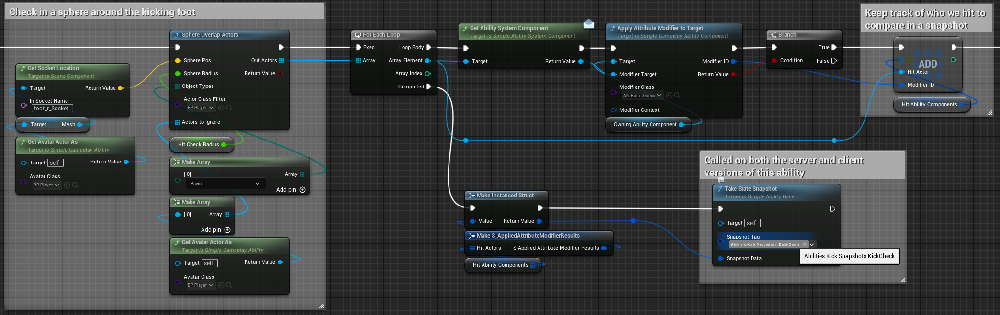
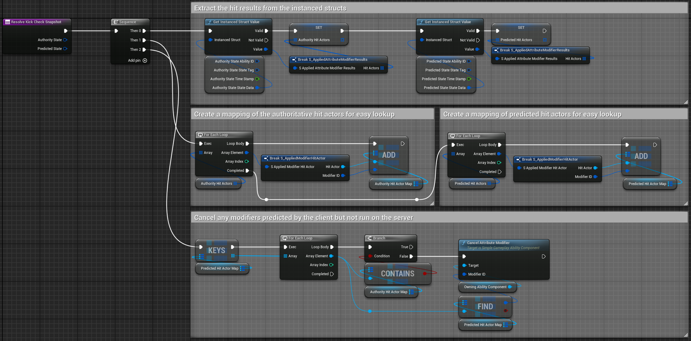

# High level concepts behind SimpleGAS
  
At its core, SimpleGAS consists of four main parts:

### 1. Simple Event Subsystem
- [A bundled subsystem](https://github.com/strayTrain/SimpleEventSubsystemPlugin) that allows events to be passed by gameplay tags
    - e.g. You can send an event that a player walked through a door with a payload consisting of a reference to the player. A listener (like a widget, player controller etc) can then react to this event
- Event payloads aren't hardcoded to a type and can be any arbitrary struct
- This is used to send and receive messages from abilities  
    

### 2. Ability Component
- Each actor that can perform abilities has an **Ability Component**.
- Manages replicated **attributes** of which there are two types:
    - **Float Attributes** e.g. Health, Stamina, Speed 
    - **Struct Attributes** e.g Vector3 or a custom struct
- Handles **ability activation** and **attribute modifiers** (special abilities that can change attributes over time)
- Maintains a replicated list of **gameplay tags** which can be used to control activation of abilities and modifiers  
    - e.g. You can't activate an attack ability if the ability component has a `PlayerState.Stunned` tag
- Allows for replicated events to be sent e.g. It allows the client to tell the server that an ability target was selected

### 3. Gameplay Abilities
- Defines what happens when an ability is activated (e.g. a player attacking or a door opening)
- Abilities can apply **attribute modifiers** and activate other abilities
- Abilities can be client predicted i.e. The client assumes the server will execute what it executes and activate immediately for the client, reducing perceived lag
- Client predicted abilities can be corrected when they mispredict using a **State Snapshot**
    - Snapshots allow you to compare what the server and the client did at predetermined points in the ability

### 4. Attribute Modifiers
- A subtype of abilities that modify attributes
- Can be **instant changes** or **apply over time**.
- Attribute Modifiers can additionally trigger **side effects** e.g. On successfull application: Play a hit reaction animation, send an event and then apply a different modifier
- Modifiers can be client predicted (with some caveats we'll get into later) 

---

### Typical Workflow
1. **Define attributes that the AbilityComponent has**
    * 
2. **Create an ability** that defines what happens when the ability is activated. 
    * A typical ability might be a player playing an attack animation, checking for a target and  modifying an attribute like Health using an **Instant** modifier on the target
    * 
    * Inside the collapsed graph  
        
    * Settings for `AM_BasicDamage`  
        
3. **Grant the ability** to the activating ability component
    * 
4. **Activate the ability** when the player presses a button or some other condition is met
    * 
5. **Outside of the ability**, you might have a a widget that listens for events about attributes changing (sent through the **SimpleAbilitySubsystem** automatically by the attribute modifier) and update the UI based on the player's health attribute
    * 
6. **Result**  
We deal 20 damage to the target. The damage first removes armor and then health. On successful application the target activates a cosmetic hit reaction ability.    
    <video width="640" height="360" controls>
    <source src="../videos/kick_result.mp4" type="video/mp4">
    Your browser does not support the video tag.
    </video>

---

### How does replication and prediction work?

The lifecycle of an ability is managed by the **AbilityComponent** through a struct called **AbilityState**.

An **AbilityState** is a struct that contains:
* Information about the ability that was activated (it's class, unique identifier, context etc)
* A status enum representing if the ability is active, ended or cancelled
* An array of **StateSnapshots** representing the state of the ability at different times

The **AbilityComponent** maintains a 2 arrays of **AbilityState**: 
* An authoritative replicated array only written to by the server
* A predicted non replicated array used by clients when activating predicted abilities  

When we activate an ability we create an **AbilityState** for it and add it to the appropriate state array (authoritative for the server and predicted for the client)  

### When an ability is activated on the server:
1. An instance of the ability is created on the server and a matching state is added to the authoritative **AbilityState** list
2. The authoritative state is replicated to all clients
3. Upon receiving the new state, the client activates the ability with the same unique identifier and context it received from the authoritative state 

### When an predicted ability is activated on the client:
1. An instance of the ability is created on the client and a matching state is added to the predicted **AbilityState** list. The client activates the ability immediately assuming it got permission from the server
2. The client sends a request to the server to activate the same ability passing along the ability's unique identifier and context
3. The server tries to activate the ability and creates a matching state in the authoritative list
4. The authoritative state is replicated to all clients. If the client that activated the ability receives the new state and it matches the predicted state, the client continues as normal.  If the states don't match, the client triggers a callback where you can implement logic to fix the misprediction
5. For more specific prediction both the client and server can take a **StateSnapshot** of the ability at any time and compare them to fix mispredictions

### What is a **StateSnapshot**?

* A **StateSnapshot** is an arbitrary struct representing the state of the ability when it was taken. e.g. A struct containing references to other actors hit by an ability after an overlap check
    * If an ability is **client predicted** then both the client and server can take a snapshot using a custom struct. The client saves its snapshot to the predicted **Ability State** and the server saves its snapshot to the authoritative **Ability State**
    * When the server replicates the authoritative **Ability State** to the client, the client compares the server's snapshot to its own. If they match, the client continues as normal. If they don't match, the client triggers a callback where you can implement logic to fix the misprediction

Take snapshot
      
Decide how to fix misprediction using the identifying snapshot tag  
      
Fix misprediction  
    

{: .note }
State Snapshots are only supported in client predicted abilities.