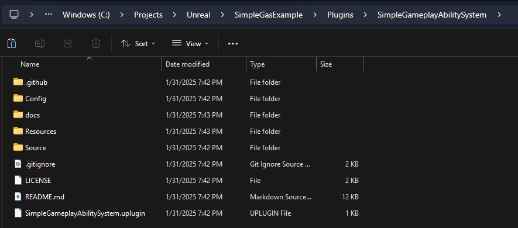

# Installing SimpleGAS

Getting SimpleGAS up and running in your Unreal Engine project is pretty straightforward. Here's how to do it.

{: .note }
SimpleGAS requires Unreal Engine 5.2 or later.  
If you're starting with a Blueprint-only project, follow all the steps below.  
**If you already have C++ code in your project, you can jump straight to Step 3.**

---

  
Step 1: Convert Your Blueprint Project to C++

Blueprint projects don't come with Visual Studio solution files or C++ support by default, so we need to add a C++ class to generate these files.

1. Go to **File** > **New C++ Class**
2. In the **Add C++ Class** window:
   - Choose **None (Empty Class)** or something simple like **Actor**
   - Click **Next**
   - Name your class anything you like (e.g., `MyCppClass`)
   - Click **Create Class**
3. Wait for Unreal to compile the C++ code - this creates all the necessary Visual Studio files
4. Once it's done, close the editor

  
Step 2: Set Up Your Visual Studio Project

1. Go to your project folder in File Explorer
2. **Right-click on your .uproject file** and select **Generate Visual Studio project files** 
   - On Windows, you might need to click "Show more options" to see this
3. Open the newly generated **.sln** file in **Visual Studio** (or Rider if you prefer)
4. In Visual Studio:
   - Set the build configuration to **Development Editor**
   - Build the project (Ctrl+Shift+B)

  
Step 3: Add SimpleGAS to Your Project

1. [Download or clone the SimpleGAS repository](https://github.com/strayTrain/SimpleGameplayAbilitySystem) and place it in your project's Plugins folder
   - If your project doesn't have a Plugins folder yet, create one
   - For example, if your project is at `C:\Projects\MyGame`, place SimpleGAS in `C:\Projects\MyGame\Plugins\SimpleGameplayAbilitySystem`
   - 
2. Rebuild your project and launch the editor
3. The plugin should be enabled by default, but you can verify by going to **Edit** > **Plugins** and searching for "SimpleGameplayAbilitySystem"

---

That's it! SimpleGAS is now installed and ready to use in your project.

*Note from the dev: I haven't tested this on Mac or Linux as I don't have machines running those on hand. If anyone can supply steps/screenshots of the process as a PR on the project it would be much appreciated!*

## Having Trouble?

Here are some common issues and solutions:

- **Compile errors**: Make sure you're using Unreal Engine 5.2 or later
- **Plugin not found**: Double-check that you've placed the plugin in the correct folder structure
- **Missing dependencies**: SimpleGAS requires the StructUtils plugin, which should be automatically enabled

If you're still having issues, drop a question on the [discussions page](https://github.com/strayTrain/SimpleGameplayAbilitySystem/discussions).