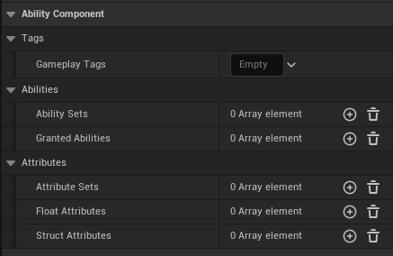
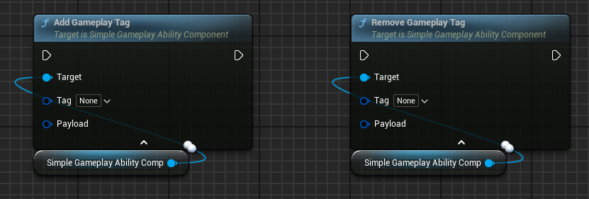
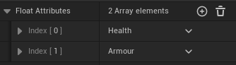
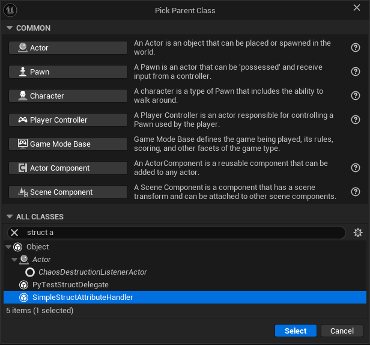
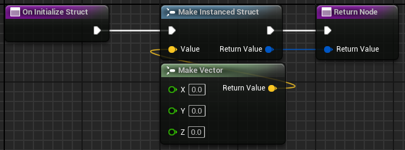
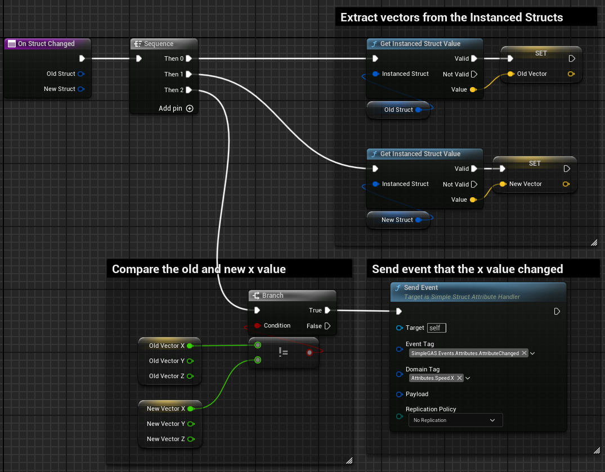

# Ability Component Explanation

Let's take a look at the ability component's class variables and what they do:

  
Tags

* These are replicated gameplay tags that are used to represent the "state" of the ability component. e.g. `PlayerState.Stunned`, `PlayerState.Dead`, etc.
* These are used by **abilities** and **attribute modifiers** to determine if they can be applied or not.  
e.g. *"Can I apply this damage modifier to the player if they are stunned?"*  
    * Another use case is checking for a tag like `PlayerState.MovementDisabled` in the pawn logic to determine if the player can move.  
    This is useful because a gameplay ability can apply and remove tags from the ability component i.e you can use tags to allow abilities to automatically stop the player from moving while the ability is running.
* You can add and remove tags using the **AddGameplayTag** and **RemoveGameplayTag** functions.
    
* There is an optional pin for a payload. The reason this exists is that whenever a gameplay tag is added or removed, it sends a SimpleEvent that can be listened to by other blueprints. The payload is a way to send extra data with the event.
    
* When listening for the events the **EventTag** for an added tag is `SimpleGAS.Events.AbilityComponent.GameplayTagAdded` and for a removed tag is `SimpleGAS.Events.AbilityComponent.GameplayTagRemoved`
    * The **DomainTag** is the tag that was added or removed.  

{: .tip }
You can use whatever naming scheme you want for your tags. I like to use `PlayerState.*` for the tags that represent the state of the player for example but any tag will work. 

  
Abilities

* **GrantedAbilities** are the abilities that this component can activate. They are an array of class references to **Gameplay Ability** blueprints.
    
* **AbilitySets** are are an array of a `DataAsset` that defines a group of abilities to grant. This is useful when you have different ability components that can activate the same abilities.
* To create an **AbilitySet** data asset, right-click in the content browser and go to `Create -> Miscellaneous -> Data Asset` for the data asset class select `Ability Set`

  

  
Attributes

**Float Attributes**  

* A `FloatAttribute` represents a single numerical value like Health, Stamina, Lives etc:
      
    1. `Attribute Name` is a cosmetic editor only value that makes it easier to scan through the list of float attributes in the editor. e.g.  
        
    2. `Attribute Tag` is the gameplay tag that identifies this attribute. 
        * This tag must be unique. 
        * If multiple float attributes have the same tag, only the last one will be used.
    3. `Base Value` is the "innate" value of the attribute. 
    4. `Current Value` is the current value of the attribute. 
    5. `Value Limits` enabling value limits allows you to clamp the associated value when it gets updated.  
        * e.g Ensuring Base Health can't go below 0.

{: .tip }
You can choose to only use the `current value` if you want. The `base value` is included as it is a common pattern to do something like `damage = base value + current value` (where current value acts like a bonus value).

**Struct Attributes**  
  
* A `StructAttribute` represents a more complex value like a Vector3 or a custom struct.
    

    1. `Attribute Name` behaves the same as the float attribute name.  
    2. `Attribute Tag` behaves the same as the float attribute tag.
    3. `Attribute Type` is the type of struct that is being represented.  
        * e.g. If you have a struct called `FPlayerStats` you would select `FPlayerStats` from the dropdown.
        * If you later try to update the attribute with a different struct type, it will generate a warning and skip the update.
    4. `Attribute Handler` is an optional class that you can create to deal with changes to the struct variable members.
        * 
        * The class has two overridable functions:
            * `OnInitializeStruct` provides default values for the struct members
            
            * `OnStructChanged` allows you to compare the old and new struct values and send events based on the changes
            

{: .note }
If you don't supply an attribute handler, a more generic event is sent when the struct changes. The `EventTag` is `SimpleGAS.Events.Attributes.StructAttributeValueChanged` and the `DomainTag` is the tag of the struct attribute.

**Attribute Sets**  

* Similar to `AbilitySets`, `AttributeSets` are a way to group attributes together and share them between different ability components.
* To create an `AttributeSet` data asset, right-click in the content browser and go to `Create -> Miscellaneous -> Data Asset` for the data asset class select `Attribute Set`
* If an attribute is defined in multiple attribute sets, the last one will be used. 

    