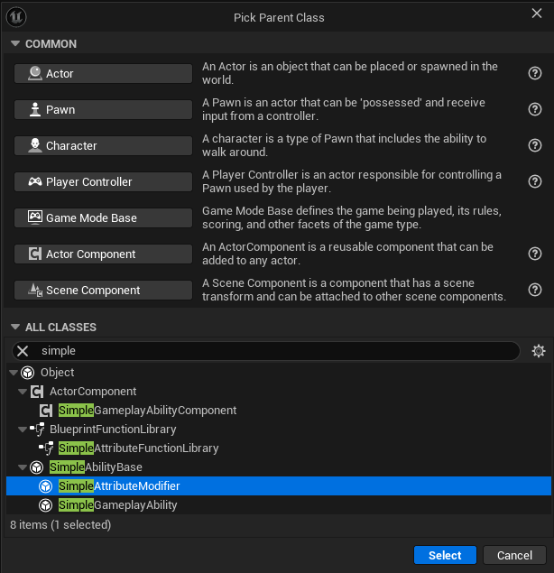
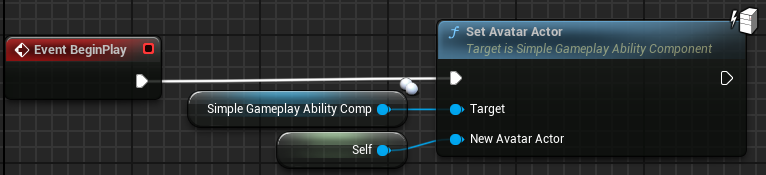

# Create required blueprints

To start, we need to create the following blueprints:

  
A SimpleGameplayAbility subclass for the kick ability

I called mine `GA_Kick`.  

  
A SimpleAttributeModifier subclass for the damage modifier

I called mine `AM_KickDamage`.  

# Setup the SimpleAbilityComponent

  
Add a SimpleAbilityComponent to your player pawn

  
Set the Avatar Actor

* An `Avatar Actor` is the actor that is performing the abilities. 
    * This is usually the player pawn.
    * This allows you to add the ability component to a player controller and upon spawning the pawn, changing the avatar actor. i.e. you can create and destroy the avatar while not losing the attribute data.
    * In our example however the avatar actor and the ability component holder are the same actor for brevity.
    * The `SetAvatarActor` function can only be called on the server.
    

