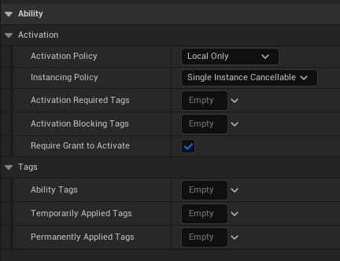
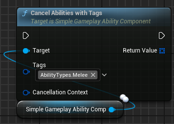
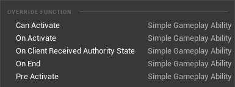
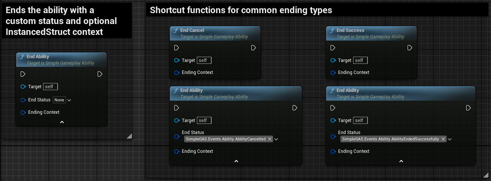
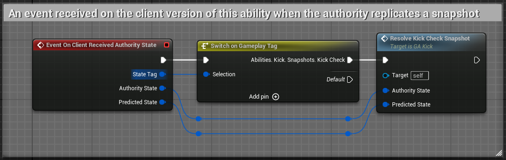

# Gameplay Ability Explanation

## SimpleGameplayAbility variables

Open the `GA_Kick` blueprint and take a look at the class default variables:

  
Activation

1. **Activation Policy** controls how and if the ability is replicated. There are four policies:
    * `Local Only` - The ability is only activated on the machine that called the activate function. This is useful for abilities that don't need to be replicated (e.g. cosmetic hit reactions) or for single player games.
    * `Client Predicted` - The ability is activated on the client immediately and then a server RPC is made to activate the ability on the server. This is useful for making abilities feel more responsive in multiplayer scenarios.
        * If the client predicts that the ability activates but the server activation fails, the client will cancel the activated ability when it receives the server's response.
        * In a listen server scenario where the server is also a client, the ability will activate with a `Server Initiated` policy
    * `Server Initiated` - The ability is activated on the server and then replicated to all connected clients. This is useful for abilities that need to be authoritative e.g. there is randomness in the ability that needs to be the same for all clients.
        * If called from a client it will not activate but instead send a server RPC to activate the ability on the server. i.e This ability can be activated by client or server but will always run on the server first. 
    * `Server Only` - The ability is only activated on the server. This is useful for abilities that don't have a visual impact for clients.
        * If a client attempts to activate an ability with this policy, it will be ignored.
2. **Instancing Policy** controls how abilities are "spawned" when activated. There are three policies:
    * `Single Instance Cancellable` - Only one instance of the `SimpleGameplayAbility` blueprint will be created. 
        * If the ability is activated while it is already running, the existing `SimpleGameplayAbility` instance will call the `EndCancel` function and and then call the `OnActivate` function. This is effectively "restarting" the ability.
        * This is useful for performance as there is only a single instance of the ability that is created and it gets reused.
    * `Single Instance Non-Cancellable` - Behaves the same as `Single Instance Cancellable` but the ability cannot be activated again while it is still running.
    * `Multiple Instances` - Multiple instances of the ability can be active at the same time.
        * Every time you activate the ability, a new instance of the `SimpleGameplayAbility` blueprint is created.
        * When this ability ends, the `SimpleGameplayAbility` object is destroyed.
3. **Activation Required Tags** and **ActivationBlockingTags** are tags that must be present or absent respectively on the ability component for the ability to activate.
    * If a tag in `Activation Required Tags` is not present on the ability component, the ability will not activate. 
        * e.g. You must have `PlayerState.Grounded` to activate a jump ability.
    * If a tag in `Activation Blocking Tags` is present on the ability component, the ability will not activate.
        * e.g. You can't activate a movement ability if you have `PlayerState.Stunned`.

  
Tags

1. `Ability Tags` are used to categorize this ability. These don't have an effect on the ability directly but can be used to filter abilities in the ability component.
    * Examples of Ability Tags are `AbilityType.Melee`, `AbilityType.Ranged`, `DamageType.Magic` etc.
    * You can cancel abilities with matching tags using the `CancelAbilitiesWithTags` function in `SimpleGameplayAbilityComponent`.  
        
2. **Temporarily Applied Tags** are tags that are added to the activating ability component when the ability is activated and removed when the ability ends.
    * e.g. Adding a `PlayerState.Attacking` tag when the player activates an attack ability.
3. **Permanently Applied Tags** are tags that are added to the activating ability component when the ability is activated and are not removed when the ability ends.
    * These tags need to be manually removed later by an `AttributeModifier`, another ability or calling the `RemoveGameplayTag` function on the ability component.

## SimpleGameplayAbility Functions
Next, let's take a look at the functions available to override in the order they are called in:
  

  
CanActivate

* This function is called before the ability is activated and returns a boolean. If it returns false, the ability will not activate.
    * You can check player resources here e.g. Check if the player have enough energy to activate this ability.

  
PreActivate

* This function is called if `CanActivate` returns true and the tag checks pass.  
* You can apply resource costs here e.g. Subtract energy from the player.

  
OnActivate

* This function is called after `PreActivate` and is where the ability's logic is implemented.
    * This is where you would play animations, apply attribute modifiers etc.
    * You must call `EndAbility` or one of the shortcut functions to officially end the ability.
        
        

  
OnClientReceivedAuthorityState

* This function is called when the client version of the ability receives a new `StateSnapshot` from the server.
    * This is where you would correct any mispredictions that the client made.
         

  
OnEnd

* This function is called when the ability ends. This is where you would clean up any resources that were used by the ability.
    * e.g. Stop animations, stop listening for events etc.

